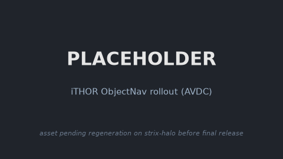

### iTHOR

This package provides the iTHOR (AI2-THOR) simulation base (Unity, rendered headless through
CloudRendering over Vulkan, no X server) as a Ryzer on AMD Ryzen AI Max+ 395 (Strix Halo,
gfx1151) under ROCm 7.14. It exposes a model-agnostic `Policy` seam (selected by `POLICY_FACTORY`)
that WAM and VLA packages chain on for closed-loop ObjectNav rollouts.

### Build

```sh
ryzers build simulation/ithor
ryzers run     # test.py: ai2thor import + headless CloudRendering render sign-of-life
```

The AI2-THOR Unity CloudRendering build (~540 MB) is fetched from the allenai public bucket on
the first run into a mounted cache, not baked into the image.

### Example: iTHOR with AVDC

Chain the AVDC video policy on the sim base and run a closed-loop ObjectNav rollout.

```sh
ryzers build simulation/ithor avdc --name avdc
ryzers run --name avdc /ryzers/demos/demo_ithor.sh
```

<p align="center">
  
  <br><em>Placeholder: AVDC closed-loop ObjectNav rollout in iTHOR.</em>
  <!-- TODO(release): regenerate on strix-halo; see docs/RELEASE_TODO.md -->
</p>

### References

- Upstream: https://github.com/allenai/ai2thor (AI2-THOR / iTHOR, `ai2thor==4.0.0`)
- ObjectNav harness: https://github.com/flow-diffusion/AVDC_experiments (pinned in `docs/UPSTREAM_PIN.commit.txt`)

Copyright (C) 2026 Advanced Micro Devices, Inc. All rights reserved.
SPDX-License-Identifier: MIT
