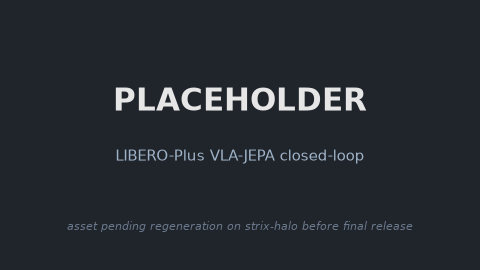

### LIBERO-Plus

This package provides the LIBERO-Plus simulation base (MuJoCo/EGL, robosuite) as a Ryzer on
AMD Ryzen AI Max+ 395 (Strix Halo, gfx1151) under ROCm 7.14. LIBERO-Plus is a drop-in
replacement for LIBERO that expands the four task suites into 10,030 perturbation instances
across 7 robustness dimensions (camera viewpoints, robot initial states, language
instructions, light conditions, background textures, sensor noise, objects layout),
stratified into 5 difficulty levels (L1 to L5). Evaluation matches LIBERO except each task
runs a single trial, since its init state encodes one perturbation config. The base exposes a
model-agnostic `sim_liberoplus.Policy` seam, selected at runtime via `POLICY_FACTORY` (default
the built-in `RandomPolicy`), that WAM and VLA packages chain on for closed-loop and
interactive rollouts.

### Build

```sh
ryzers build simulation/libero-plus
ryzers run     # test.py: LIBERO-Plus + MuJoCo import and perturbation classification sign-of-life
```

### Example: LIBERO-Plus with VLA-JEPA

```sh
ryzers build simulation/libero-plus vlajepa
ryzers run --name vlajepa-libero-plus /ryzers/demos/demo_closedloop_liberoplus.sh
```

<!-- TODO(release): regenerate on strix-halo; see docs/RELEASE_TODO.md -->
<p align="center">
  
  <br><em>PLACEHOLDER: VLA-JEPA closed-loop rollout in LIBERO-Plus, pending regeneration on strix-halo.</em>
</p>

### References

- Upstream: https://github.com/sylvestf/LIBERO-plus (pinned in `docs/UPSTREAM_PIN.commit.txt`)

Copyright (C) 2026 Advanced Micro Devices, Inc. All rights reserved.
SPDX-License-Identifier: MIT
