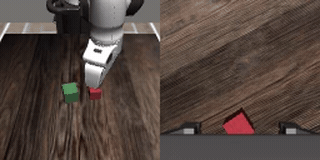

### MimicGen

This package provides the [MimicGen](https://github.com/NVlabs/mimicgen) manipulation simulation
base (robosuite 1.4 / MuJoCo, rendered headless via EGL with an OSMesa software fallback) as a
Ryzer on AMD Ryzen AI Max+ 395 (Strix Halo, gfx1151) under ROCm 7.14. It exposes a model-agnostic
`sim_mimicgen.Policy` seam (selected at runtime by `POLICY_FACTORY`, driving robosuite's OSC_POSE
7-D end-effector delta) that WAM and VLA packages chain on for closed-loop rollouts across the nine
MimicGen core tasks (coffee, square, stack, stack_three). It ships no policy or model weights; the
built-in `RandomPolicy` is a headless sign-of-life.

### Build

```sh
ryzers build simulation/mimicgen
ryzers run     # test.py: ROCm torch + sim import sign-of-life
```

Task hdf5 (env config plus demo initial states) are fetched at run time from
`amandlek/mimicgen_datasets` into the `/sim_data` mount, never baked into the image.

### Example: MimicGen with VERA

Chain the VERA video-to-action policy on the sim base and run a closed-loop rollout. VERA serves its
policy over a websocket and the sim base steps the env against it across the `Policy` seam.

```sh
ryzers build simulation/mimicgen vera
ryzers run --name vera-mimicgen /ryzers/demos/demo_closedloop_mimicgen.sh
```

<p align="center">
  
  <br><em>VERA closed-loop rollout in MimicGen (agentview left, wrist view right).</em>
</p>

### References

- Upstream: https://github.com/NVlabs/mimicgen (MimicGen; robosuite / robomimic / MuJoCo)
- Eval harness: https://github.com/sizhe-li/VERA (reused unchanged; pinned in `docs/UPSTREAM_PIN.commit.txt`)
- Datasets: `amandlek/mimicgen_datasets` (fetched at run time, not re-hosted)

Copyright (C) 2026 Advanced Micro Devices, Inc. All rights reserved.
SPDX-License-Identifier: MIT
