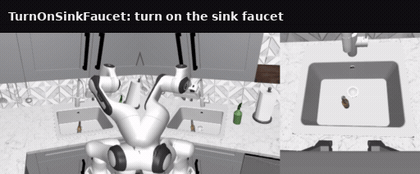

### RoboCasa

This package provides the [RoboCasa](https://github.com/robocasa/robocasa) kitchen
manipulation simulation base (robosuite v1.5 / MuJoCo, headless EGL) as a Ryzer on AMD Ryzen
AI Max+ 395 (Strix Halo, gfx1151) under ROCm 7.14. It exposes a model-agnostic `Policy` seam
(`sim_robocasa.Policy`, selected at runtime by `POLICY_FACTORY`, driving robosuite's OSC_POSE
7-D end-effector delta) that WAM and VLA packages chain on for closed-loop and interactive
rollouts.

### Build

```sh
ryzers build simulation/robocasa
ryzers run     # test.py: sim import + headless render sign-of-life
```

### Example: RoboCasa with X-WAM

```sh
ryzers build simulation/robocasa xwam
ryzers run --name xwam-robocasa /ryzers/demos/demo_closedloop_robocasa.sh
```

<p align="center">
  
  <br><em>X-WAM closed-loop rollout in RoboCasa (TurnOnSinkFaucet, 9/10 over 10 seeds).</em>
</p>

### References

- Upstream: https://github.com/robocasa/robocasa (with robosuite; both pinned in `docs/UPSTREAM_PIN.commit.txt`)

Copyright (C) 2026 Advanced Micro Devices, Inc. All rights reserved.
SPDX-License-Identifier: MIT
