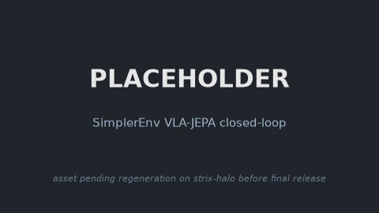

### SimplerEnv

This package provides the [SimplerEnv](https://github.com/simpler-env/SimplerEnv) real-to-sim
evaluation suite as a simulation base on AMD Ryzen AI Max+ 395 (Strix Halo, gfx1151) under
ROCm 7.14. The backend is ManiSkill2 real2sim on SAPIEN 2 with CPU physics and offscreen Vulkan
rendering, evaluating manipulation policies across the Google Robot and WidowX+Bridge embodiments
through a uniform Gym API. It exposes a model-agnostic `Policy` seam
(`sim_simplerenv.Policy.predict_action_chunk(obs, instruction) -> [T, 7]`, selected by
`POLICY_FACTORY`, default `RandomPolicy`) that WAM and VLA packages chain on for closed-loop and
interactive rollouts.

### Build

```sh
ryzers build simulation/simplerenv
ryzers run                                      # test.py: SAPIEN + ManiSkill2 + SimplerEnv import sign-of-life
ryzers run /ryzers/demos/demo_sim_sanity.sh     # headless RandomPolicy rollout -> MP4 (render check)
```

### Example: SimplerEnv with VLA-JEPA

```sh
ryzers build simulation/simplerenv vlajepa
ryzers run --name vlajepa-simplerenv /ryzers/demos/demo_closedloop_simplerenv.sh
```

<!-- TODO(release): regenerate on strix-halo; see docs/RELEASE_TODO.md -->
<p align="center">
  
  <br><em>PLACEHOLDER: VLA-JEPA closed-loop rollout in SimplerEnv, pending regeneration on strix-halo.</em>
</p>

### References

- Upstream: https://github.com/simpler-env/SimplerEnv (pinned in `docs/UPSTREAM_PIN.commit.txt`)

Copyright (C) 2026 Advanced Micro Devices, Inc. All rights reserved.
SPDX-License-Identifier: MIT
