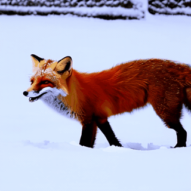
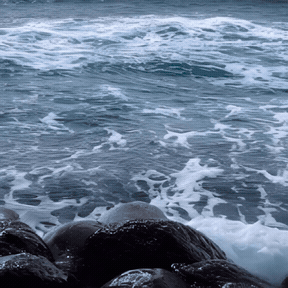
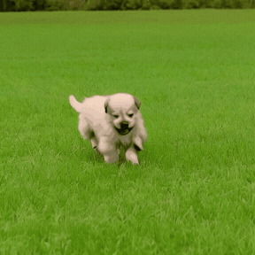
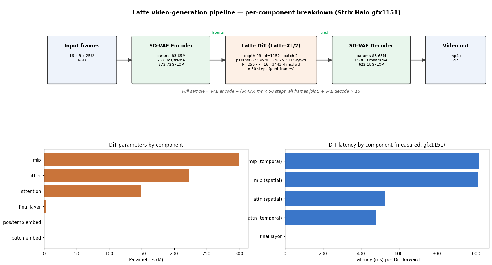

### Latte

This package runs [Latte](https://github.com/Vchitect/Latte) on AMD Ryzen AI Max+ 395
(Strix Halo, `gfx1151`) under ROCm 7.14. Latte is a latent-diffusion video-generation
transformer: a DiT with factorized spatial and temporal attention that denoises every frame
of a clip jointly, decoded by an SD-VAE, with a T5 text encoder on the text-to-video path.
This is a direct PyTorch port: the upstream code runs on the base image's ROCm torch, the
conda/CUDA stack is dropped, and only minimal ROCm source patches are applied.

Two generation paths share the same image:

- Class-conditional and unconditional (`sample/sample.py`): `ffs`, `sky`, `taichi`
  (unconditional) and `ucf101` (101-class). Weights: HF `maxin-cn/Latte`.
- Text-to-video and text-to-image (`sample/sample_t2x.py`, T5 text encoder + SD-VAE):
  `t2v`, `t2i`. Weights: HF `maxin-cn/Latte-1`.

### Build

```sh
ryzers build latte --name latte
ryzers run --name latte                 # test.py: ROCm torch + GPU + imports + DiT forward (math & SDPA)
```

Weights are fetched at runtime into the mounted models dir, never re-hosted:

```sh
WHICH=class ryzers run --name latte /ryzers/scripts/download_checkpoints.sh   # ffs/sky/taichi/ucf101 + SD-VAE
WHICH=t2v   ryzers run --name latte /ryzers/scripts/download_checkpoints.sh   # T2V/T2I transformer + T5 + SD-VAE
```

Artifacts are written to `workspace/latte/outputs`. Set `HF_TOKEN` for faster or gated downloads.

### Demos

| Demo | What it does |
|---|---|
| `demos/demo_t2v.sh` | Text-to-video / text-to-image with every generation knob as an env var (see below). |
| `demos/demo_t2x.sh` | T2V/T2I off the upstream YAML config (`TASK=t2v\|t2i`, optional `PROMPT`). |
| `demos/demo_class.sh` | Class-conditional / unconditional clip (`DATASET=ffs\|sky\|taichi\|ucf101`) to `sample.mp4`. |

```sh
PROMPT="a corgi running on the beach at sunset" ryzers run --name latte /ryzers/demos/demo_t2v.sh
DATASET=sky NUM_SAMPLING_STEPS=50 SAMPLE_METHOD=ddim ryzers run --name latte /ryzers/demos/demo_class.sh
```

### Text-to-video

16-frame clips generated on Strix Halo (`gfx1151`) at 512x512 with 50-step DDIM and the
temporal VAE decoder. Previews are downscaled and slowed from the 8 fps source.

<p align="center">
  
  
  
  <br><em>a red fox walking in snow, waves crashing on a rocky shore, a campfire burning at night</em>
</p>
<p align="center">
  
  
  
  <br><em>a waterfall in a green forest, a puppy running across a grass field, northern lights over a snowy field</em>
</p>

### Useful knobs

`demos/demo_t2v.sh` exposes every generation control as an env var:

| Knob | Default | Meaning |
|---|---|---|
| `PROMPT` | demo prompt | text prompt |
| `STEPS` | 50 | diffusion sampling steps |
| `RESOLUTION` | 512x512 | `HxW`, each divisible by 8 |
| `FRAMES` | 16 | `video_length`; `1` gives text-to-image |
| `GUIDANCE` | 7.5 | classifier-free guidance scale |
| `METHOD` | DDIM | sampler (DDIM/DDPM/PNDM/EulerDiscrete/DPMSolverMultistep) |
| `SEED` | 0 | reproducible seed |
| `FPS` | 8 | output mp4 frame rate |
| `TEMPORAL_VAE` | on for video | SVD temporal VAE decoder (less flicker, slower) |
| `TEMPORAL_ATTN` | 1 | temporal attention blocks |
| `FP16` | 1 | compute precision (`0` gives fp32) |

Class demos take `DATASET`, `NUM_SAMPLING_STEPS`, `SAMPLE_METHOD` (`ddpm|ddim`) and `SEED`.
`HF_TOKEN` speeds up or unlocks gated downloads.

### Optimization

fp32 with `math` attention to fp16 with SDPA is about 15x faster per DiT forward (4789 ms to
311 ms on `gfx1151`) and quality-neutral: PSNR 59.8 dB, SSIM 0.99998 and FVD 0.08 between the
SDPA and `math` references over 6 Sky clips. The port also fixes an upstream flash-attention
reshape bug (a missing `.transpose(1, 2)`, cos-sim 0.38 to 1.0). Decoding the SD-VAE per frame
instead of with the SVD temporal decoder cuts a 512x512 text-to-video clip about 3.4x end to
end (`TEMPORAL_VAE=0`). Full study in `RUNTIME_OPTIMIZATION.md`.

<p align="center">
  
  <br><em>Latte pipeline with per-component DiT parameters and measured latency on Strix Halo (gfx1151).</em>
</p>

### References

- Upstream: https://github.com/Vchitect/Latte (pinned in `docs/UPSTREAM_PIN.commit.txt`)
- Paper: https://arxiv.org/abs/2401.03048
- Checkpoints: https://huggingface.co/maxin-cn/Latte-1 (text-to-video / text-to-image), https://huggingface.co/maxin-cn/Latte (class-conditional)

Copyright (C) 2026 Advanced Micro Devices, Inc. All rights reserved.
SPDX-License-Identifier: MIT
