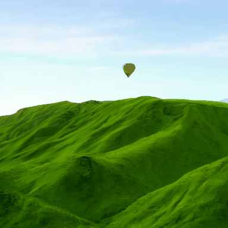
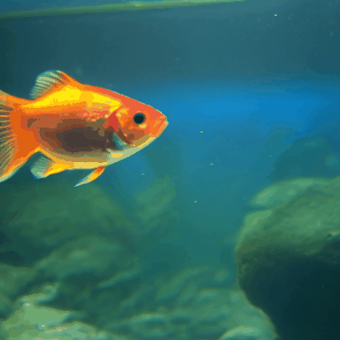
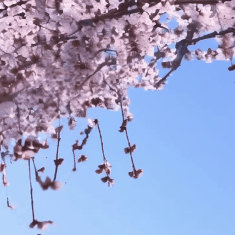
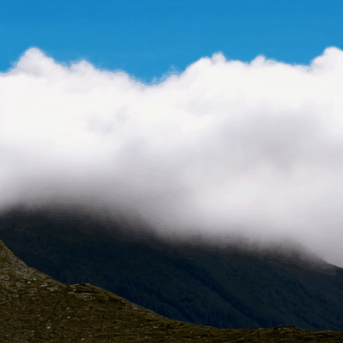

### Latte

This package runs [Latte](https://github.com/Vchitect/Latte) — a **latent-diffusion
video-generation DiT** (Latent Diffusion Transformer with factorized spatial/temporal attention)
— on AMD Ryzen AI Max+ 395 (Strix Halo, `gfx1151`) under ROCm 7.2.2. Direct PyTorch port: the
upstream code runs on the base image's ROCm torch; the conda/CUDA stack (`environment.yml`:
`pytorch-cuda` + nvidia channel) is dropped and only the minimal ROCm source patches are applied.

Latte has two generation paths, both near-pure PyTorch and served by the same image:

- **Class-conditional / unconditional** (`sample/sample.py` + `diffusion/`, `models/latte.py`):
  `ffs`, `sky`, `taichi` (unconditional) and `ucf101` (101-class). Weights: HF `maxin-cn/Latte`.
- **Text-to-video / text-to-image** (`sample/sample_t2x.py` + `sample/pipeline_latte.py`,
  `models/latte_t2v.py`; T5 text encoder + SD-VAE): `t2v`, `t2i`. Weights: HF `maxin-cn/Latte-1`.

It lives in the **`vidgen/`** category (video generation), alongside `nano-world-model`.

### Build

```sh
ryzers build latte --name latte
ryzers run --name latte                 # test.py: ROCm torch + GPU + import + DiT forward (math & SDPA)
```

Weights are fetched at runtime into the mounted models dir (never re-hosted, rule 8):

```sh
WHICH=class ryzers run --name latte /ryzers/scripts/download_checkpoints.sh   # ffs/sky/ucf101/taichi + SD-VAE
WHICH=t2v   ryzers run --name latte /ryzers/scripts/download_checkpoints.sh   # T2V/T2I transformer + T5 + SD-VAE
```

### Demos

| Demo | What it does |
|---|---|
| `demos/demo_t2v.sh` | **Text-to-video / text-to-image entrypoint** exposing every upstream generation knob (see below). |
| `demos/demo_class.sh` | Class/unconditional video (`DATASET=ffs\|sky\|taichi\|ucf101`) → `sample.mp4`. |
| `demos/demo_t2x.sh` | Minimal T2V/T2I runner off the upstream YAML config (`TASK=t2v\|t2i`, optional `PROMPT=...`). |

```sh
DATASET=sky NUM_SAMPLING_STEPS=50 SAMPLE_METHOD=ddim ryzers run --name latte /ryzers/demos/demo_class.sh
PROMPT="a corgi running on the beach" ryzers run --name latte /ryzers/demos/demo_t2v.sh
```

`demo_t2v.sh` (thin wrapper over `demos/demo_t2v.py`, built on the upstream `LattePipeline`)
exposes all generation controls as env vars — probe the model before committing:

| Knob | Default | Meaning |
|---|---|---|
| `PROMPT` | demo prompt | text prompt |
| `STEPS` | 50 | diffusion sampling steps |
| `RESOLUTION` | 512x512 | `HxW`, each divisible by 8 |
| `FRAMES` | 16 | `video_length`; `1` ⇒ text-to-image |
| `GUIDANCE` | 7.5 | classifier-free guidance scale |
| `METHOD` | DDIM | sampler (DDIM/DDPM/PNDM/EulerDiscrete/DPMSolverMultistep/…) |
| `SEED` | 0 | reproducible seed (wired via `torch.Generator`) |
| `FPS` | 8 | output mp4 frame rate |
| `TEMPORAL_VAE` | video:on | SVD temporal VAE decoder (less flicker) |
| `TEMPORAL_ATTN` | 1 | temporal attention blocks |
| `FP16` | 1 | compute precision (`0` ⇒ fp32) |

```sh
# 30-step DPM-Solver, 320x512, 16 frames, custom prompt/seed:
PROMPT="a corgi running on the beach at sunset" STEPS=30 METHOD=DPMSolverMultistep \
  RESOLUTION=320x512 FRAMES=16 SEED=42 ryzers run --name latte /ryzers/demos/demo_t2v.sh
# text-to-image (single frame):
PROMPT="an astronaut riding a horse, photorealistic" FRAMES=1 ryzers run --name latte /ryzers/demos/demo_t2v.sh
```

### Samples

16-frame text-to-video clips generated on Strix Halo (`gfx1151`, ROCm) with
`demos/demo_t2v.sh` — 512×512, 50-step DDIM, temporal VAE decoder, ~9.7 min/clip.
GIFs are downscaled to 384 px and slowed to ~4.5 fps for preview (source is 8 fps).

| | | |
|---|---|---|
| <br>*a red fox walking in snow* | <br>*waves crashing on a rocky shore* | <br>*a campfire burning at night* |
| <br>*a hot air balloon over green hills* | <br>*a goldfish swimming in a tank* | <br>*cherry blossoms falling in the wind* |
| <br>*a waterfall in a green forest* | <br>*a candle flame flickering in the dark* | <br>*clouds drifting over a mountain peak* |
| <br>*a puppy running across a grass field* | <br>*steam rising from a cup of coffee* | <br>*northern lights over a snowy field* |

### Strix Halo optimization

`demos/model_analysis.py` (per-component params/FLOPs/latency + system diagram),
`demos/knob_sweep.py` (precision × attention-backend grid), and the quality gate
`patches/opt/parity_test.py`. Headline result: **fp16/bf16 + SDPA attention ≈ 15× faster** DiT
forward than the fp32+math baseline, **quality-neutral** (PSNR 59.8 dB, FVD ≈ 0.08 vs the `math`
reference). The port also fixes an upstream `flash`-attention reshape bug (missing `.transpose(1,2)`,
cos-sim 0.38 → 1.0). Full details and numbers in `docs/OPTIMIZATIONS.md`.

### Evaluation metrics (FVD / FID / IS)

The StyleGAN3-based metric stack (`tools/metrics`, `tools/torch_utils`) runs on ROCm: the custom
`bias_act`/`upfirdn2d` ops fall back to the pure-torch reference (the compiled path rejects
`--use_fast_math` on ROCm clang), and the I3D / InceptionV3 detectors run on the iGPU. The port
fixes a stale dataset class name, adds a 16-frame `fvd_16f` metric, and a small-N inception-score
NaN. Self-consistency (real=fake → FVD/FID ≈ 0) validates the pipeline end-to-end.

### References

- Upstream: https://github.com/Vchitect/Latte (pinned in `docs/UPSTREAM_PIN.commit.txt`)
- Paper: https://arxiv.org/abs/2401.03048
- Checkpoints: https://huggingface.co/maxin-cn/Latte-1 · https://huggingface.co/maxin-cn/Latte

Copyright (C) 2026 Advanced Micro Devices, Inc. All rights reserved.
SPDX-License-Identifier: MIT
