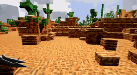
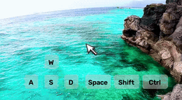
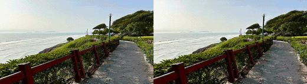
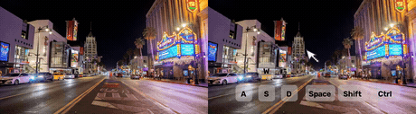

### Micro-World

This package runs [Micro-World](https://github.com/AMD-AGI/Micro-World) on AMD Ryzen AI Max+ 395
(Strix Halo, `gfx1151`) under ROCm 7.14. Micro-World is a Wan2.1 / VideoX-Fun-derived,
action-controlled interactive world model (T5 text encoder, CLIP image encoder, conv3d WAN VAE, and
a Wan DiT) with first-person keyboard-and-mouse control: a 1.3B text path and a 14B image path. This
is a direct PyTorch port: upstream runs on the base image's ROCm torch, flash-attn is omitted, and
the DiT attention and CLIP image encoder fall back to torch SDPA on `gfx1151` (see
`patches/rocm_port.py`).

Four inference modes, each reproduced by the env-driven `demos/mw_generate.py` (no in-place upstream
edits):

- `t2v`: text to video (Wan2.1-T2V-1.3B baseline, no action control).
- `t2w`: text to world, action-controlled (`WanActionControlNetModel` on the 1.3B base).
- `i2v`: image to video (Wan2.1-I2V-14B-480P inpaint, CLIP-primed).
- `i2w`: image to world, action-controlled (`WanActionAdaLNModel` plus LoRA on the 14B base).

Action schedule format: `[[end_frame, "w s a d shift ctrl _ mouse_y mouse_x"], ..., "space_frames"]`
(the trailing string marks free/idle frames); it is auto-clamped to the effective clip length.

### Build

```sh
ryzers build --name micro-world micro-world   # model sign-of-life + video-gen demos
ryzers run --name micro-world                 # test.py: ROCm torch + GPU + import smoke
```

Artifacts are written to `workspace/micro-world/outputs`. Set `HF_TOKEN` for faster or gated
downloads. Weights are fetched on the first model run.

### Weights

`WHICH` selects the subset to fetch into the mounted model volume (present dirs are verified and
skipped):

```sh
WHICH=t2v ryzers run --name micro-world /ryzers/scripts/download_checkpoints.sh   # Wan2.1-T2V-1.3B
WHICH=t2w ryzers run --name micro-world /ryzers/scripts/download_checkpoints.sh   # + amd/Micro-World-T2W (default)
WHICH=i2v ryzers run --name micro-world /ryzers/scripts/download_checkpoints.sh   # Wan2.1-I2V-14B-480P
WHICH=i2w ryzers run --name micro-world /ryzers/scripts/download_checkpoints.sh   # + amd/Micro-World-I2W
```

`mw-t2w` / `mw-i2w` fetch only the AMD adapters (reuse an already-present base); `all` fetches
everything.

### Demos

| Demo | Needs | What it does |
|---|---|---|
| `demos/demo_t2v.sh` | `WHICH=t2v` | Text to video, single-column MP4. |
| `demos/demo_t2w_action.sh` | `WHICH=t2w` | Text to world, action-controlled, single-column MP4 with key/mouse HUD. |
| `demos/demo_i2v.sh` | `WHICH=i2v` | Image to video, two-column reference and generated. |
| `demos/demo_i2w_action.sh` | `WHICH=i2w` | Image to world, action-controlled, two-column reference and generated. |

```sh
ryzers run --name micro-world /ryzers/demos/demo_t2v.sh
# 14B image paths default to model_cpu_offload (full residency exceeds the ~47 GB GPU pool):
GPU_MEMORY_MODE=model_cpu_offload ryzers run --name micro-world /ryzers/demos/demo_i2w_action.sh
```

### Text to video and text to world

Both text paths are pure generations with no reference. `t2v` is the plain Wan2.1-T2V-1.3B baseline;
`t2w` adds a ControlNet so the video follows a key/mouse action schedule (shown as the on-screen HUD).

<p align="center">
  
  
  <br><em>Left: t2v text to video. Right: t2w action-controlled text to world, with the key/mouse HUD.</em>
</p>

### Image to video and image to world

The image paths start from a single reference frame (CLIP-primed, 14B). The reference frame is on the
left and the generated video on the right; `i2w` adds action control (HUD).

<p align="center">
  
  <br><em>i2v image to video: reference frame (left), generated video (right).</em>
</p>
<p align="center">
  
  <br><em>i2w action-controlled image to world: reference frame (left), generated video (right) with the key/mouse HUD.</em>
</p>

### Useful knobs

Override from the host: `VAR=... ryzers run --name micro-world /ryzers/demos/demo_*.sh`.

- Generation: `PROMPT`, `NEGATIVE_PROMPT`, `ACTION_LIST` (json), `REF_IMAGE`, `SAMPLE_SIZE` (`H,W`),
  `VIDEO_LENGTH`, `NUM_STEPS`, `GUIDANCE_SCALE`, `SAMPLER` (`Flow_Unipc`/`Flow_DPM++`/`Flow`), `SHIFT`,
  `SEED`, `FPS`.
- Memory: `GPU_MEMORY_MODE` (`model_full_load` / `model_cpu_offload` / `sequential_cpu_offload`). The
  1.3B t2v/t2w paths run `model_full_load` (peak ~18 GB); the 14B i2v/i2w paths default to
  `model_cpu_offload` because full residency exceeds the box's ~47 GB GPU-addressable memory.
- Speed: `TEACACHE` (default on), `TEACACHE_THRESHOLD` (per-mode 0.10/0.20), `NUM_SKIP_START_STEPS`,
  `CFG_SKIP_RATIO`, `MW_DISABLE_CUDNN` (conv3d override, default 1).
- Weights: `TRANSFORMER_PATH`, `LORA_PATH`, `LORA_WEIGHT`, `BASE_MODEL`. `HF_TOKEN` for downloads.

### Optimization

Micro-World is dominated by the DiT denoise loop (about 92.7%, 52.2 s of 56.3 s on the t2v-1.3B
proxy; WAN VAE 5.5%, T5 1.8%). Built-in TeaCache ships default-on with per-mode thresholds (t2v/i2v
0.10, t2w/i2w 0.20) for about 1.51x at PSNR 23.0 dB, or 2.09x at 20.3 dB with threshold 0.20. The
conv3d override (`MW_DISABLE_CUDNN=1`) gives a 1.49x VAE-decode speedup that grows on the 49-frame
image paths. UniPC runs 30 steps by default (`NUM_STEPS=20` for about 1.45x at solid quality).
Cross-attn K/V caching is bit-exact but shows no measured gain on this self-attention-bound DiT, so
it is not baked in. See `RUNTIME_OPTIMIZATION.md` for the full study.

```sh
# component profile + conv/steps/teacache/kv A/B on the cheap t2v-1.3B proxy -> mw_opt_ab.json:
ryzers run --name micro-world bash -lc 'cd /repos/micro-world && python /ryzers/scripts/opt_ab_microworld.py'
```

### References

- Upstream: https://github.com/AMD-AGI/Micro-World (pinned in `docs/UPSTREAM_PIN.commit.txt`)
- Model: https://huggingface.co/amd/Micro-World-T2W, https://huggingface.co/amd/Micro-World-I2W
- Bases: https://huggingface.co/Wan-AI/Wan2.1-T2V-1.3B, https://huggingface.co/Wan-AI/Wan2.1-I2V-14B-480P

Copyright (C) 2026 Advanced Micro Devices, Inc. All rights reserved.
SPDX-License-Identifier: MIT
