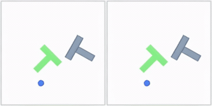
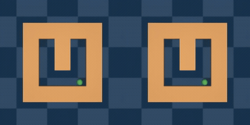
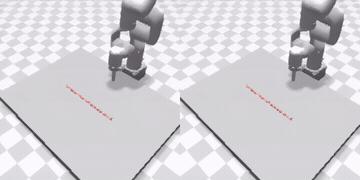
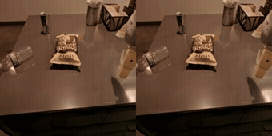
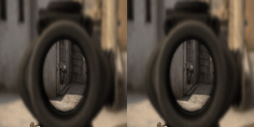
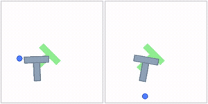
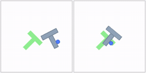
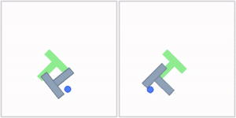
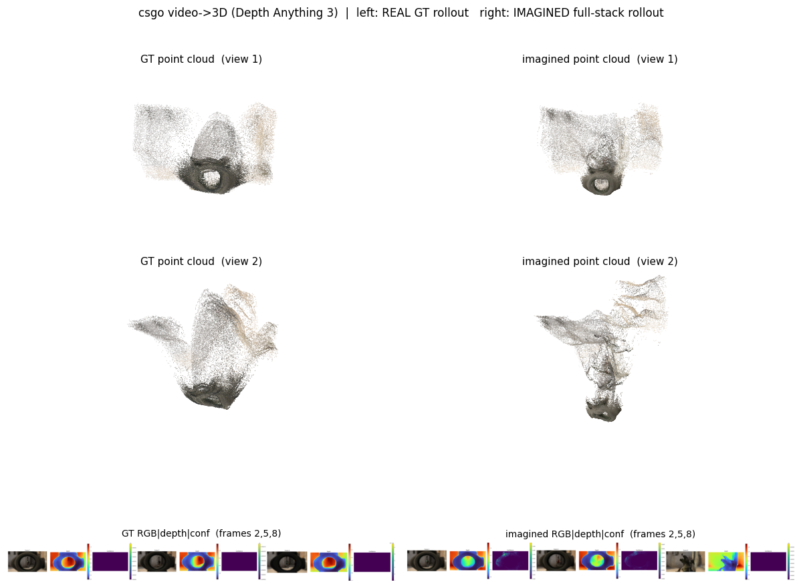
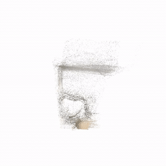

### Nano World Model

This package runs [Nano World Model](https://github.com/simchowitzlabpublic/nano-world-model) on
AMD Ryzen AI Max+ 395 (Strix Halo, `gfx1151`) under ROCm 7.14. Nano World Model (NanoWM) is a
minimalist diffusion-forcing video world model (Latte-style DiT over an SD-VAE latent codec, DFoT /
DINO-WM lineage) that generates future frames autoregressively from a short frame history plus
optional actions. It ships two scales, NanoWM-B/2 (158.6M) and NanoWM-L/2 (558.7M), across DINO-WM
control and deformable domains (PushT, point maze, wall, rope, granular), RT-1 real-robot video, and
CSGO video-game video. This is a direct PyTorch port: upstream runs on the base image's ROCm torch
and only the conda/CUDA torch pins are stripped.

NanoWM ships no simulator. The rollout, planning, and video-to-3D demos all run standalone on the
plain ROCm base.

### Build

```sh
ryzers build nano-world-model --name nanowm
ryzers run --name nanowm                 # test.py: ROCm torch + GPU + NanoWM import sign-of-life
```

Artifacts are written to `workspace/nanowm/outputs`. Weights and datasets are fetched at runtime
into the mounted HF cache (never re-hosted). Set `HF_TOKEN` for faster or gated downloads.

```sh
ryzers run --name nanowm /ryzers/scripts/download_checkpoints.sh   # a released HF checkpoint (+ SD-VAE codec)
ryzers run --name nanowm /ryzers/scripts/download_datasets.sh      # dataset context frames
```

### Demos

| Demo | Base | What it does |
|---|---|---|
| `demos/demo_rollout.sh` | plain | Autoregressive world-model rollout for a `DOMAIN`; writes gen, ground-truth, and comparison mp4 plus timing. |
| `demos/demo_planning.sh` | plain | CEM/MPC planning over the world model on PushT; writes planned episode mp4 plus metrics. |
| `demos/demo_video_to_3d.sh` | plain | Lift a generated rollout to a 3D point cloud with Depth Anything 3; per-frame depth-vis PNGs plus a PLY. |

```sh
DOMAIN=dino_wm_pusht NUM_SAMPLES=4 ROLLOUT_LENGTH=16 \
  ryzers run --name nanowm /ryzers/demos/demo_rollout.sh
```

### World-model rollout

Autoregressive rollout at 50 DDIM steps, one frame per sliding window. A 16-frame DINO-WM rollout
runs about 107 s/sample on gfx1151. On PushT the generated frames track ground truth at PSNR 35.1
and SSIM 0.986.

<p align="center">
  
  
  
  
  <br><em>Ground truth (left) vs generated (right): PushT (control), point maze (navigation), rope (deformable), RT-1 (real robot).</em>
</p>

The largest checkpoint, NanoWM-L/2 (558.7M), rolls out the CSGO video-game domain. This is the
hardest, highest-entropy domain (gen-vs-GT PSNR 16.5).

<p align="center">
  
  <br><em>CSGO video-game rollout, ground truth (left) vs generated (right).</em>
</p>

### Planning

CEM/MPC planning over the world model on PushT: the model rolls out candidate action plans to push
the T-block toward its goal pose (horizon 5, replan every 5).

<p align="center">
  
  
  
  <br><em>Planned PushT episodes (achieved pose left, goal pose right).</em>
</p>

### Video to 3D

A generated rollout is lifted to a colored point cloud with Depth Anything 3, giving per-frame depth
plus a novel-view reconstruction of the imagined scene.

<p align="center">
  
  <br><em>CSGO video-to-3D: point cloud from the ground-truth rollout (left) vs the generated rollout (right).</em>
</p>
<p align="center">
  
  <br><em>Orbiting the reconstructed point cloud of a generated CSGO rollout.</em>
</p>

### Useful knobs

- `DOMAIN`: rollout checkpoint and domain (`dino_wm_{point_maze,pusht,wall,rope,granular}`, `rt1`, `csgo`).
- `NUM_SAMPLES`, `ROLLOUT_LENGTH`, `HISTORY_LENGTH`: rollout size (history is auto-derived from the checkpoint if unset).
- `NUM_SAMPLING_STEPS`: DDIM steps, default 50; fewer trades speed for quality.
- `SCHEDULING_MODE` (default `sequential`), `SEED`, `FPS`.
- Planning: `PLANNING_PROFILE` (`fast`/`default`/`paper` CEM budget), `ENV_NAME` (`pusht`/`point_maze`).
- Video-to-3D: `DA3_MODEL`, `MAX_FRAMES`, `VIDEO` (input rollout clip).
- `HF_TOKEN` for faster or gated downloads.
- An inference-optimization study (bf16 DiT, causal-window trim, context KV cache, fewer steps) is documented in `RUNTIME_OPTIMIZATION.md`, with a measured up to 54x (CSGO L/2) per-generated-frame DiT speedup, rising to 104x with fewer sampling steps, at unchanged output quality. The exact fp32 full-window path stays the shipped default.

### References

- Upstream: https://github.com/simchowitzlabpublic/nano-world-model (pinned in `docs/UPSTREAM_PIN.commit.txt`)
- Paper: https://arxiv.org/abs/2605.23993
- Checkpoints: https://huggingface.co/collections/knightnemo/nano-world-model
- Datasets: DINO-WM (https://osf.io/bmw48), RT-1 fractal (https://huggingface.co/datasets/IPEC-COMMUNITY/fractal20220817_data_lerobot), CSGO (https://huggingface.co/datasets/teapearce/CounterStrike_Deathmatch)

Copyright (C) 2026 Advanced Micro Devices, Inc. All rights reserved.
SPDX-License-Identifier: MIT
