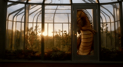
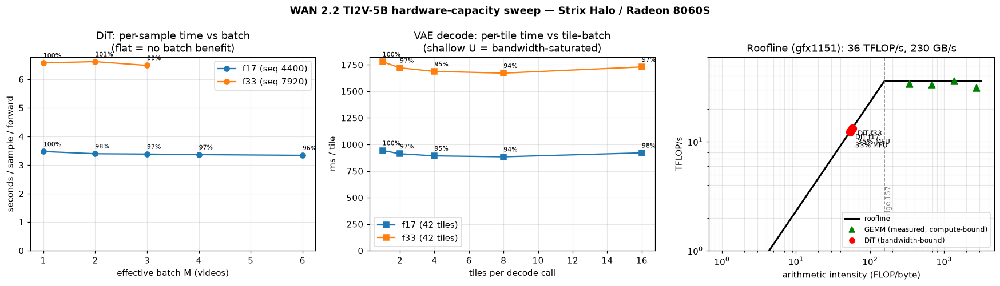

### WAN 2.2

This package runs [Wan2.2-TI2V-5B](https://github.com/Wan-Video/Wan2.2) on AMD Ryzen AI Max+
395 (Strix Halo, gfx1151) under ROCm 7.14. Wan2.2-TI2V-5B is a 5B text-and-image-to-video
diffusion model (UMT5-XXL text encoder, Wan 2.2 VAE, and a video DiT) that generates native
1280x704 clips at 24 fps: text-to-video from a prompt alone, or image-to-video from a prompt
plus one conditioning image. This is a direct PyTorch port that runs on the base image's ROCm
torch with a Triton `flash_attn` shim and a feathered-overlap tiled VAE decode for Strix Halo.

### Build

```sh
ryzers build wan22                       # build the WAN 2.2 image
ryzers run                               # smoke test: ROCm torch, SDPA, flash_attn shim, WAN TI2V config, mp4 write
```

Weights are not baked into the image. The `Wan-AI/Wan2.2-TI2V-5B` checkpoint is downloaded once
into the persistent `/models` volume and reused. Fetch it explicitly, or let the first
generation auto-download it. Set `HF_TOKEN` if the model is gated. Artifacts are written to
`workspace/wan22/outputs`.

```sh
ryzers run /ryzers/download_wan22.sh     # download Wan-AI/Wan2.2-TI2V-5B into /models
```

### Demos

| Demo | Base | What it does |
|---|---|---|
| `demo_wan22.sh` | plain | Text-to-video: generate a clip from a text prompt. |
| `demo_wan22.sh` with `IMAGE` | plain | Image-to-video: first frame anchored to the input image, prompt drives the motion. |

### Text-to-video

Generate a 1280x704 clip from a prompt. `FRAME_NUM` must be `4n+1` (121 frames is about 5 s at
24 fps); `SAMPLE_STEPS` defaults to 50.

```sh
PROMPT="A cinematic amber dragon coiled inside a glass greenhouse at dawn, soft volumetric light, gentle camera push-in, fantasy realism." \
SIZE=1280x704 FRAME_NUM=121 SAMPLE_STEPS=50 \
ryzers run /ryzers/demo_wan22.sh
```

<p align="center">
  
  <br><em>Text-to-video: "A cinematic amber dragon coiled inside a glass greenhouse at dawn."</em>
</p>

### Image-to-video

Provide `IMAGE` to seed generation from a conditioning image. The first frame is anchored to the
image and the prompt drives the motion. Mode auto-detects when `IMAGE` is set (force with
`MODE=i2v`).

```sh
PROMPT="Two anthropomorphic cats in boxing gear trade rapid combinations on a spotlighted stage, footwork and dodges, dynamic motion, cinematic lighting." \
IMAGE=/outputs/i2v_condition.png \
SIZE=1280x704 FRAME_NUM=121 SAMPLE_STEPS=50 \
ryzers run /ryzers/demo_wan22.sh
```

<p align="center">
  
  
  <br><em>Image-to-video: conditioning image (left) and the generated 121-frame clip (right).</em>
</p>

### Useful knobs

- `PROMPT` or `PROMPT_FILE`: text prompt (required).
- `IMAGE`: conditioning image path; enables image-to-video.
- `MODE`: `auto` (default), `t2v`, or `i2v`.
- `SIZE`: `1280x704` or `704x1280`.
- `FRAME_NUM`: WAN frame count, must be `4n+1`; or `DURATION_SECONDS` for the nearest valid count.
- `SAMPLE_STEPS`: denoise steps (default 50).
- `SEED`: default 20260525.
- `SAVE_FILE`: output path (default under `/outputs`).
- `BENCHMARK_JSON`: write per-stage timing and optimization flags.
- `HF_TOKEN`: for gated or faster downloads.

### Optimization

The lossless fast route ships default-on: bf16 VAE decode, 12x12 feathered-overlap tiled decode
(a 4-cell / 64px cross-faded overlap so tile seams stay invisible), batched tile decode, and a
bit-exact text and cross-attention K/V cache. On a 17-frame, 10-step 1280x704 bench this is about
6.05x faster end to end (683 s to 113 s), rising to about 7.0x with fewer steps. A full 121-frame,
50-step 1280x704 image-to-video clip generates in about 62 min (DiT about 55 min, feathered bf16
tiled VAE decode about 6.6 min); text-to-video of the same size and steps is comparable. The
pipeline is memory-bandwidth-bound on this device, so batching whole videos buys under 6 percent.
`RUNTIME_OPTIMIZATION.md` records the levers measured and rejected as defaults (torch.compile, K/V token
merging, whole-video batching, temporal-delta decode, sparse conv).

<p align="center">
  
  <br><em>Capacity sweep: the DiT and tiled VAE both sit on the 230 GB/s memory-bandwidth roofline, so per-sample time stays flat with batch.</em>
</p>

### References

- Upstream: https://github.com/Wan-Video/Wan2.2 (pinned in `docs/UPSTREAM_PIN.commit.txt`)
- Model: https://huggingface.co/Wan-AI/Wan2.2-TI2V-5B

Copyright (C) 2026 Advanced Micro Devices, Inc. All rights reserved.
SPDX-License-Identifier: MIT
