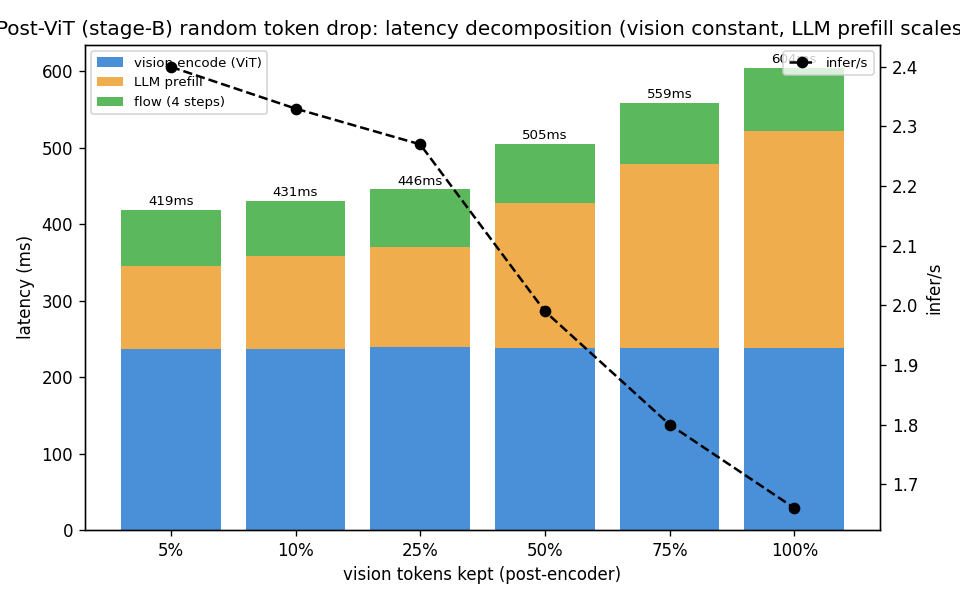
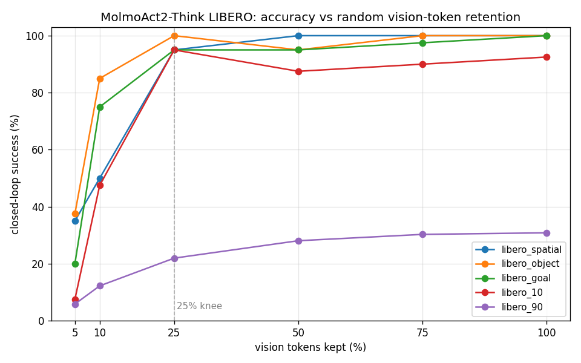
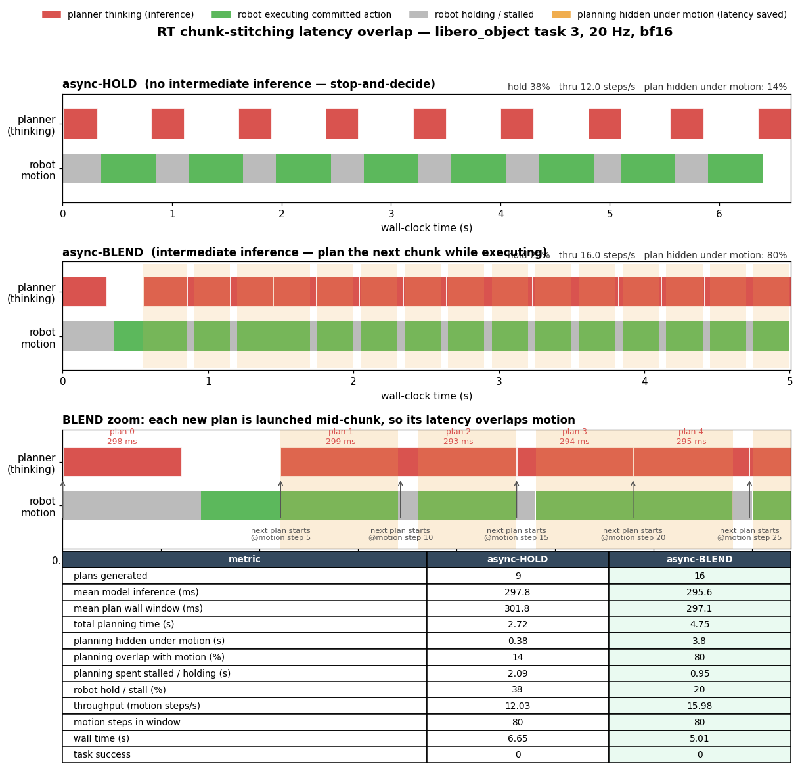

# MolmoAct2 on Strix Halo — Vision-Token Efficiency & Real-Time Action Blending

> **Research track (not shipped in Ryzers).** This document extends the MolmoAct2 VLA
> port that we upstreamed in the `feat/molmoact2-vla-strix` branch (the PR'd Ryzers
> package: smoke test, DROID open-loop, LIBERO closed-loop, synchronous + real-time
> interactive demos, and UR5e/xArm6 cross-embodiment). Everything below lives on the
> `research/rt-chunk-stitching` branch and builds *on top of* that package. The goal is
> a single research lever: **make planning latency drop below execution latency so the
> robot stops freezing mid-task and moves in real time.**

All numbers are MolmoAct2-Think-LIBERO, **bf16 fast path** (depth reasoning off,
`num_steps=4` flow steps), 20 Hz control, on the AMD Strix Halo (gfx1151) box.

---

## Where we started (the PR'd baseline)

The shipped real-time demo plans an action *chunk*, executes it, then **stops to
plan the next one**. At bf16 a single plan is ~600 ms end-to-end. Because the robot
holds its pose while the model thinks, motion is punctuated by stop-and-decide pauses
— ugly, and far from real time. The baseline plan decomposes as:

| stage | cost @ full tokens | scales with |
|---|---|---|
| vision encode (SigLIP2 ViT, 27 blocks) | ~238 ms | number of image patches |
| LLM prefill (Qwen backbone) | ~284 ms | number of pooled vision + text tokens |
| flow matching (4 steps, action DiT) | ~78 ms | num_steps (token-count independent) |
| **total** | **~600 ms** | |

Two independent ways to attack this: **drop vision tokens** (shrink the two
token-dependent stages) and **overlap planning with motion** (hide what latency
remains). We pursued both.

---

## 1. Post-ViT token pruning — how cheap can the LLM stage get?

**What:** run the full vision encoder, pool to tokens, then randomly **drop x% of the
pooled vision tokens before the LLM backbone** (`patch_vis_reduce.py`, stage-B). The
ViT still sees every patch, so only LLM prefill shrinks.

**Latency** (`ablation_visdrop/latency.png`): vision encode stays pinned at ~238 ms;
LLM prefill falls from 284 ms (100% keep) to ~108 ms (5% keep), taking the total from
601 → 416 ms and lifting throughput from 1.66 → 2.40 infer/s.

**Accuracy** (`ablation_visdrop/accuracy.png`): strikingly robust. Easy/medium suites
hold ~95–100% all the way down to **25% keep** (i.e. dropping 75% of tokens):
spatial 95, object 100, goal 95, libero_10 95. Only below the 25% knee does it fall
off a cliff (10% keep → spatial 50 / object 85; 5% keep → ~35). Long-horizon
`libero_90` degrades gently (30.8 → 21.9 at 25% keep).

**Takeaway:** the pooled token stream is *highly redundant* — the LLM can localize and
act with a quarter of the vision tokens. But the encoder bill (the larger ~238 ms
half) is untouched, so this alone can't get us under execution latency.

---

## 2. Action blending — invoke the planner early to hide latency

**What:** instead of waiting for a chunk to finish, launch the next plan **mid-chunk**
and stitch it onto the one in flight: drop the planner's stale lead-in to re-align to
the present (latency alignment), ramp-blend the short overlap on the six OSC delta
dims, and apply hysteresis on the absolute gripper. This is the RTC-style async loop
(`rt_smoothness_ablation.py`, `interactive_server_rt.py`). The decision module fires
*more often* — more compute — but each plan's latency now overlaps motion instead of
stalling it.

**Result** (`rt_smoothness/latency_timeline_*.png`, full-token baseline): async-HOLD
(stop-and-decide) hides only ~10% of planning under motion and stalls 45% of the time.
async-BLEND lifts the hidden fraction to **54%** and nudges throughput 10.4 → 11.1
steps/s. The residual stall is the open problem: at full tokens each plan (~436 ms) is
*longer* than the runway the replan trigger leaves (~250 ms), so blending can't hide
all of it. That is exactly what pruning fixes — shrink the plan until it fits the
runway.

---

## 3. Pre-ViT token pruning — paying down the encoder bill too

**What:** to cut the *vision encoder* (not just prefill), drop whole 2×2 pooling
groups **before the ViT** ("Route-A" group-drop, `patch_vis_groupdrop.py`). Fewer
patches enter the encoder *and* fewer pooled tokens enter the LLM, so **both
token-dependent stages scale down together.**

**Latency** (`ablation_groupdrop/latency.png`): unlike post-ViT, the blue (vision) bar
shrinks too — vision 238 → 97 and prefill 284 → 187 at 50% keep → total 598 → 360 ms;
at 25% keep, 255 ms. This is the regime where the plan finally fits under a chunk.

**Accuracy** (`ablation_groupdrop/accuracy.png`): the trade-off is sharper than
post-ViT, which is the key scientific result of this section. **75% keep is
near-lossless** (spatial 100, object 100, goal 90, libero_10 90), but **degradation is
already prominent at 50% keep** (spatial 70, goal 80, libero_10 70; only object holds
100) and **collapses to 0% everywhere at 25% keep**.

**Why the asymmetry?** Post-ViT pruning throws away *redundant* tokens after the
encoder has already integrated global spatial context, so the model tolerates losing
75% of them. Pre-ViT pruning removes *raw spatial evidence the encoder never gets to
see* — once ~half the groups are gone the policy can no longer reliably localize
objects, and by 75% drop it is blind. So the sweet spot is asymmetric:

| pruning stage | lossless down to | usable down to | cliff |
|---|---|---|---|
| post-ViT (drop pooled tokens) | ~50% keep | ~25% keep | <25% keep |
| pre-ViT (drop pooling groups) | ~75% keep | ~50% keep | 25% keep |

The practical recipe: **pre-ViT keep 0.75 for the encoder saving with no accuracy
cost**, or push to 0.50 when you need the latency and the task is object-centric.

---

## 4. Pre-ViT pruned + blended real-time demo — the payoff

**What:** the real-time interactive demo with **50% group-drop and action blending
both baked in** (`interactive_rt_groupdrop_run.sh`, keep=0.5 + `RT_STITCH=blend`),
measured with the latency-overlap timeline (`rt_latency_timeline_groupdrop_run.sh`).

**Result** (`rt_smoothness_groupdrop/latency_timeline_*.png`): cutting the plan to
~296 ms lets each replan finish well inside the executing chunk, so async-BLEND now
hides **80% of planning under motion** (vs 54% at full tokens), stalls fall from 43% →
**20%**, and throughput jumps 11.1 → **16.0 steps/s** (wall time for 80 motion steps
7.2 → 5.0 s).

| metric (async-BLEND) | full tokens | **50% group-drop** |
|---|---|---|
| mean model inference | 436 ms | **296 ms** |
| planning hidden under motion | 54% | **80%** |
| robot hold / stall | 43% | **20%** |
| throughput | 11.1 steps/s | **16.0 steps/s** |

This closes the loop on the original goal: pruning shrinks the plan below the runway
the blender leaves, and blending then hides almost all of what's left — the robot
moves in (near) real time instead of freezing every chunk.

---

## 5. Attention-feedback deterministic pruning — replacing the random scorer

**What:** Route-A group-drop (§3) chooses *which* 2×2 groups to keep at **random**.
Section 3 showed that on object-centric suites random keep-0.5 is fine, but on
harder/long-horizon tasks it degrades — intuitively, randomly discarding half the
scene each step throws away whatever the policy needed that step. The idea here is
**"tunnel vision"**: survey the whole scene once, harvest where the model actually
looked, then on later frames keep only the *informative* groups
(`patch_vis_attnfeedback.py`, gated by `VIS_ATTNFB=1`, reusing
`VIS_GROUPDROP_KEEP_FRAC`). No training — a frozen, deterministic signal.

**Signal (training-free, debiased).** On a *survey* frame we force the LLM attention
to eager + `output_attentions`, sum the self-attention each `<image>` token *receives*
from the text rows over the last 8 layers, average over heads, and **demote the
attention sink** (the task-independent MAD-outlier column) so it is pruned rather than
kept. The result is a per-pooling-group saliency. Validated on the DROID sample whose
trusted gradient/occlusion peaks are already in `artifacts/strix/interp/diag/`: the
gradient-L2 peak group lands at the **99th percentile** of the harvested saliency
(random ≈ 50th), top-1 mass falls to 0.003 (sink suppressed). See
`artifacts/strix/interp/attnfb/attnfb_overlay.png` (two-column input vs saliency).

**Carry + re-survey.** The saliency is carried across frames (mirrors the existing
`depth_cache`): the model self-carries for single-episode loops, and the lerobot policy
keeps a per-env `_saliency_caches` that **clears on `reset()`** so every episode
re-surveys (`patch_lerobot_attnfb.py`). A pruned frame only sees its kept groups, so it
cannot rescore the dropped ones — a *fixed* frame-0 tunnel goes blind wherever the
gripper/object later moves. `VIS_ATTNFB_SURVEY_EVERY=N` forces a full re-survey every
N inferences to track motion.

**Accuracy** (`libero_object`, 1 ep/task, keep=0.5): on this *easiest* suite random is
already saturated, so it is the hardest place to beat — and a frozen tunnel underperforms
it, with re-surveying recovering the gap monotonically:

| condition | pc_success |
|---|---|
| full (keep=1.0) | 100% |
| random group-drop (keep=0.5) | 100% |
| attn-feedback, no re-survey | 50% |
| attn-feedback, re-survey N=4 | 70% |
| attn-feedback, re-survey N=2 | 80% |

**Latency** (DROID sample, bf16, `num_steps=4`; `latency_attnfb.csv`): a pruned frame is
total 552 / vision 99 ms (vs full 1083 / 285 ms — same group-drop scaling as §3); a
survey frame costs ~full. Cadence-weighted effective speedup vs full: **1.49× (N=2),
1.69× (N=4), 1.82× (N=8)** — the re-survey cadence is the accuracy↔latency knob.

**Takeaway:** the mechanism works end-to-end and the harvested signal is real
(gradient-peak overlap p99, deterministic keeps), but `libero_object` is the wrong place
to *show* a win — random saturates there. The motivating regime is the harder /
long-horizon suites (`libero_10`, `libero_90`) where §3 random degrades; evaluating
attn-feedback there (and re-survey on pruned frames via a partial-coverage refresh) is
the next step. Representation-alignment fine-tuning (BlindVLA-style) to sharpen the
signal is deferred.

---

## Summary

1. **Post-ViT pruning** makes the LLM stage cheap and is remarkably accuracy-robust
   (good to 25% keep), but leaves the encoder bill untouched.
2. **Action blending** hides latency under motion but, on its own at full tokens, can
   only hide ~half because the plan is longer than the runway.
3. **Pre-ViT pruning** pays down both stages so the plan fits the runway; its
   accuracy trade-off is sharper (lossless at 75%, prominent loss by 50%, blind at
   25%) — the opposite end of the curve from post-ViT.
4. **Combined (pre-ViT 50% + blending)** is the win: 296 ms plans, 80% planning hidden,
   stalls down to 20%, ~16 steps/s — a real-time-feeling robot.
5. **Attention-feedback deterministic pruning** replaces group-drop's random scorer with
   a debiased, training-free saliency harvested from LLM self-attention (gradient-peak
   overlap at the 99th percentile). It is validated end-to-end with a re-survey cadence
   that trades accuracy for latency (1.5–1.8× speedup), but on the saturated
   `libero_object` suite it doesn't beat random — the harder/long-horizon suites are the
   regime to prove it out.

### Reproduce

| experiment | sweep / runner | latency bench | plots |
|---|---|---|---|
| post-ViT (stage-B) | `sweep_ablation.sh` / `run_ablation_detached.sh` | `bench_opt_study.py` | `plot_ablation.py`, `plot_visdrop_latency.sh` |
| pre-ViT (group-drop) | `sweep_groupdrop.sh` / `run_groupdrop_detached.sh` | `bench_groupdrop_latency.py` | `plot_preenc.py`, `plot_groupdrop.sh` |
| blending (sync/hold/blend) | `rt_smoothness_run.sh` | `rt_latency_timeline_run.sh` | `plot_rt_smoothness.py` |
| pruned + blended RT demo | `interactive_rt_groupdrop_run.sh` | `rt_latency_timeline_groupdrop_run.sh` | (timeline PNG) |
| attn-feedback pruning | `smoke_attnfb_libero.sh` / `run_attnfb_smoke_detached.sh` | `bench_attnfb_latency.py` / `run_attnfb_bench.sh` | `validate_attnfeedback.py`, `plot_attnfb_overlay.py` |

Model patches: `patch_vis_reduce.py` (post-ViT), `patch_vis_groupdrop.py` (pre-ViT
group-drop), `patch_vis_preenc.py` (pre-ViT within-group variant), `patch_vis_attnfeedback.py`
(attention-feedback deterministic scorer, gated by `VIS_ATTNFB`; needs group-drop applied
first) + `patch_lerobot_attnfb.py` (per-env saliency carrier in the lerobot policy, gated by
`VIS_ATTNFB_SURVEY_EVERY` for the re-survey cadence). All are gated by env vars
(`VIS_KEEP_FRAC`, `VIS_GROUPDROP_KEEP_FRAC`, `VIS_PREENC_KEEP_FRAC`, `VIS_ATTNFB`) and applied
to the HF hub snapshot so they survive `transformers_modules` regeneration.
