# MolmoAct2 Research Branch - Pruning, Blending, and Attention Feedback

> This branch is the independent research track on top of the published MolmoAct2 Ryzers package. It keeps the base package layout and adds experimental work focused on making MolmoAct2 faster and smoother for interactive control.

## Scope

This README is a standalone technical document for the research branch. It keeps the material from the Jun 30 presentation, but reorganizes it as a proper narrative:

- motivation and system context,
- baseline capability and milestones,
- qualitative demos,
- quantitative ablations,
- attention-feedback experiments,
- reproduction map and artifact index.

## Branch layout

- Base package: `packages/vla/molmoact2/` (same structure as the published Ryzers package).
- Research code: `packages/vla/molmoact2/research/`.
- Presentation assets used in this README: `packages/vla/molmoact2/research/assets/presentation/`.
- Presentation manifests: `packages/vla/molmoact2/research/docs/slide_manifest.md`.
- Experiment command map: `packages/vla/molmoact2/research/EXPERIMENT_GUIDE.md`.
- Project context snapshot (copied as-is): `packages/vla/molmoact2/research/project_context.MD`.

## Quick links

- Implementation notes: [`EFFICIENCY_RESEARCH.md`](EFFICIENCY_RESEARCH.md)
- Experiment command index: [`EXPERIMENT_GUIDE.md`](EXPERIMENT_GUIDE.md)
- Slide extraction manifest: [`docs/slide_manifest.md`](docs/slide_manifest.md)
- Presentation data snapshots: [`data/presentation/`](data/presentation)

## 1) Project goal and motivation

MolmoAct2 is already functional for simulation and interactive demos, but default real-time behavior is still bottlenecked by model inference latency. The practical target of this branch is:

- keep control behavior stable,
- reduce per-plan latency,
- minimize hold/stall periods while the planner thinks,
- move toward near real-time action policy behavior.

The branch investigates three complementary levers:

1. random pruning of vision tokens/patches,
2. asynchronous action blending,
3. deterministic attention-guided pruning using model feedback.

## 2) What MolmoAct2 is (and why inference is expensive)

MolmoAct2 is a vision-language-action policy built around a VLM backbone and an action expert. In practice, the deployed path here uses the continuous flow-matching action head.

Conceptually, each step is:

- multimodal input (multi-camera RGB, state, language),
- vision encoding (SigLIP2 + connector/pooling),
- VLM reasoning pass (Qwen3-4B backbone),
- flow expert denoising loop for the action chunk.

The major runtime budget sits in the vision encode + VLM prefill stages. That is why pruning and overlap strategies can matter more than small micro-optimizations.

## 3) Baseline milestones already achieved

Before these efficiency experiments, the branch had already established a complete MolmoAct2 baseline flow in the Ryzers-style package:

- full-model smoke check,
- DROID open-loop replay,
- LIBERO closed-loop evaluation,
- synchronous interactive demo,
- asynchronous real-time demo,
- cross-embodiment tests (Panda/UR5e/xArm6 style workflows).

That baseline serves as the reference point for all comparisons below.

## 4) Qualitative demo progression

### 4.1 Asynchronous real-time control behavior

The asynchronous setup runs simulation and planning in separate threads. The control loop can keep stepping while a new plan is computed, but residual latency still causes hold windows if the planner cannot finish in time.

<table>
<tr>
<td>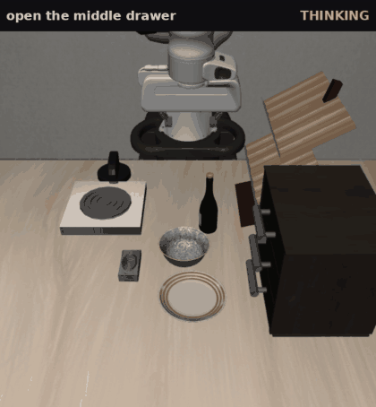</td>
<td>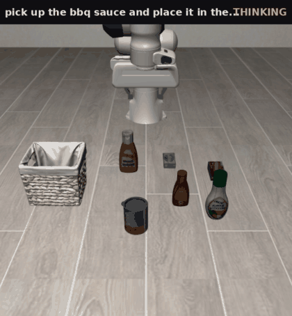</td>
<td>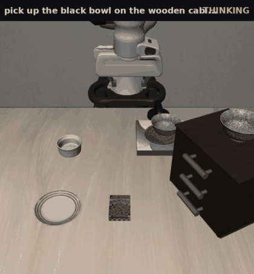</td>
</tr>
</table>

  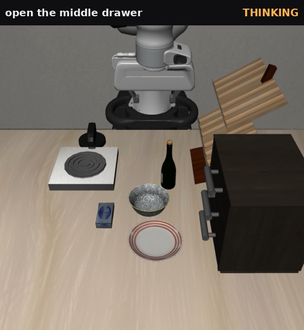
  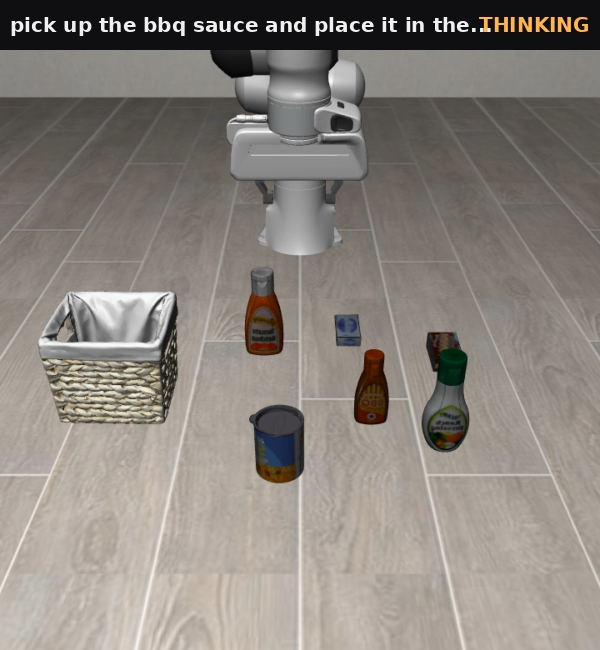
  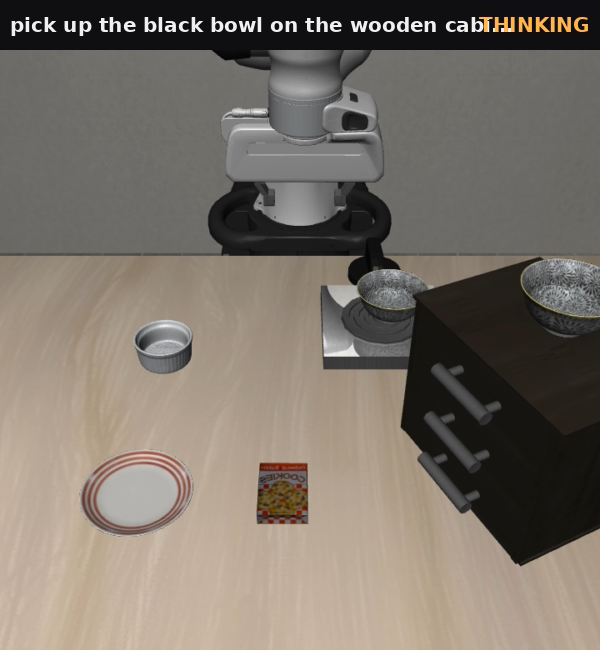

### 4.2 Cross-embodiment behavior checks

To ensure speedup ideas are not tied to one embodiment only, the branch also validated transfer workflows across arm configurations used in the project.

<table>
<tr>
<td>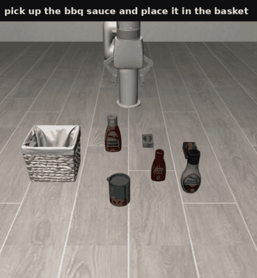</td>
<td>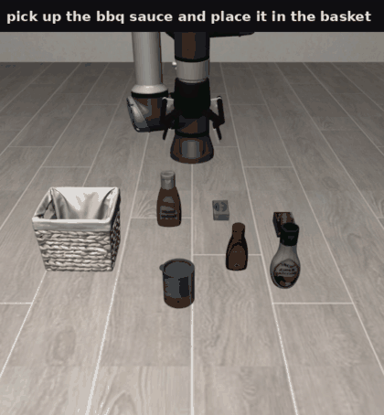</td>
<td>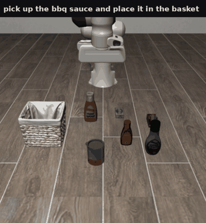</td>
</tr>
</table>

  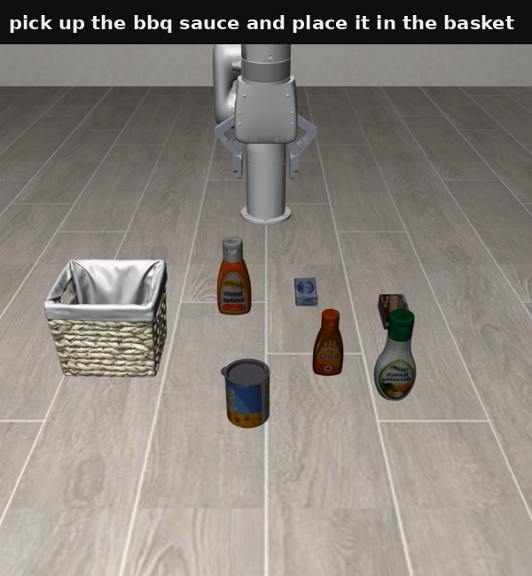
  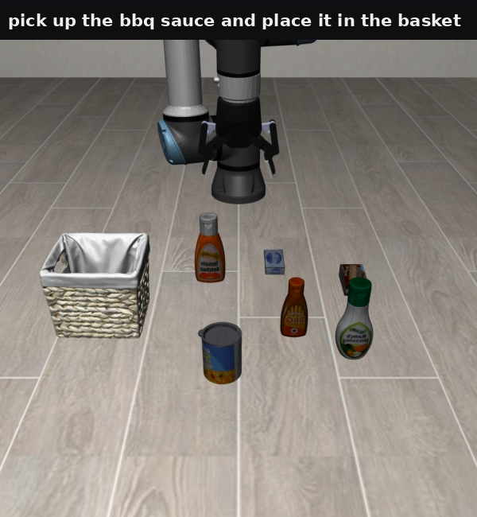
  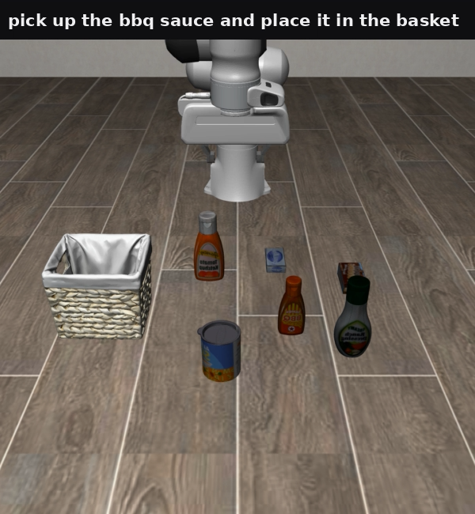

## 5) Baseline bottleneck decomposition

The core finding at baseline is that one planning pass is dominated by visual and VLM compute. The flow-matching loop is smaller in comparison.

  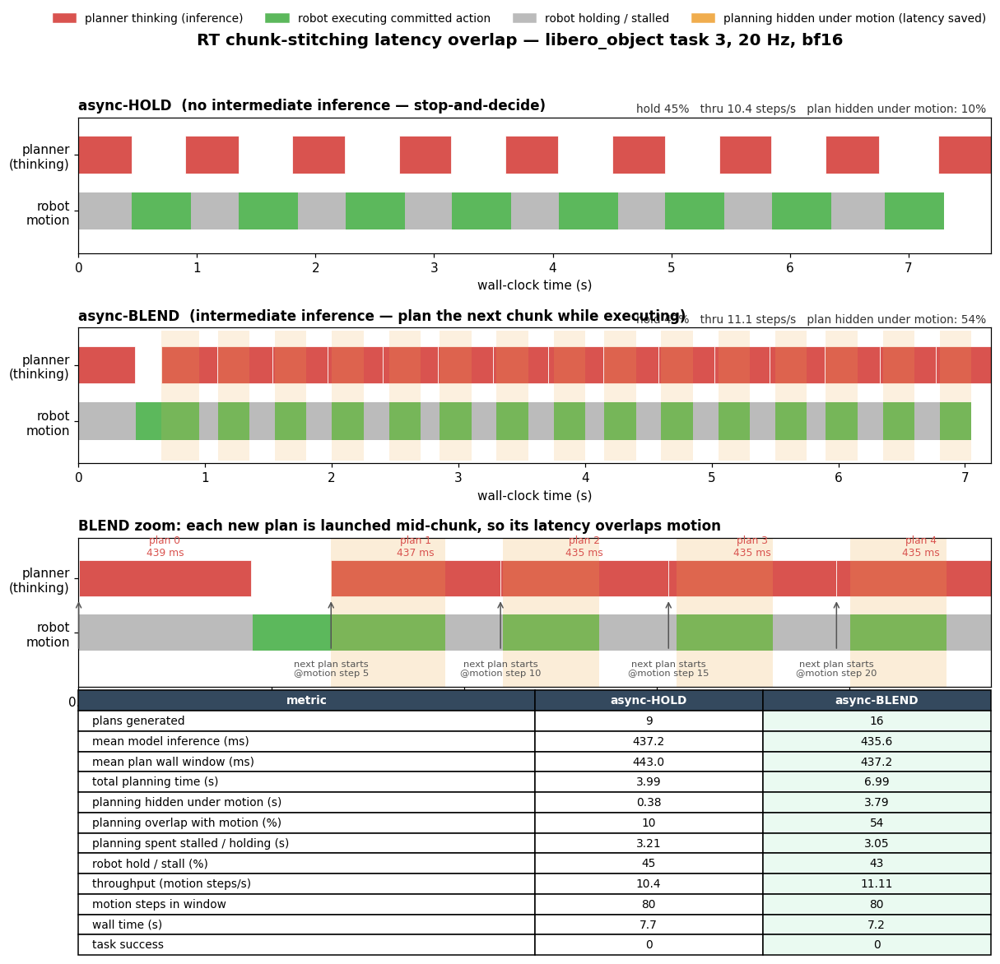
  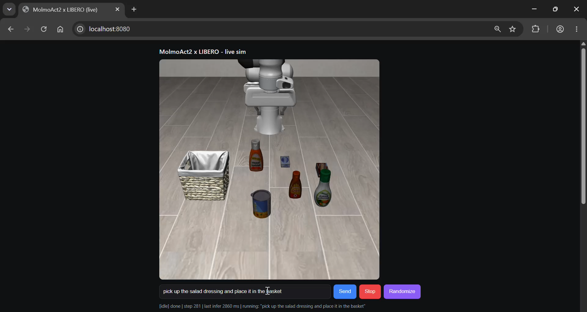

<table>
<tr>
<td>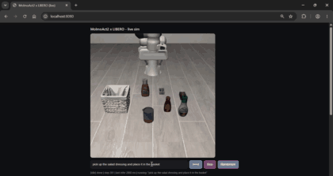</td>
</tr>
</table>

This decomposition motivates the rest of the branch:

- post-ViT pruning reduces VLM token load,
- pre-ViT pruning reduces both vision and VLM load,
- blending hides some residual latency under motion.

## 6) Track A - Post-ViT random token pruning

This variant keeps full vision encoding, then drops a fraction of pooled visual tokens before the VLM pass.

- Purpose: reduce prefill cost while keeping upstream visual context intact.
- Expected behavior: good robustness at moderate drop ratios, but no change to encoder cost.

  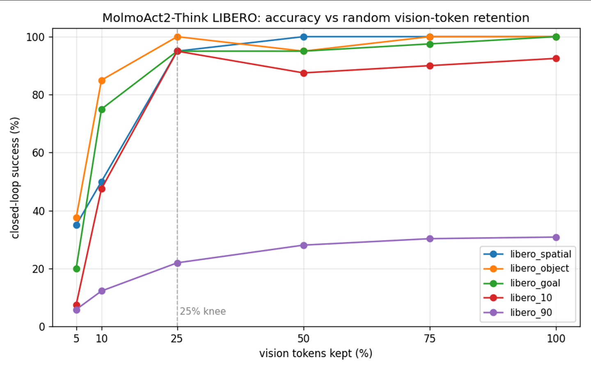
  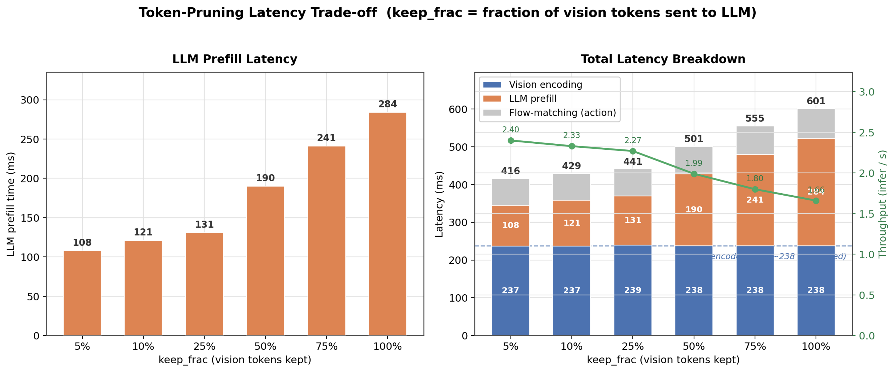

  
  

Interpretation:

- latency improves because VLM token count shrinks,
- accuracy remains strong down to a moderate keep fraction,
- total improvement is bounded because vision encoder cost is unchanged.

## 7) Track B - Pre-ViT random group pruning

This variant drops 2x2 patch groups before the vision encoder path, so both encoder and VLM token workloads shrink.

- Purpose: attack the largest compute block directly.
- Tradeoff: stronger latency gains, but sharper accuracy degradation when pushed too far.

  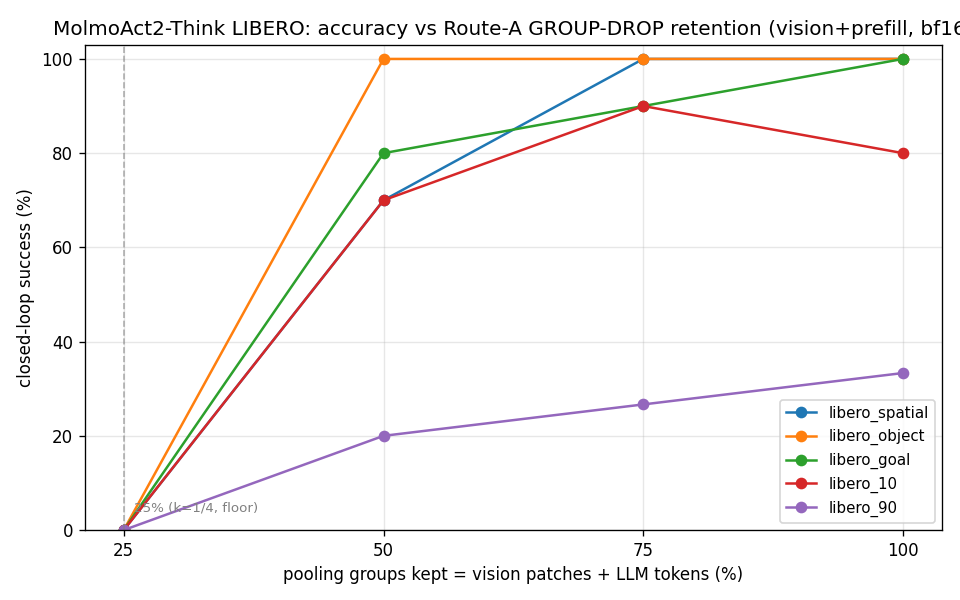
  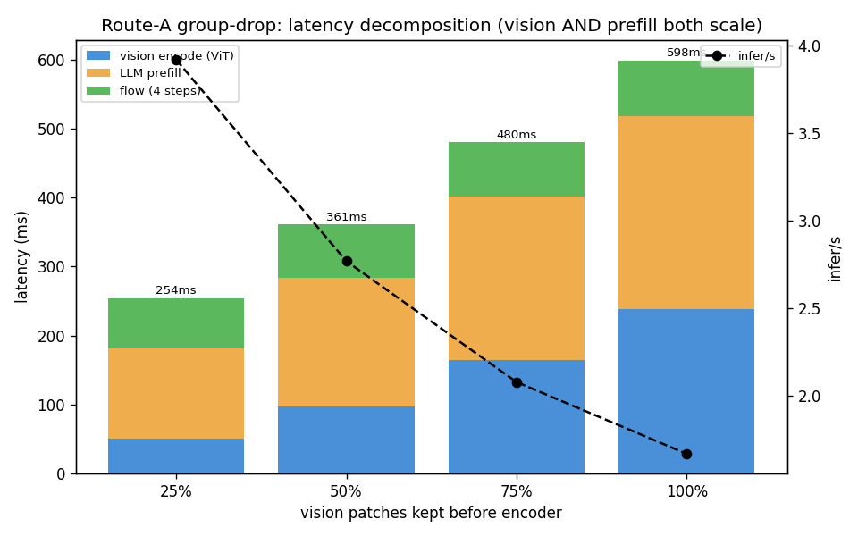

  
  

Interpretation:

- this is the most direct route to large latency reduction,
- moderate keep values can still be useful,
- aggressive drop values can collapse performance on harder settings.

## 8) Track C - Action blending in asynchronous control

Action blending starts re-planning before the active chunk fully finishes, then stitches/blends trajectories to reduce visible stop-and-go behavior.

- Purpose: hide planning latency under execution time.
- Behavior: better smoothness and throughput, especially when plan time is already reduced by pruning.

  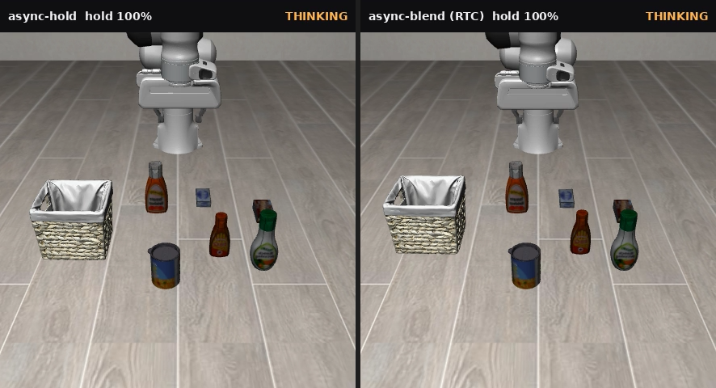

<table>
<tr>
<td>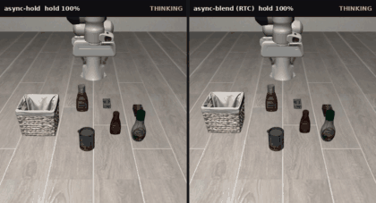</td>
</tr>
</table>

  
  

Combined outcome (pre-ViT prune + blending) is the strongest operational result in this branch.

## 9) Track D - Attention-feedback pruning

Random pruning is simple and surprisingly strong in some regimes, but it discards information without context. This track tests deterministic selection based on model-derived attention signals.

### 9.1 Motivation

- collect saliency from attention behavior,
- keep patches/tokens predicted to matter for action generation,
- reuse that signal to guide pruning instead of random choice.

  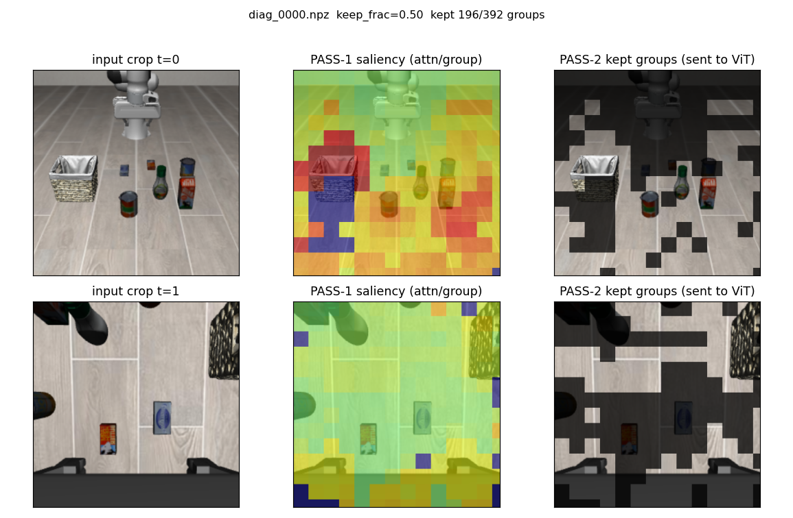
  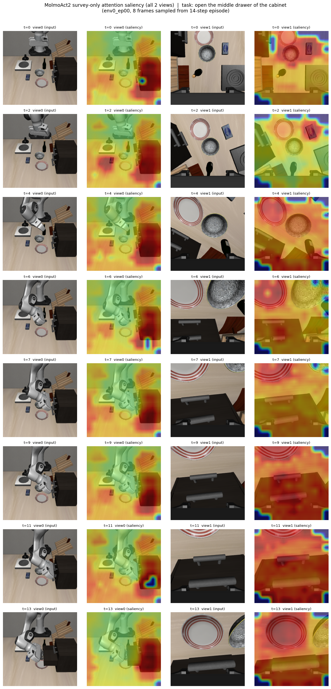

### 9.2 Pre- and post-ViT attention-guided paths

  
  

### 9.3 Current status

- infrastructure is implemented end-to-end,
- deterministic signal path is operational,
- early outcomes are informative but not yet clearly better than random pruning on easier suites,
- re-survey cadence and stronger prediction mechanisms remain open follow-up work.

### 9.4 Quantitative snapshot from this branch phase

At keep fraction 0.5 on a lightweight closed-loop setting, the current comparison is:

| condition | success |
|---|---|
| full (no pruning) | 100% |
| random group-drop | 100% |
| attention-feedback (no re-survey) | 50% |
| attention-feedback with periodic re-survey | 70-80% |

Latency behavior follows the expected trend:

- survey passes run close to full-cost inference,
- pruned passes preserve the group-drop speed advantage,
- effective speedup depends on re-survey cadence (accuracy-latency tradeoff knob).

## 10) Qualitative pruning visualization

The branch includes side-by-side visualization of retained regions under different keep ratios.

<table>
<tr>
<td>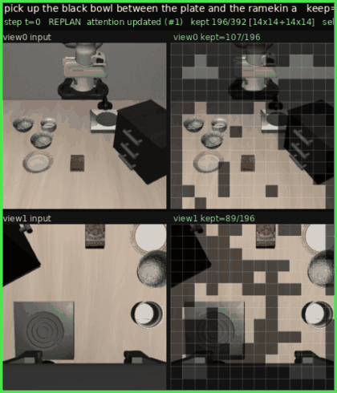</td>
<td>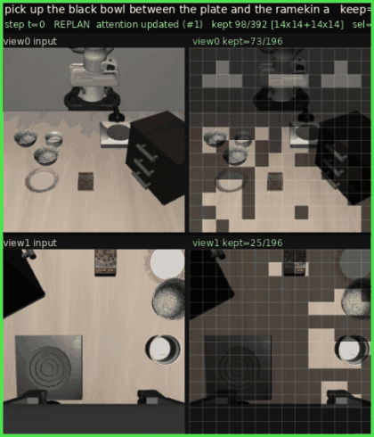</td>
</tr>
</table>

  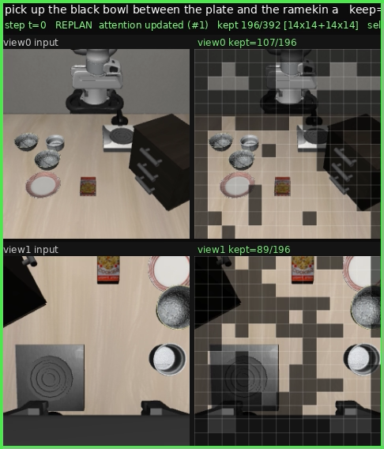
  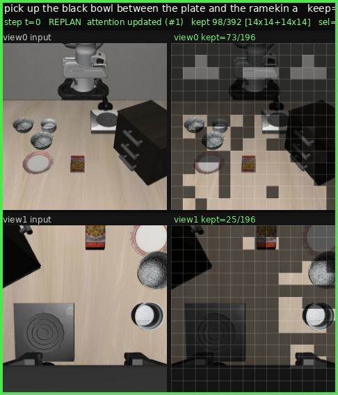

These visual checks are useful for debugging whether pruning behavior is consistent with task-relevant scene regions.

## 11) Practical conclusions so far

  

- Post-ViT random pruning gives easy latency wins with limited robustness cost at moderate keep values.
- Pre-ViT random pruning is stronger for speed but must be tuned carefully for task quality.
- Action blending improves real-time feel by reducing visible wait behavior, especially when paired with pruning.
- Attention-feedback pruning is promising but still an active research direction, not a finalized replacement.

## 12) Reproduction map

The branch contains script-level support for each track.

| experiment | primary runners | analysis and plots |
|---|---|---|
| post-ViT random pruning | `sweep_ablation.sh`, `run_ablation_detached.sh` | `bench_opt_study.py`, `plot_ablation.py`, `plot_visdrop_latency.sh` |
| pre-ViT random group pruning | `sweep_groupdrop.sh`, `run_groupdrop_detached.sh` | `bench_groupdrop_latency.py`, `plot_preenc.py`, `plot_groupdrop.sh` |
| async hold/blend behavior | `rt_smoothness_run.sh`, `rt_latency_timeline_run.sh` | `plot_rt_smoothness.py`, `rt_latency_timeline.py` |
| pruned + blended RT demo | `interactive_rt_groupdrop_run.sh`, `rt_latency_timeline_groupdrop_run.sh` | timeline artifacts under `assets/efficiency/` |
| attention-feedback pruning | `run_attnfb_smoke_detached.sh`, `run_attnfb_validate.sh`, `run_attnfb_bench.sh` | `validate_attnfeedback.py`, `plot_attnfb_overlay.py`, `bench_attnfb_latency.py` |

For a concise command-first index, see [`EXPERIMENT_GUIDE.md`](EXPERIMENT_GUIDE.md).

## 13) Supplemental figures and data snapshots

The README also ships selected supporting plots and csv/json snapshots used during this branch phase.

### Supplemental figures

  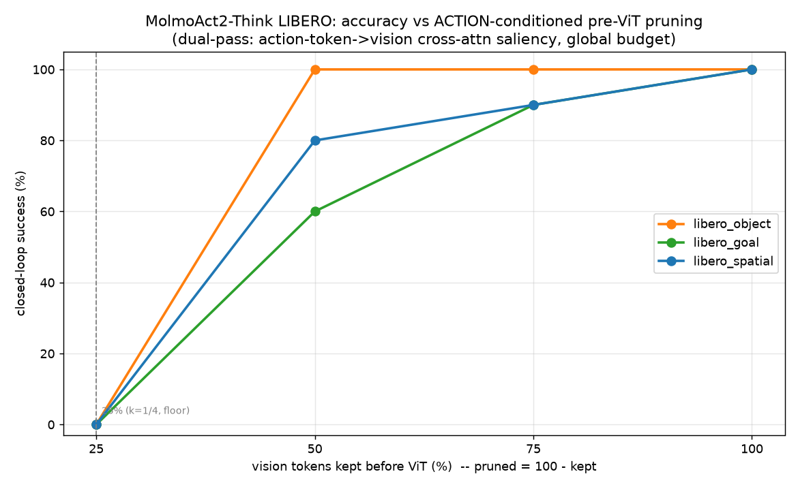
  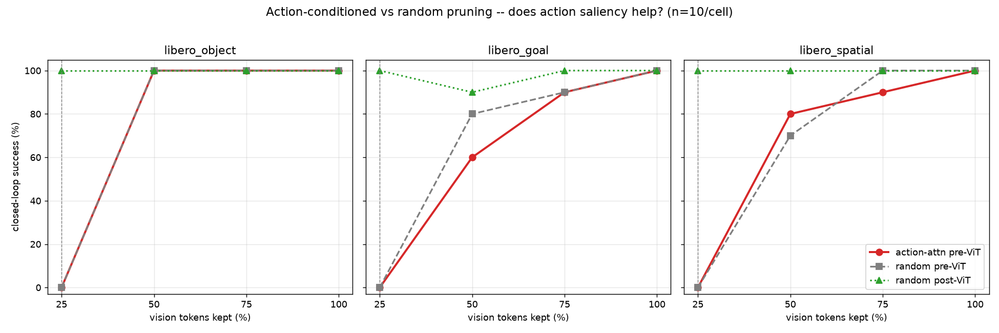
  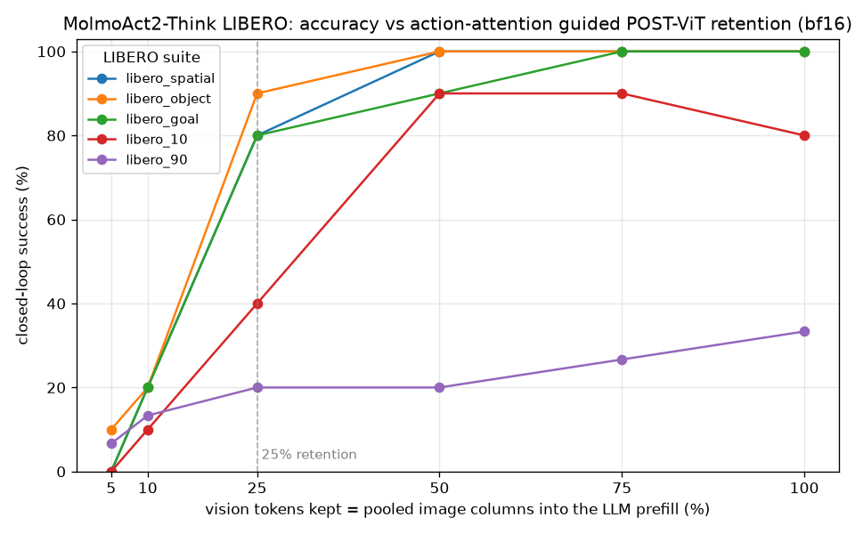
  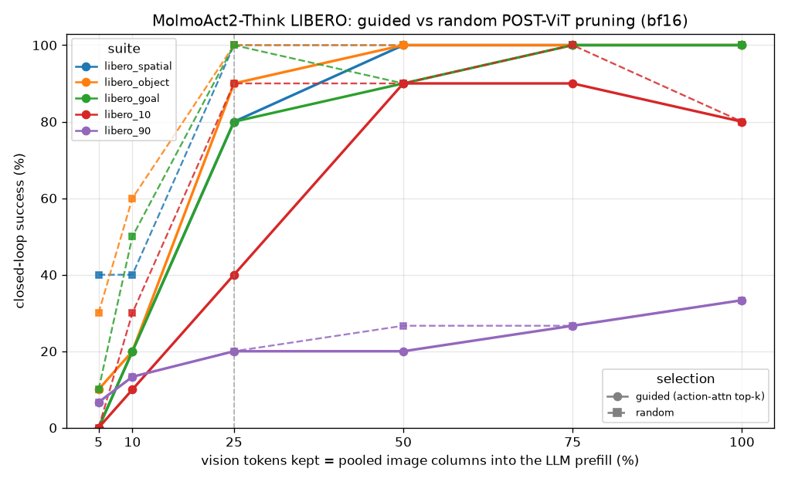
  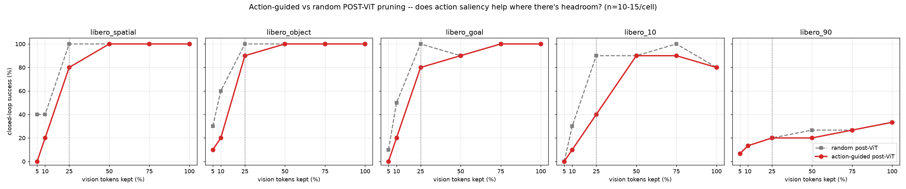
  
  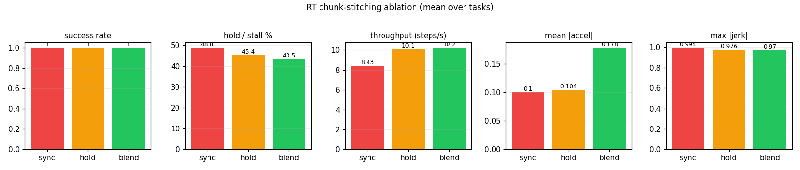

### Snapshot datasets

- `data/presentation/results_actionattn.csv`
- `data/presentation/results_actpost.csv`
- `data/presentation/results.csv`
- `data/presentation/summary_20260617_092533.csv`
- `data/presentation/latency_timeline_libero_object_t3_20260617_181022.json`

## 14) Notes

- Presentation videos are embedded here as compressed GIFs for GitHub readability.
- This branch is intentionally research-first and not packaged as an upstream product release.
- If you want the complete extraction map for provenance, see `docs/slide_manifest.md`.
