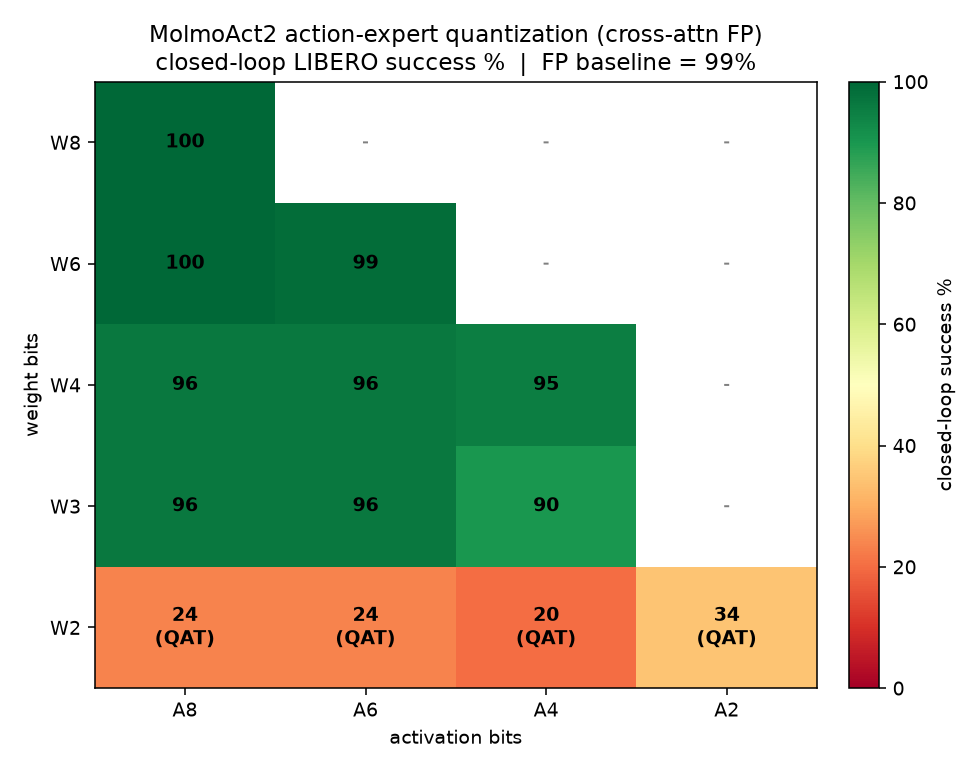

# Low-bit quantization of the MolmoAct2 flow-matching action expert

## Abstract

We quantize the action expert of the MolmoAct2 vision-language-action model across a weight/activation bit-width grid (W8A8 down to W2A2) and measure the effect on closed-loop task success in LIBERO. Uniform quantization of the whole action expert destroys closed-loop performance even at 8-bit. A per-component analysis shows that this is caused entirely by the cross-attention layers, which read the frozen language-model context. Leaving cross-attention in full precision and quantizing every other part of the action expert recovers full-precision success: W8A8 reaches 100% with post-training quantization alone, and the model stays within a few points of the full-precision baseline down to 3-bit weights and 4-bit activations without any fine-tuning. Two-bit weights are the practical floor: quantization-aware training lowers the training loss below the full-precision value but does not restore closed-loop success, which stays in the 20-35% range.

## 1. Model

The action expert is a flow-matching diffusion transformer attached to a frozen MolmoAct2 backbone. It has 36 transformer blocks. Each block contains a self-attention module, a cross-attention module that attends to the backbone's per-layer key/value cache, a feed-forward (MLP) module, and an adaptive-layer-norm modulation module. In total the expert has 295 linear layers and 72 attention modules (36 self, 36 cross), and about 0.58 B trainable parameters.

At inference the expert integrates a velocity field with 8 Euler steps to produce an action chunk of 10 steps. Training uses the flow-matching objective: a mean squared error between the predicted velocity and the target velocity, with the diffusion timestep drawn from a Beta(1.0, 1.5) distribution.

## 2. Method

### 2.1 Fake quantization

We use Brevitas fake-quantization. Weights are quantized per output channel; activations are quantized per tensor. For weights at 4 bits and above the scale is set from the maximum-absolute statistic; for weights at 3 bits and below the scale is a learned parameter (learned step size, initialised from statistics) so that fine-tuning can move it away from the outlier-dominated maximum. Activation quantizers are the signed per-tensor type at the target bit width. All fake-quantization runs in bfloat16 to match the model's compute dtype; running the fake-quant in float32 under the model's autocast produced NaNs during calibration.

Attention is quantized by replacing the inner scaled-dot-product attention with a Brevitas quantized attention block. This keeps the module's own query/key normalisation and rotary embedding ordering intact and quantizes the query, key, value, the softmax input, the attention weights, and the attention output.

### 2.2 Precision assignment

Two schemes are compared.

* **Uniform.** Every linear layer and every attention block in the expert is quantized to the target weight/activation bit width. The input/output layers (time and action embeddings, the two context projections, the final velocity head) are pinned to 8-bit.
* **Cross-attention in full precision.** Identical to the uniform scheme except the 36 cross-attention modules are left in full precision. Concretely, this reverts each block's cross-attention query projection (`q_proj`) and output projection (`out_proj`), together with its quantized-attention block (the query, key, value, softmax input, attention weights, and attention output quantizers), back to full precision. It is important to note what is not reverted: the key and value that cross-attention reads are not produced inside the cross-attention module but by the shared context projections (`context_k_proj`, `context_v_proj`), which belong to the input/output group and therefore stay quantized at 8-bit. The expensive projection of the long backbone context into keys and values is thus still done in low precision; only the small action-side query and output projections, and the attention math itself, are full precision. Under this scheme 223 of the 295 linear layers are quantized, 72 (the 36 `q_proj` plus 36 `out_proj`) remain full precision, and 36 self-attention blocks use quantized attention.

### 2.3 Calibration and fine-tuning

Post-training quantization (PTQ) calibrates the activation and weight scales on 16 real LIBERO batches in calibration mode, with no gradient updates.

Quantization-aware training (QAT) then fine-tunes the quantized expert on the flow-matching loss for 3000 steps with AdamW, gradient clipping, and a constant learning rate (5e-5, reduced to 3e-5 for the 2-bit-weight cells). The backbone is frozen and its key/value cache is detached before the expert, so no gradient enters the backbone. Training batches come from the same LeRobot preprocessor used for the original fine-tune, so the inputs and normalisation match the deployed model.

### 2.4 Closed-loop evaluation

Each quantized expert is loaded into the deployed policy checkpoint and evaluated in closed loop on four LIBERO suites: spatial, object, goal, and long. Evaluation uses the continuous inference action mode in bfloat16. The static inference CUDA graph is disabled: the graph capture is incompatible with the fake-quant operations and causes both a crash when full-precision and quantized chunks share a process and a roughly sixfold slowdown. Success is the percentage of episodes that complete the task, averaged over the four suites. The bit-width grid uses 20 episodes per suite; the 2-bit-weight row was re-measured at 50 episodes per suite for tighter, equally covered statistics.

## 3. Results

### 3.1 Uniform quantization fails, and the cause is cross-attention

Under the uniform scheme W8A8 collapses in closed loop. Isolating the mechanism: PTQ-only W8A8 reaches 0% closed-loop, QAT W8A8 reaches 40%, against a full-precision baseline of 98-99%. Because QAT improves over PTQ, the loss is not a training artifact; and normalisation and context length match between training and evaluation, so it is not an input mismatch.

Quantizing one component at a time at W8A8 and measuring the held-out flow-matching loss (full precision 0.382) localises the damage to cross-attention:

| Component quantized (W8A8) | Held-out flow loss |
| --- | --- |
| Self-attention | 0.360 |
| MLP | 0.360 |
| Modulation (AdaLN) | 0.359 |
| Input/output layers | 0.378 |
| **Cross-attention** | **1.545** |
| All (uniform) | 1.570 |

Cross-attention alone reproduces the loss of the fully uniform model; every other component is essentially free at 8-bit. Keeping cross-attention in full precision and quantizing the rest to W8A8 gives a held-out flow loss of 0.380 and 100% closed-loop success with PTQ only. This matches the role of cross-attention in the architecture: it is the only pathway by which the small action stream reads the frozen vision-language backbone's context, so it carries the task conditioning that steers every predicted action. Quantization noise on that pathway corrupts the conditioning and the predicted actions drift, whereas the self-attention, feed-forward, and modulation paths operate within the action stream and tolerate low precision.

### 3.2 The cost of exempting cross-attention is small

Leaving cross-attention in full precision sounds expensive, but in this expert it is not, because the module is a "few queries attend to many keys" block. Each Euler step processes only the handful of action tokens in the chunk (hidden size 1024, 16 heads), while cross-attention reads the full backbone context (images plus prompt), which is hundreds to over a thousand tokens. The query side is therefore tiny and the two cross-attention weight projections are cheap. Counting the weight-multiply work per block, which is the work that weight quantization actually shrinks, the budget of linear layers splits roughly as: MLP (`up_proj`, `gate_proj`, `down_proj`) about 57%, self-attention (`qkv`, `out_proj`) about 28%, the adaptive-layer-norm modulation about 1%, and the two full-precision cross-attention projections (`q_proj`, `out_proj`) only about 13-14%. Leaving those two projections full precision thus forfeits roughly a seventh of the quantizable weight compute; the other ~86%, plus the 8-bit context key/value projections that carry the expensive long-context work, still run in low precision, so almost the entire memory and compute benefit of quantization is retained.

Cross-attention's other cost is the query-key-softmax-value attention over the long context. That term grows with context length and can be comparable to a single projection, but it is an activation-times-activation operation rather than a weight matmul, so neither scheme quantizes it. The net picture is a textbook mixed-precision outcome: a small, sensitive minority of the layers (about one seventh of the weight compute) dominates the quantization error, and exempting exactly that minority recovers full-precision closed-loop success while preserving nearly all of the compression.

### 3.3 Bit-width grid (cross-attention in full precision)

Post-training-quantization flow loss across the grid (full precision 0.382):

| W\A | 8 | 6 | 4 | 2 |
| --- | --- | --- | --- | --- |
| 8 | 0.380 | – | – | – |
| 6 | 0.379 | 0.379 | – | – |
| 4 | 0.374 | 0.373 | 0.576 | – |
| 3 | 0.395 | 0.398 | 0.629 | – |
| 2 | 0.902 | 0.917 | 0.919 | 8.917 |

Closed-loop success (%), full-precision baseline 99.0. Cells with weights at 3 bits and above are PTQ only; the 2-bit-weight row is after QAT and at 50 episodes/suite.

| W\A | 8 | 6 | 4 | 2 |
| --- | --- | --- | --- | --- |
| 8 | 100.0 | – | – | – |
| 6 | 100.0 | 98.8 | – | – |
| 4 | 96.2 | 96.2 | 95.0 | – |
| 3 | 96.2 | 96.2 | 90.0 | – |
| 2 | 23.5 | 23.5 | 20.0 | 34.5 |



Down to 3-bit weights with 4-bit or higher activations the expert stays within about 4-9 points of the full-precision baseline, using post-training quantization only. No QAT is needed in this region.

### 3.4 The 2-bit-weight floor

Two-bit weights break closed-loop control regardless of activation precision. QAT lowers the held-out flow loss of the 2-bit cells to 0.07-0.12, below the full-precision value, but closed-loop success stays between 20% and 35%:

| Cell | QAT flow loss | Closed-loop success (50 ep/suite) |
| --- | --- | --- |
| W2A8 | 0.072 | 23.5 |
| W2A6 | 0.071 | 23.5 |
| W2A4 | 0.083 | 20.0 |
| W2A2 | 0.124 | 34.5 |

The flow-matching loss is therefore not a reliable predictor of closed-loop success at this precision. Within the 2-bit row there is no ordering by activation precision: the A8, A6, and A4 cells are flat within statistics, and the higher A2 value reflects run-to-run variance of independent QAT runs in a degenerate regime, not an effect of using fewer activation bits.

## 4. Reproduction

Hardware and stack: AMD Instinct MI210 GPUs, one four-GPU node per job, SLURM and Apptainer. Code lives in this package (`packages/vla/molmoact2/research/distillation/llm`). The three entry points are `ae_quant.py` (fake-quantization of the expert), `ae_qat.py` (PTQ and QAT trainer), and `eval_closedloop_ae.py` (loads a quantized expert into the policy and runs the LIBERO closed-loop eval).

The `--groups` flag selects which components to quantize (`self_attn,cross_attn,mlp,modulation,io`); omitting `cross_attn` is the cross-attention-in-full-precision scheme. `--target-steps 0` runs PTQ only.

Component sensitivity (one group at a time, PTQ only):

```bash
for g in self_attn cross_attn mlp modulation io; do
  python ae_qat.py --weight-bits 8 --act-bits 8 --io-bits 8 \
    --groups "$g" --quant-dtype bf16 --target-steps 0 --calib-batches 16 \
    --out runs/sens_w8a8_$g
done
```

One grid cell, post-training quantization only (cross-attention kept full precision):

```bash
python ae_qat.py --weight-bits 4 --act-bits 4 --io-bits 8 \
  --groups self_attn,mlp,modulation,io --quant-dtype bf16 \
  --target-steps 0 --calib-batches 16 --out runs/xf_w4a4
```

One grid cell with quantization-aware training (used for the 2-bit row):

```bash
python ae_qat.py --weight-bits 2 --act-bits 8 --io-bits 8 \
  --groups self_attn,mlp,modulation,io --quant-dtype bf16 \
  --target-steps 3000 --ae-lr 3e-5 --lr-schedule constant \
  --calib-batches 16 --out runs/xfqat_w2a8
```

Closed-loop evaluation of a saved quantized expert (one suite shown; repeat for `libero_spatial`, `libero_object`, `libero_goal`, `libero_10`). The blob carries the bit widths and the quantized component set, so the eval reconstructs the same scheme:

```bash
QUANT_STATE=runs/xfqat_w2a8/ae_W2A8_qat_ep.pt \
python eval_closedloop_ae.py \
  --policy.path=<policy_checkpoint> \
  --policy.inference_action_mode=continuous \
  --policy.model_dtype=bfloat16 --policy.use_amp=true \
  --policy.enable_inference_cuda_graph=false --policy.device=cuda \
  --env.type=libero --env.task=libero_spatial --env.task_ids="[0,1,2,3,4]" \
  --eval.n_episodes=10 --output_dir=runs/cl/xfqat_w2a8_libero_spatial
```

`--eval.n_episodes` is per task; with five task ids this gives 50 episodes per suite. Use 4 for the 20-episode/suite budget.

The SLURM/Apptainer group launchers are in `../../slurm/`: `ae_qat_group.sbatch` runs up to four PTQ/QAT arms on one 4-GPU node (`ARMS="8:8:8 6:6:8 4:6:8 4:4:8"`), and `ae_cl_group.sbatch` runs the closed-loop eval for a group of cells (it invokes `ae_cl_grouprun.sh` / `ae_cl_inner.sh`, one suite per GPU).

## 5. Artifacts

* `cl_heatmap.png` — closed-loop success heatmap over the bit-width grid.
* `cl_grid_final.csv` — per-cell flow loss and closed-loop success, with episode counts and the 2-bit caveat.
* `make_heatmap.py` — regenerates the heatmap from the grid values.
