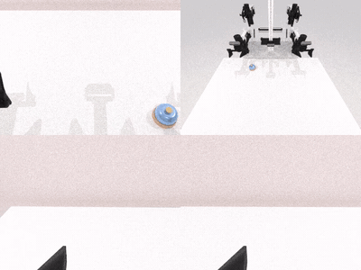
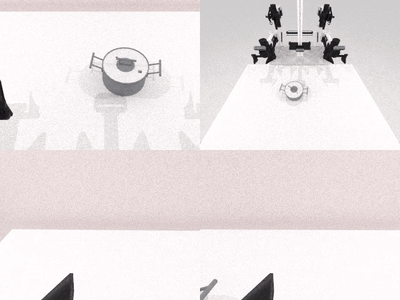
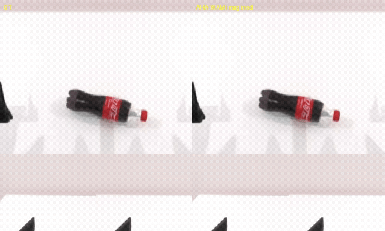

### AHA-WAM

This package runs [AHA-WAM](https://github.com/serene-sivy/AHA-WAM) on AMD Ryzen AI Max+ 395 (Strix Halo, gfx1151) under ROCm 7.14. AHA-WAM is a direct successor of FastWAM: an asynchronous Wan2.2-TI2V-5B world-action model (umt5-xxl text encoder, Wan VAE, and a joint video/action DiT) that splits inference into a slow observation-guided video-context prefill (the planner) and a fast action-DiT chunk that reuses the prefilled KV cache (the executor), so the two phases run at different rates. It ships no simulator: it runs standalone on the plain base for video imagination, or chains on top of the RoboTwin 2.0 simulator base for interactive and closed-loop rollouts.

### Build

```sh
ryzers build ahawam --name ahawam                        # model layer: standalone demos (smoke / video imagination)
ryzers run --name ahawam                                 # test.py: ROCm torch + GPU + deps check
```

For interactive and closed-loop rollouts, chain the model on the RoboTwin 2.0 simulator base.

```sh
ryzers build robotwin ahawam --name ahawam-robotwin      # chain the model on the RoboTwin base
```

Artifacts are written to `workspace/ahawam/outputs`. Set `HF_TOKEN` for faster or gated downloads.
The ~12 GB Wan2.2 base weights and the RoboTwin 2.0 checkpoint are fetched on the first model run.

```sh
ryzers run --name ahawam /ryzers/scripts/download_checkpoints.sh robotwin   # RoboTwin 2.0 ckpt
```

### Interactive RoboTwin 2.0

Drive the robot live in a browser. The interactive server streams the SAPIEN view over
HTTP/MJPEG and prints its `http://localhost:PORT` URL; view it at `http://localhost:PORT` via
`ssh -L PORT:localhost:PORT <host>`. The `_rt.sh` variant decouples execution from planning so
the browser sees the two-phase planner latency (the arms hold while the model thinks, then
resume when the action buffer refills). Both default to AHA-WAM-Flash for a responsive demo.

```sh
ryzers run --name ahawam-robotwin /ryzers/demos/demo_interactive_robotwin.sh     # live browser control
ryzers run --name ahawam-robotwin /ryzers/demos/demo_interactive_robotwin_rt.sh  # real-time (visible planner holds)
```

### Closed-loop RoboTwin 2.0

RoboTwin 2.0 runs under the SAPIEN Vulkan renderer; the two phases are scheduled with
`chunks_per_video_prefill`. Each task runs RoboTwin's own `eval_policy.py` against the
`ahawam_policy` plugin and writes a success rate plus per-episode videos.

```sh
TASKS="click_bell lift_pot" NUM_EPISODES=10 \
  ryzers run --name ahawam-robotwin /ryzers/demos/demo_closedloop_robotwin.sh   # batch rollouts + success rate
```

<p align="center">
  
  <br>
  
  <br><em>Closed-loop RoboTwin rollouts: click bell (top), lift pot (bottom).</em>
</p>

### Video imagination

The world-model video branch imagines the future clip from a ground-truth start frame and
instruction (ground truth left, imagined right). This runs on the standalone image.

```sh
DATASET=robotwin ryzers run --name ahawam /ryzers/demos/demo_videogen.sh
```

<p align="center">
  
  <br><em>RoboTwin: ground truth (left) vs imagined future (right).</em>
</p>

### References

- Upstream: https://github.com/serene-sivy/AHA-WAM (commit pinned in `config.yaml`)
- Checkpoints: https://huggingface.co/SereneC/AHA-WAM-RoboTwin2.0
- Dataset: https://huggingface.co/datasets/yuanty/robotwin2.0-fastwam

Copyright (C) 2026 Advanced Micro Devices, Inc. All rights reserved.
SPDX-License-Identifier: MIT
