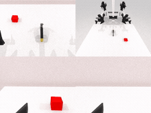
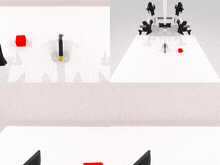
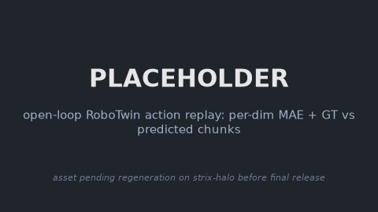

### AHA-WAM

This package runs [AHA-WAM](https://github.com/serene-sivy/AHA-WAM) on AMD Ryzen AI Max+ 395
(Strix Halo, gfx1151) under ROCm 7.14. AHA-WAM is an asynchronous Wan2.2-TI2V-5B world-action
model (umt5-xxl text encoder, Wan VAE, a video-DiT world planner, and an action-DiT executor)
that splits inference into a slow observation-guided video-context prefill (`phase="video"`,
the planner) and a fast 16-step action chunk that reuses the prefilled video KV cache
(`phase="action"`, the executor), so the planner can run off the control loop. This is a
direct PyTorch port: upstream runs on the base image's ROCm torch and only the CUDA torch pins
are stripped.

AHA-WAM ships no simulator. It is a slim policy layer that chains on the `simulation/robotwin`
base through a runtime `Policy` adapter (`adapters/ahawam_robotwin_policy.py`, selected by
`POLICY_FACTORY`) for closed-loop and interactive RoboTwin 2.0 rollouts, or runs standalone on
the plain base for the non-sim demos (open-loop replay and async real-time serving). It ships
RoboTwin 2.0 weights only (no LIBERO checkpoint); the ~12 GB Wan2.2 base is fetched by the
DiffSynth loader on the first model run.

### Build

```sh
ryzers build simulation/robotwin ahawam --name ahawam-robotwin      # chain on the RoboTwin 2.0 base: closed-loop + interactive
ryzers build ahawam --name ahawam                        # standalone: non-sim demos (open-loop / async real-time)
ryzers run --name ahawam                                 # test.py: ROCm torch + GPU + deps check
```

Artifacts are written to `workspace/ahawam/outputs`. Set `HF_TOKEN` for faster or gated
downloads. The ~12 GB Wan2.2 base is fetched on the first model run.

```sh
ryzers run --name ahawam /ryzers/scripts/download_checkpoints.sh all   # RoboTwin base + Flash ckpts
ryzers run --name ahawam /ryzers/scripts/download_datasets.sh          # open-loop RoboTwin data
```

### Demos

| Demo | Base | What it does |
|---|---|---|
| `demos/demo_interactive_robotwin.sh` | `robotwin` | Interactive RoboTwin over HTTP, live 4-view MJPEG in the browser. |
| `demos/demo_interactive_robotwin_rt.sh` | `robotwin` | Real-time interactive RoboTwin: execution decoupled from planning, arms HOLD while the model plans. |
| `demos/demo_async_rt.sh` | plain | Async real-time serving: upstream `deploy/` TCP server (async mode) plus async client. |
| `demos/demo_closedloop_robotwin.sh` | `robotwin` | Closed-loop RoboTwin 2.0 rollouts (SAPIEN Vulkan) plus success rate and videos. |
| `demos/demo_openloop.sh` | plain | Replay RoboTwin observations, overlay predicted vs ground-truth action chunks plus MAE. |

The async real-time demo reuses the upstream `deploy/` stack unchanged (single-process async
server plus dummy client) to serve action chunks against a background video prefill:

```sh
ryzers run --name ahawam /ryzers/demos/demo_async_rt.sh                 # WHICH=flash (default)
```

On AHA-WAM-Flash (`num_inference_steps=1`) this serves 30/30 action requests with 0 errors
while 648 image frames are pushed concurrently on the decoupled channel, with the video
prefill kept off the action path.

### Interactive and closed-loop RoboTwin 2.0

RoboTwin 2.0 runs under the SAPIEN Vulkan renderer. Drive the robot live in a browser, or run
a batch rollout for a success rate. Both default to AHA-WAM-Flash (1 diffusion step) for
responsiveness; set `CKPT=.../robotwin_ahawam.pt` for the base 10-step model.

```sh
ryzers run --name ahawam-robotwin /ryzers/demos/demo_interactive_robotwin.sh       # live browser control, PORT 8082
ryzers run --name ahawam-robotwin /ryzers/demos/demo_interactive_robotwin_rt.sh    # real-time, HOLD while thinking, PORT 8083
TASKS="click_bell lift_pot" NUM_EPISODES=10 \
  ryzers run --name ahawam-robotwin /ryzers/demos/demo_closedloop_robotwin.sh      # batch rollouts + success rate
```

Closed-loop RoboTwin 2.0, `demo_clean`, 10 episodes per task, `chunks_per_video_prefill=2`,
matched seeds:

| Task | Flash (1 step) | Base (10 steps) |
|---|---|---|
| `click_bell` | 10/10 | 10/10 |
| `handover_block` | 9/10 | 7/10 |
| `beat_block_hammer` | 7/10 | 4/10 |
| `place_object_basket` | 5/10 | 3/10 |
| `lift_pot` | 5/10 | 5/10 |
| **Overall** | **36/50 (72%)** | **29/50 (58%)** |

The 1-step Flash model matches or exceeds the 10-step base on every task here while running
about 2.66x faster on the executor (small 10-episode samples, so treat plus or minus one to
two episodes as noise). Closed-loop runs RoboTwin's own `script/eval_policy.py` against the
`ahawam_policy` plugin; the interactive and real-time demos drive the same validated plugin
through the model-agnostic `sim_robotwin.Policy` seam.

<!-- TODO(release): expand to the full multi-task closed-loop gallery + an interactive/real-time capture on strix-halo; see docs/RELEASE_TODO.md -->
<p align="center">
  
  
  <br><em>Closed-loop RoboTwin 2.0 rollouts, beat_block_hammer (episodes 1 and 4). This real
  gallery currently covers only beat_block_hammer; the full multi-task gallery and an
  interactive capture are pending regeneration (see docs/RELEASE_TODO.md).</em>
</p>

### Open-loop replay

Predicted action chunks track ground truth on replayed RoboTwin episodes: mean normalized MAE
0.0094 (raw-unit MAE 0.0060).

```sh
ryzers run --name ahawam /ryzers/demos/demo_openloop.sh
```

<!-- TODO(release): regenerate on strix-halo; see docs/RELEASE_TODO.md -->
<p align="center">
  
  <br><em>Placeholder pending regeneration on strix-halo: RoboTwin per-dimension normalized
  MAE (left) and ground truth vs predicted action chunks (right). See docs/RELEASE_TODO.md.</em>
</p>

### Useful knobs

- Non-sim: `WHICH=flash|robotwin` (async / latency), `NUM_STEPS`, `SEED`, `NUM_EPISODES`.
- Async real-time: `PORT`, `INSTRUCTION`, `NUM_ACTION_REQUESTS`, `ACTION_RATE`, `IMAGE_FPS`, `PREFILL_WAIT`.
- Closed-loop RoboTwin: `TASKS`, `TASK_CONFIG`, `NUM_EPISODES`, `CHUNKS_PER_VIDEO_PREFILL`, `NUM_INFERENCE_STEPS`.
- Interactive RoboTwin: `TASK`, `TASK_CONFIG`, `SEED`, `PORT`, `MAX_STEPS`, `VIEW_RES`, `VIDEO_RES`, `NUM_INFERENCE_STEPS`, `CHUNKS_PER_VIDEO_PREFILL`.
- `CKPT`, `DATASET_STATS` point at specific weights; `HF_TOKEN` for faster or gated downloads.
- Efficiency toggles: `AHAWAM_KV_EDITOR_FAST` (batched KV editor, default 1), `AHAWAM_CACHE_TEXT_CONTEXT` (text-embed cache, default 1).

### Optimization

Two default-on lossless (bf16-equivalent) optimizations ship on top of the pinned upstream
commit via `patches/ahawam_opt.patch`: batching the per-layer KV-editor GEMMs (action chunk
407 to 153 ms, 2.66x, executor about 39 to 105 control Hz on Flash) and caching the static
instruction text embedding across video prefills (removes the roughly 160 ms umt5 re-encode
per prefill). Disable with `AHAWAM_KV_EDITOR_FAST=0` / `AHAWAM_CACHE_TEXT_CONTEXT=0`. See
`RUNTIME_OPTIMIZATION.md` for the full study, including the portable levers that transfer to
other diffusion world models and the ones that did not help on this hardware.

### References

- Upstream: https://github.com/serene-sivy/AHA-WAM (pinned in `docs/UPSTREAM_PIN.commit.txt`)
- Model: https://huggingface.co/SereneC/AHA-WAM-RoboTwin2.0
- Datasets: https://huggingface.co/datasets/yuanty/robotwin2.0-fastwam

Copyright (C) 2026 Advanced Micro Devices, Inc. All rights reserved.
SPDX-License-Identifier: MIT
