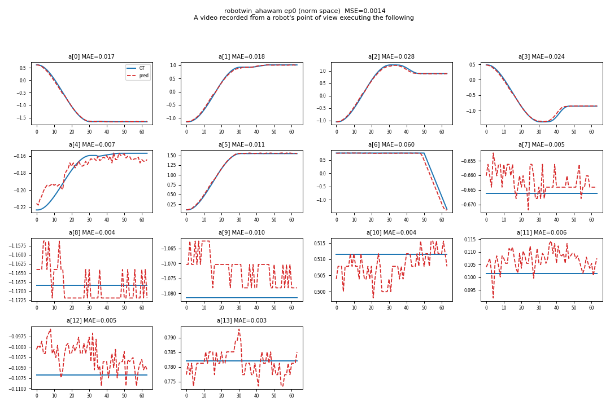
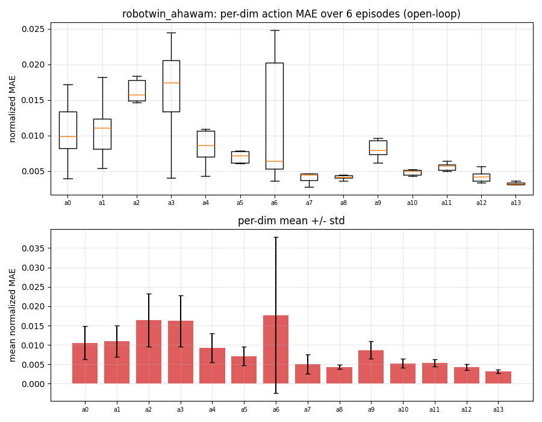

### AHA-WAM

This package runs [AHA-WAM](https://github.com/serene-sivy/AHA-WAM) on AMD Ryzen AI Max+ 395 (Strix Halo, gfx1151) under ROCm 7.2.2 (7.14 when chained on the RoboTwin base). AHA-WAM is an asynchronous Wan2.2-TI2V-5B world-action model (umt5-xxl text encoder, Wan VAE, and a joint video/action DiT) that splits inference into a slow observation-guided video-context prefill (the planner) and a fast action-DiT chunk that reuses the prefilled KV cache (the executor), so the two phases can run at different rates. It is a slim policy layer that ships no simulator: it runs standalone on the plain base for the non-sim demos, or chains on top of the RoboTwin 2.0 base for closed-loop rollouts. This package mirrors `packages/wam/fastwam`; the build applies a lossless, default-on efficiency patch (batched chunk KV-editor plus a static text-embedding cache) that can be disabled with `AHAWAM_KV_EDITOR_FAST=0` / `AHAWAM_CACHE_TEXT_CONTEXT=0`.

### Build

```sh
ryzers build ahawam --name ahawam                        # model layer: non-sim demos (smoke / open-loop)
ryzers run --name ahawam                                 # test.py: ROCm torch + GPU + deps check
```

For closed-loop rollouts, chain the model on the RoboTwin 2.0 simulator base.

```sh
ryzers build robotwin ahawam --name ahawam-robotwin      # chain the model on the RoboTwin base
```

Artifacts are written to `workspace/ahawam/outputs`. Set `HF_TOKEN` for faster or gated downloads.
The ~12 GB Wan2.2 base weights and the RoboTwin 2.0 checkpoint are fetched on the first model run.

```sh
ryzers run --name ahawam /ryzers/scripts/download_checkpoints.sh robotwin   # RoboTwin 2.0 ckpt
```

### Model smoke and open-loop replay

These run on the standalone image. The smoke demo builds the real 13.74 B-parameter model, loads the
checkpoint and runs one end-to-end two-phase action prediction; open-loop replay feeds ground-truth
RoboTwin 2.0 observations and overlays the predicted action chunks against ground truth.

```sh
ryzers run --name ahawam /ryzers/demos/demo_smoke.sh                          # load ckpt + one two-phase infer
NUM_EPISODES=6 ryzers run --name ahawam /ryzers/demos/demo_openloop.sh        # GT replay + MAE overlays
```

Over 6 episodes the predicted chunks track ground truth closely (mean normalized MAE 0.0089, raw-unit
MAE 0.0056).

<p align="center">
  
  <br>
  
  <br><em>Open-loop RoboTwin replay: predicted vs ground-truth chunk (top), per-dimension MAE (bottom).</em>
</p>

### Closed-loop RoboTwin 2.0

RoboTwin 2.0 runs under the SAPIEN Vulkan renderer; the two phases are scheduled with
`chunks_per_video_prefill`. Each task runs RoboTwin's own `eval_policy.py` against the `ahawam_policy`
plugin and writes a success rate plus per-episode videos.

```sh
TASKS="click_bell lift_pot" NUM_EPISODES=3 \
  ryzers run --name ahawam-robotwin /ryzers/demos/demo_closedloop_robotwin.sh # batch rollouts + success rate
```

On this run `click_bell` scored 3/3 (100%) and `lift_pot` 1/3.

<p align="center">
  
  <br>
  
  <br><em>Closed-loop RoboTwin rollouts: click bell (top), lift pot (bottom).</em>
</p>

Additional demos are included in `demos/`: two-phase latency profiling (`demo_latency.sh`), async
real-time serving (`demo_async_rt.sh`), and live browser control (`demo_interactive_robotwin.sh`,
`demo_interactive_robotwin_rt.sh`).

### References

- Upstream: https://github.com/serene-sivy/AHA-WAM (commit pinned in `config.yaml`)
- Checkpoints: https://huggingface.co/SereneC/AHA-WAM-RoboTwin2.0
- Dataset: https://huggingface.co/datasets/yuanty/robotwin2.0-fastwam

Copyright (C) 2026 Advanced Micro Devices, Inc. All rights reserved.
SPDX-License-Identifier: MIT
