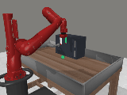
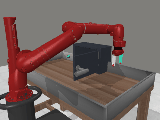
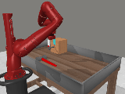
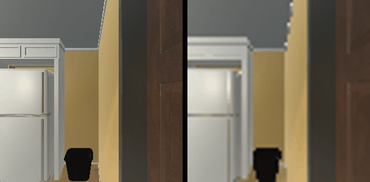
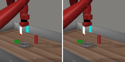

### AVDC

This package runs [AVDC](https://github.com/flow-diffusion/AVDC) on AMD Ryzen AI Max+ 395
(Strix Halo, gfx1151) under ROCm 7.14. AVDC ("Learning to Act from Actionless Videos through
Dense Correspondences") is a text-conditioned 3D-UNet video-diffusion policy: given the current
frame and a task string it imagines a short future video (CLIP ViT-B/32 task tokens, a
GoalGaussianDiffusion DDIM sampler), then turns that video into actions with UniMatch (GMFlow)
dense optical flow. This is a direct PyTorch port: upstream runs on the base image's ROCm torch,
the CUDA torch pins are stripped, and a single NVML no-op patch is applied.

AVDC is a model layer that chains on the `packages/simulation/ithor` sim base
(`ryzers build simulation/ithor avdc`), so the iTHOR half reuses that base's ai2thor + Vulkan runtime and
`sim_ithor` harness instead of duplicating it. The layer bundles a vendored Meta-World MuJoCo
simulator, so one image runs all three demos: closed-loop Meta-World, closed-loop iTHOR
ObjectNav, and open-loop video prediction.

### Build

```sh
ryzers build simulation/ithor avdc --name avdc          # model layer on the iTHOR sim base: all three demos
ryzers run --name avdc                        # model_smoke.py: 3D-UNet + DDIM forward sign-of-life
```

Artifacts are written to `workspace/avdc/outputs`. Set `HF_TOKEN` for faster or gated downloads.
CLIP and the AVDC snapshots are fetched on the first model run; UniMatch flow weights and the
MuJoCo runtime are baked in at build.

```sh
WHICH=all   ryzers run --name avdc /ryzers/scripts/download_checkpoints.sh   # Meta-World (+ DA) ckpts
WHICH=ithor ryzers run --name avdc /ryzers/scripts/download_checkpoints.sh   # iTHOR ckpt
```

### Demos

| Demo | Base | What it does |
|---|---|---|
| `demos/demo_metaworld.sh` | `avdc` | Closed-loop Meta-World rollout (MuJoCo/EGL), executed GIF + metrics. |
| `demos/demo_metaworld_benchmark.sh` | `avdc` | Meta-World tasks x seeds sweep + per-task success rate. |
| `demos/demo_ithor.sh` | `avdc` | Closed-loop iTHOR ObjectNav rollout (Vulkan) + plan-vs-sim GIF. |
| `demos/demo_ithor_benchmark.sh` | `avdc` | iTHOR ObjectNav tasks x seeds sweep + success rate. |
| `demos/demo_openloop.sh` | `avdc` | Open-loop video prediction: init frame + task -> generated future. |

### Closed-loop Meta-World

Video model plans, UniMatch flow solves actions, MuJoCo executes headless via EGL. Eleven
Meta-World V2 tasks x 5 seeds, corner camera, 100 DDIM steps: mean success 0.564 (per-task 0.0
to 1.0).

```sh
ENV_NAME=door-open-v2-goal-observable ryzers run --name avdc /ryzers/demos/demo_metaworld.sh
ryzers run --name avdc /ryzers/demos/demo_metaworld_benchmark.sh
```

<p align="center">
  
  
  
  <br><em>Closed-loop Meta-World rollouts: door-open, door-close, hammer.</em>
</p>

### Closed-loop iTHOR ObjectNav

ObjectNav over the sim base's ai2thor CloudRendering / Vulkan runtime with the AVDC video->flow->nav
policy. Twelve tasks x 5 seeds = 60 episodes, 64x64 policy input, `MAX_EPLEN=50`, fp16 +
`torch.compile`: mean success 0.233 (per-task 0.0 to 0.4), in line with AVDC's published iTHOR
numbers.

```sh
SCENE=FloorPlan1 TARGET=Toaster ryzers run --name avdc /ryzers/demos/demo_ithor.sh
TASKS=all N_SEEDS=5 ryzers run --name avdc /ryzers/demos/demo_ithor_benchmark.sh
```

<p align="center">
  
  <br><em>iTHOR ObjectNav: the sim observation the plan was imagined from (left) and AVDC's generated future plan (right).</em>
</p>

### Open-loop video prediction

One initial frame and a task string produce an 8-frame future clip (1 conditioning + 7 predicted)
at 128x128 over 100 DDIM steps. AVDC is actionless, so the open-loop signal is the generated video;
a single reference frame drives the generation, so the initial frame is shown on the left and the
generated future on the right.

```sh
IMAGE=/data/init.png TEXT="open the door" ryzers run --name avdc /ryzers/demos/demo_openloop.sh
```

<p align="center">
  
  <br><em>Initial frame (left) and AVDC's generated future video (right).</em>
</p>

### Useful knobs

- Checkpoint: `WHICH`, `CKPT_DIR`, `MILESTONE`, `SAMPLE_STEPS` (defaults: Meta-World `/models/metaworld` m24, iTHOR `/models/ithor` m16).
- Open-loop: `IMAGE`, `TEXT`, `GUIDANCE`, `FLOW`, `SEED`.
- Meta-World: `ENV_NAME`, `CAMERA` (corner|corner2|corner3), `MAX_REPLANS`, `SEED`.
- iTHOR: `SCENE`, `TARGET`, `TASKS`, `N_SEEDS`, `MAX_EPLEN`, `RENDER_RESOLUTION`, `THOR_PLATFORM`, `POLICY_FACTORY` (default `avdc_ithor_policy:build_policy`).
- Optimization: `AVDC_AMP` (fp16), `AVDC_COMPILE`, `AVDC_COMPILE_MODE`; fp16 + `torch.compile` give about 2x faster DDIM sampling, quality-neutral.
- `MIOPEN_FIND_MODE`: use `FAST` for quick Meta-World runs (the 128x128x7 3D convs are slow to warm under `NORMAL` on gfx1151); `NORMAL` kernels are cached after the first run.
- `HF_TOKEN` for faster or gated downloads.

### References

- Upstream: https://github.com/flow-diffusion/AVDC_experiments (pinned in `docs/UPSTREAM_PIN.commit.txt`)
- Model: https://huggingface.co/Po-Chen/flowdiffusion
- Datasets: Meta-World (https://meta-world.github.io), AI2-THOR iTHOR (https://ai2thor.allenai.org)

Copyright (C) 2026 Advanced Micro Devices, Inc. All rights reserved.
SPDX-License-Identifier: MIT
