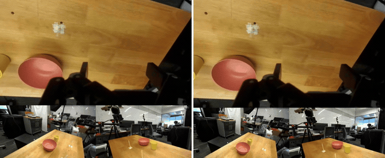
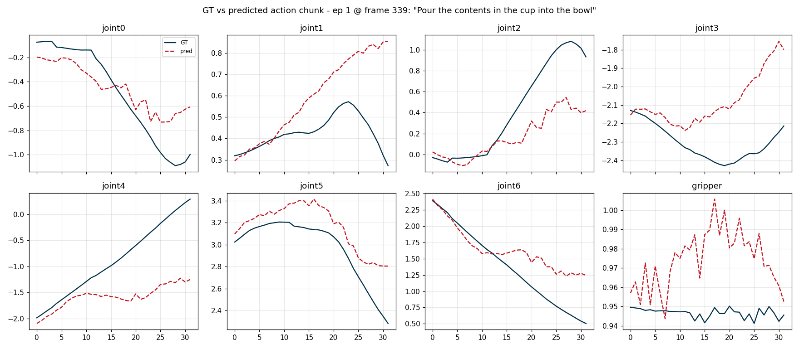
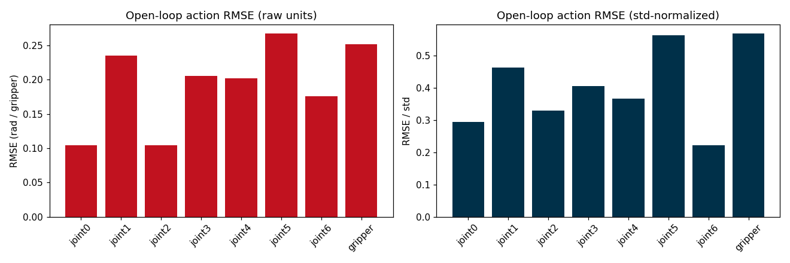
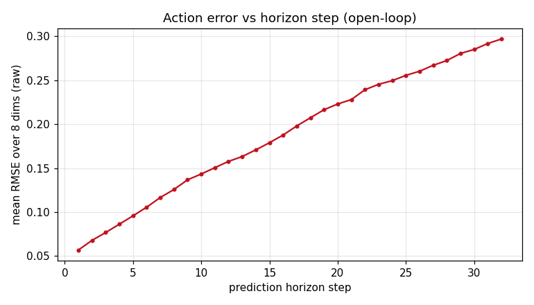

### Cosmos3-Nano-Policy-DROID

This package runs [Cosmos3-Nano-Policy-DROID](https://huggingface.co/nvidia/Cosmos3-Nano-Policy-DROID)
on AMD Ryzen AI Max+ 395 (Strix Halo, gfx1151) under ROCm 7.14. It is an about-15B-parameter
Mixture-of-Transformers world-action model: a Qwen3-VL-8B MoT backbone (understanding and generation
experts), a Wan2.2 VAE vision tokenizer, and small action/proprio adapters, denoised by a UniPC
rectified-flow sampler. From a concatenated DROID camera view (wrist, left, right) plus proprioception
and language it predicts 32-step joint-position action chunks, and can imagine the future video
alongside the action plan. This is a direct PyTorch port: the cosmos-framework policy stack installs on
the base image's ROCm torch, the CUDA torch and NVIDIA-only attention kernels are never pulled, and
attention routes to SDPA/AOTriton on gfx1151.

Cosmos3 ships no simulator. The demos run standalone on the plain ROCm base: video imagination and
open-loop DROID replay.

### Build

```sh
ryzers build cosmos3 --name cosmos3        # model layer: non-sim demos (video imagination / open-loop)
ryzers run --name cosmos3                  # test.py: ROCm torch + GPU + deps check
```

Artifacts are written to `workspace/cosmos3/outputs`. The Cosmos3 weights and the Cosmos3-DROID dataset
are gated: accept the licenses on Hugging Face and set `HF_TOKEN`. Both are fetched on the first demo
run, or ahead of time:

```sh
ryzers run --name cosmos3 /ryzers/scripts/download_checkpoints.sh   # Cosmos3-Nano-Policy-DROID (~32 GB)
ryzers run --name cosmos3 /ryzers/scripts/download_datasets.sh      # Cosmos3-DROID open-loop slice
```

### Demos

| Demo | Base | What it does |
|---|---|---|
| `demos/demo_videogen.sh` | plain | Imagine the future concat-view video, GT-vs-imagined two-column clip. |
| `demos/demo_openloop.sh` | plain | Replay DROID episodes, overlay predicted vs GT action chunks + RMSE. |

### Video imagination

The world-model path imagines the future concat-view video together with the action plan (ground truth
left, imagined right). On gfx1151 under ROCm 7.2.2 the Wan2.2 conv3d decode hangs in bf16/fp16, so the
decode runs offline in fp32 and is visualization-only, off the deployed action path (fixed upstream in
ROCm >=7.12; a tiny Conv2D decoder that sidesteps conv3d is the recommended fast path, see
`RUNTIME_OPTIMIZATION.md`).

```sh
EP=0 DECODE_DTYPE=fp32 MIOPEN_FIND_MODE=2 ryzers run --name cosmos3 /ryzers/demos/demo_videogen.sh
```

<p align="center">
  
  <br><em>DROID episode 0: ground truth (left) vs the model's imagined future (right).</em>
</p>

### Open-loop replay

Predicted action chunks track ground truth over 60 queries from 10 DROID episodes: overall RMSE 0.202 in
raw joint-position space (per-dimension 0.10 to 0.27 rad), growing from 0.057 to 0.297 across the 32-step
horizon. Action inference is about 26 s per query at `num_steps=4` (cold start 75 s), peak VRAM 33.3 GB.

```sh
NUM_EPISODES=10 ryzers run --name cosmos3 /ryzers/demos/demo_openloop.sh
```

<p align="center">
  
  <br><em>Ground truth (solid) vs predicted (dashed) action chunk, all 8 dimensions, highest-motion query.</em>
</p>
<p align="center">
  
  
  <br><em>Per-dimension RMSE, raw and std-normalized (left); RMSE growth over the 32-step horizon (right).</em>
</p>

### Useful knobs

- Open-loop: `NUM_EPISODES` (default 10), `QUERIES_PER_EP` (8), `NUM_STEPS` (UniPC denoise steps, 4), `SEED` (0).
- Video imagination: `EP` (episode index), `DECODE_DTYPE` (fp32), `MIOPEN_FIND_MODE=2` for the stable fp32 conv3d decode.
- `HF_TOKEN` for the gated weights and dataset.

### Optimization

`RUNTIME_OPTIMIZATION.md` has the full per-component runtime breakdown (CUDA-event hooks on every
module) and the architecture diagram. Action inference is MoT-bound: about 95% of the wall clock is the
15B Mixture-of-Transformers backbone across the 8 CFG network calls, so the main levers are fewer UniPC
steps and CFG or attention-kernel tuning on gfx1151. The only 3D-conv liability is the video decode,
which is off the action path; the tiny Conv2D decoder both removes the gfx1151 hang and makes rollout
rendering interactive.

### References

- Upstream: https://github.com/NVIDIA/cosmos-framework (pinned in `docs/UPSTREAM_PIN.commit.txt`)
- Model: https://huggingface.co/nvidia/Cosmos3-Nano-Policy-DROID
- Datasets: https://huggingface.co/datasets/nvidia/Cosmos3-DROID

Copyright (C) 2026 Advanced Micro Devices, Inc. All rights reserved.
SPDX-License-Identifier: MIT
