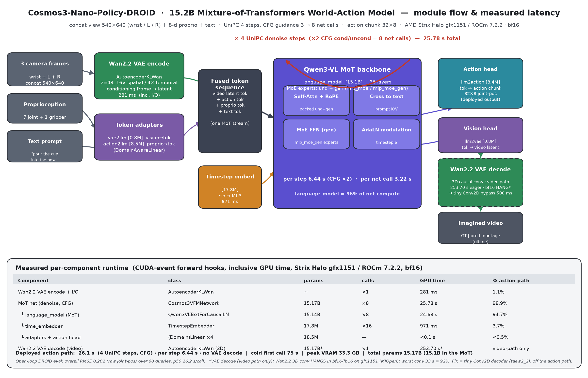

<!-- Copyright(C) 2026 Advanced Micro Devices, Inc. All rights reserved. SPDX-License-Identifier: MIT -->
# Cosmos3-Nano-Policy-DROID — runtime analysis on AMD Strix Halo (gfx1151 / ROCm 7.2.2)

Full per-component runtime breakdown of the released `nvidia/Cosmos3-Nano-Policy-DROID` policy on
a single AMD Strix Halo (gfx1151) unit, bf16, measured with CUDA-event forward hooks on **every**
`nn.Module` (inclusive GPU time). Reproduce with `scripts/cosmos3_latency_profile.py`; the diagram
below is rendered by `scripts/cosmos3_render_arch.py` from the emitted JSON.

## Model
`OmniMoTModel` — a 15.17B-parameter **Mixture-of-Transformers** world-action model. The backbone is
`Qwen/Qwen3-VL-8B-Instruct` re-cast as a unified MoT (`Qwen3VLTextForCausalLM`, 36 layers) whose
FFN experts are duplicated into an *understanding* set (`mlp_moe`) and a *generation* set
(`mlp_moe_gen`) — hence ~15B from an ~8B base. Vision is tokenised by the **Wan2.2 VAE**
(`AutoencoderKLWan`, 16× spatial / 4× temporal, z=48, causal-3D); actions/proprio enter and leave
through small (Domain)Linear adapters. A UniPC rectified-flow sampler denoises action (and, on the
video path, vision) tokens.

| top-level module | class | params |
|---|---|---|
| `net.language_model` | `Qwen3VLTextForCausalLM` (MoT) | 15.14 B |
| `net.time_embedder` | `TimestepEmbedder` | 17.8 M |
| `net.vae2llm` / `net.llm2vae` | `Linear` | 0.79 M each |
| `net.action2llm` / `net.llm2action` | `DomainAwareLinear` | 8.5 M / 8.4 M |
| Wan2.2 VAE (tokenizer, encode+decode) | `Wan2pt2VAEInterface` | (separate) |

## Deployed action path — measured (num_steps=4, CFG guidance 3.0)
CFG runs cond+uncond, so the network is evaluated **8×** per inference (2 × 4 UniPC steps).

| component | class | calls | GPU time | % action path |
|---|---|---:|---:|---:|
| Wan2.2 VAE encode (conditioning frame) + I/O | `AutoencoderKLWan` | ×1 | **0.28 s** | 1.1% |
| MoT net (denoise loop, CFG) | `Cosmos3VFMNetwork` | ×8 | **25.78 s** | 98.9% |
| &nbsp;&nbsp;└ `language_model` (MoT backbone) | `Qwen3VLTextForCausalLM` | ×8 | 24.68 s | 94.7% |
| &nbsp;&nbsp;└ `time_embedder` | `TimestepEmbedder` | ×16 | 0.97 s | 3.7% |
| &nbsp;&nbsp;└ adapters + action head | (Domain)Linear ×4 | — | <0.1 s | <0.5% |
| **total action path** | | | **26.06 s** | 100% |

- **per denoise step ≈ 6.44 s** (2 net calls); **per net call ≈ 3.22 s**.
- The MoT backbone is essentially the entire cost — **95% of the network**. There is no separate
  ViT vision tower on the action path; images are a handful of VAE-latent tokens.
- cold first call **75.2 s** (ROCm/AOTriton autotune + MIOpen find), steady thereafter.
- peak VRAM **33.3 GB**; weight load ~19 s warm (Wan2.2 VAE cached) / tokenizer set-up ~12 s.

## Open-loop DROID accuracy (`scripts/openloop_replay.py`)
60 queries over 10 episodes, horizon 32, raw joint-position space:
- overall **RMSE 0.202** (raw); per-dim 0.10–0.27 rad (gripper 0.25); std-normalized 0.22–0.57.
- horizon RMSE grows 0.057 → 0.297 across the 32-step chunk (expected open-loop drift).
- latency mean 27.1 s, p50 26.2 s, cold 75.2 s — consistent with the profile above.
See `assets/openloop_*.png` and `docs/results/openloop_metrics.json`.

## Video (world-model) path — VAE decode bottleneck
The imagined-video path adds one **Wan2.2 `AutoencoderKLWan` 3D-conv decode**
(latent `[1,48,8,30,54]` → `29×480×864`). This is **off** the deployed action/eval path
(visualization only) but is the dominant cost when enabled, and hits a MIOpen conv3d pathology on
gfx1151 / ROCm 7.2.2:

- full eager decode ≈ **253.7 s / iter**, GPU util ~5% (host-side MIOpen search dominated);
  `sum(conv3d)` 35.5 s of which the **single worst conv is 32.7 s = 92%**
  (`decoder.up_blocks.3.resnets.0.conv1`, `512→256` @ 240×432, k=3³). By output resolution,
  240×432 = 95% of conv3d time — a **specific large-channel@high-res shape**, not conv3d in general.
- **bf16/fp16 hang the GPU** on this unit; disabling the direct + explicit-GEMM fallbacks reveals
  those are the *only* 3D kernels MIOpen has (→ "No suitable algorithm"); **fp32 is the only path
  that runs** (~24.5 s for that one conv — unusable online). No MIOpen env knob rescues the
  half-precision path. Matches upstream reports (pytorch#146998, ROCm#5514, pytorch#169857; fixed
  in ROCm ≥7.12).

### Recommended fix (both speedup and stability)
**Tiny Conv2D decoder** (`taew2_2` / `lighttaew2_2`, TAEHV family) for the Wan2.2 latent space:
Conv2D-only, so it **sidesteps the broken conv3d path entirely** (~0.5 s, <0.5 GB). Because decode
is visualization-only, the quality trade-off is acceptable. `scripts/cosmos3_videogen.py` renders
the two-column GT|pred rollout and takes a `DECODE_DTYPE` / tiny-decoder switch; wiring the tiny
decoder weights (fetched at container build, not vendored — rule 8) is the next step.

## Where the runtime goes — takeaways
1. **Action inference is MoT-bound**: 95% of wall is the 15B MoT backbone across 8 CFG net calls.
   Levers: fewer UniPC steps, CFG-parallel / CFG-distillation, and MoE-expert / attention kernel
   tuning on gfx1151.
2. **Vision in is cheap** (VAE encode of one concat frame ≈ 0.28 s).
3. **Video out is the only 3D-conv liability** and is off the action path; the tiny Conv2D decoder
   both fixes the gfx1151 hang and makes rollout rendering interactive.
