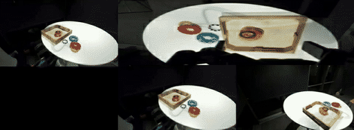
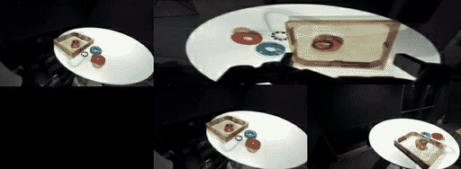
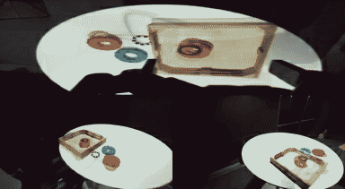

### DreamZero-DROID

This package runs [DreamZero](https://github.com/dreamzero0/dreamzero) — NVIDIA GEAR's 14B
**joint world-action** diffusion model (UMT5-XXL text encoder + Wan2.1 VAE/CLIP + a blockwise
causal DiT that emits *both* a future-video latent and a 24-step action chunk) — on AMD Ryzen
AI Max+ 395 (Strix Halo, `gfx1151`). Fine-tuned checkpoint: `GEAR-Dreams/DreamZero-DROID`.

It is a **WAM-direct port**: correctness-first, the upstream tree kept byte-for-byte pristine,
and every AMD-specific bridge isolated in `overlay/`:

- **Pristine upstream** is git-cloned at a pinned commit into `/opt/dreamzero` (never edited),
  placed first on `PYTHONPATH` so `groot.*` imports win.
- **`overlay/python/flash_attn`** is an SDPA-backed shim that satisfies the `flash_attn.*`
  import surface without CUDA-only kernels; with aotriton enabled it routes attention through
  torch SDPA on ROCm — **no flash-attn source build**.
- **All correctness/memory fixes are runtime monkey-patches** (`overlay/tests/_stage_b_patches.py`,
  `validate_stage3_path_b.py::apply_amd_patches`): tiled VAE encode/decode, in-place KV cache,
  forced-CUDA `prepare_input`, and text-encoder CPU offload. The upstream tree is untouched.

Validated on the ROCm base (torch 2.10.0) under both **rocm7.2.2** and **rocm7.14**. The only
version-sensitive knob is the allocator (`expandable_segments:False`; see below).

### Build

```sh
ryzers build dreamzero --name dreamzero
ryzers run   --name dreamzero            # test.py: ROCm torch + GPU + flash_attn shim + groot graph
```

Artifacts land in `workspace/dreamzero/outputs`. Weights/data are fetched by the script below
(big: DreamZero-DROID ~28 GB, Wan2.1-I2V-14B ~40 GB). Set `HF_TOKEN` for faster/gated pulls.

```sh
ryzers run --name dreamzero /ryzers/scripts/download_checkpoints.sh all   # model + Wan2.1 + 3 eval eps
EPISODES_N=10 ryzers run --name dreamzero /ryzers/scripts/download_checkpoints.sh data
```

### Demos

| Demo | What it does |
|---|---|
| `demos/demo_smoke.sh` | Weight-free ROCm/GPU + flash_attn shim + `groot.vla.model.dreamzero` import graph + tiny AttentionModule forward. |
| `demos/demo_openloop.sh` | Teacher-force released DROID episodes; predicted vs GT action chunks — arm RMSE, per-step cosine, gripper accuracy + overlays. |
| `demos/demo_videogen.sh` | K-chunk continuous predicted-video rollout with the **open-loop looping fix** ON (rolling-overlap decode + `VIDEO_FPS=5` + `STAGE_C=0`) + an autoregressive extrapolation pass; writes per-episode mp4s, anchor\|prediction side-by-side, and a manifest. |

```sh
EPISODES=0 CHUNKS_PER_EPISODE=3 ryzers run --name dreamzero /ryzers/demos/demo_openloop.sh
EPISODES=0 NUM_CHUNKS=4         ryzers run --name dreamzero /ryzers/demos/demo_videogen.sh
```

### The open-loop "looping" fix

The predicted future-video appeared to *loop / redo the task* in open-loop rollouts. It was
three compounding effects, none a model bug (full analysis + evidence in
`RUNTIME_OPTIMIZATION.md`):

1. **Playback rate** — the model's predicted video is native **5 fps**; rendering at the DROID
   15 fps plays it ~3.2× too fast so a single reach looks like several. → `VIDEO_FPS=5`.
2. **Per-chunk VAE boundary spike** — decoding each chunk's latent in isolation drops temporal
   context at the seam. → **rolling-overlap decode** (`STREAMING_OVERLAP_DECODE=1`, ~49% seam-spike
   reduction).
3. **Image-feature reuse at local-attention resets** injects a semantic jump. → `STAGE_C=0`.

`demos/demo_videogen.sh` enables all three by default.

### Video imagination

With the fix on, the model *imagines the future in the real scene*. Below, the real DROID
observation is held on the **left**; the model's imagined future (its predicted video, decoded
with the looping fix) plays on the **right**. Episode 0 — task *"Pick up the blue ring from the
table and put it in the wooden tray"* (native 5 fps; peak VRAM ~42 GiB on `gfx1151`).

<p align="center">
  
  <br><em>Rolling-overlap streaming decode (the looping fix): real anchor (left) vs imagined rollout (right) — coherent forward progress, no re-looping.</em>
</p>
<p align="center">
  
  <br><em>Grounded rollout: real anchor (left) vs the model's imagined future (right).</em>
</p>
<p align="center">
  
  <br><em>Autoregressive extrapolation — the model imagines forward purely from its own predictions.</em>
</p>

### Configuration knobs (`config.yaml` / env)

| Var | Default | Notes |
|---|---|---|
| `PYTORCH_HIP_ALLOC_CONF` | `expandable_segments:False` | **Must be False on rocm7.14** (True caps the GTT pool at ~19.5 GiB); False reaches the full ~47 GiB pool. |
| `FLASH_ATTN_BACKEND` / `ENABLE_FLASH_SDPA` | `sdpa` / `1` | SDPA shim + aotriton flash; no CUDA flash-attn. |
| `TORCH_ROCM_AOTRITON_ENABLE_EXPERIMENTAL` | `1` | Enables aotriton fused attention on gfx1151. |
| `VIDEO_FPS` / `STREAMING_OVERLAP_DECODE` / `STAGE_C` | `5` / `1` / `0` | The looping-fix trio. |
| `EPISODES` / `NUM_CHUNKS` / `DENOISE_STEPS` | `0` / `4` / `2` | Video rollout schedule. |

### What is in this package

```
config.yaml Dockerfile test.py README.md RUNTIME_OPTIMIZATION.md
overlay/python/flash_attn/          SDPA-backed flash_attn shim
overlay/tests/render_stage5_long.py K-chunk predicted-video render + looping fix
overlay/tests/validate_stage3_path_b.py  DroidDataset (+ GEAR variant) + AMD patch suite + numeric eval
overlay/tests/_stage_{b,c}_patches.py    runtime memory/KV/VAE monkey-patches
scripts/  download_checkpoints.sh  _hf_common.sh
demos/    demo_smoke.sh  demo_openloop.sh  demo_videogen.sh
assets/   README imagination gifs (anchor|imagined side-by-side + autoregressive)
docs/     UPSTREAM_PIN.md  UPSTREAM_PIN.commit.txt
```

### References

- DreamZero (NVIDIA GEAR) — pinned commit in `docs/UPSTREAM_PIN.commit.txt`.
- Checkpoint: `GEAR-Dreams/DreamZero-DROID`; base: `Wan-AI/Wan2.1-I2V-14B-480P`, `google/umt5-xxl`.
- Eval data: `GEAR-Dreams/DreamZero-DROID-Data` (LeRobot per-episode parquet + mp4).
