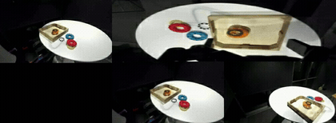
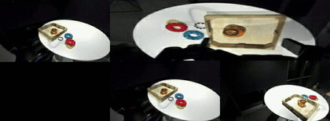
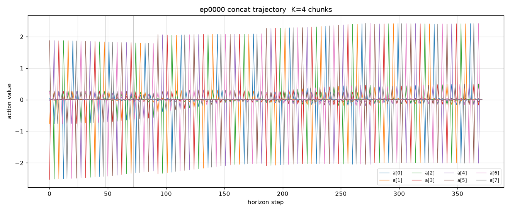

### DreamZero-DROID

This package runs [DreamZero](https://github.com/dreamzero0/dreamzero) on AMD Ryzen AI Max+
395 (Strix Halo, gfx1151) under ROCm 7.14. DreamZero is NVIDIA GEAR's 14B joint world-action
diffusion model: a UMT5-XXL text encoder, the Wan2.1 VAE and CLIP, and a blockwise-causal DiT
that emits both a future-video latent and a 24-step action chunk. This package runs the
fine-tuned `GEAR-Dreams/DreamZero-DROID` checkpoint standalone with no simulator: it replays
released DROID episodes open-loop and imagines the future video in the real scene.

This is a direct PyTorch port. The pinned upstream tree runs on the base image's ROCm torch
and is kept pristine; `flash_attn` is satisfied by an SDPA shim that routes attention through
torch SDPA on ROCm (no CUDA kernel build), and the correctness and memory fixes (tiled VAE
encode/decode, text-encoder CPU offload, forced-CUDA input, in-place KV cache) are applied at
runtime. Validated on the ROCm base (torch 2.10.0) under both ROCm 7.2.2 and 7.14; the only
version-sensitive knob is the allocator (`expandable_segments:False`, see below).

### Build

```sh
ryzers build dreamzero --name dreamzero
ryzers run   --name dreamzero            # test.py: ROCm torch + GPU + flash_attn shim + groot graph
```

Artifacts are written to `workspace/dreamzero/outputs`. Set `HF_TOKEN` for faster or gated
downloads. Weights are fetched by the script below (DreamZero-DROID ~28 GB, Wan2.1-I2V-14B
base ~40 GB).

```sh
ryzers run --name dreamzero /ryzers/scripts/download_checkpoints.sh all   # model + Wan2.1 base + eval episodes
EPISODES_N=10 ryzers run --name dreamzero /ryzers/scripts/download_checkpoints.sh data
```

### Demos

| Demo | Base | What it does |
|---|---|---|
| `demos/demo_videogen.sh` | plain | K-chunk predicted-video rollout with the looping fix on, plus an autoregressive pass; writes GT-vs-imagined clips. |
| `demos/demo_openloop.sh` | plain | Teacher-force released DROID episodes, score predicted vs GT action chunks (arm RMSE, per-step cosine, gripper accuracy). |

### Video imagination

With the looping fix on, the model imagines the future video in the real scene. The real DROID
observation is held on the left; the model's imagined future (its predicted video, decoded with
the looping fix) plays on the right. Episode 0, task "Pick up the blue ring from the table and
put it in the wooden tray", native 5 fps, K=4 chunks at 2 denoise steps, peak VRAM about 42 GiB
on gfx1151 (per-chunk inference 17 to 32 s).

```sh
EPISODES=0 NUM_CHUNKS=4 ryzers run --name dreamzero /ryzers/demos/demo_videogen.sh
```

<p align="center">
  
  <br><em>Rolling-overlap streaming decode (the looping fix): real anchor (left) vs imagined rollout (right), coherent forward progress with no re-looping.</em>
</p>
<p align="center">
  
  <br><em>Grounded rollout: real anchor (left) vs the model's imagined future (right).</em>
</p>
<p align="center">
  
  <br><em>Autoregressive extrapolation: the model imagines forward purely from its own predictions.</em>
</p>

### Open-loop replay

Teacher-force released DROID episodes, predict one 24-step action chunk per anchor, and score
arm RMSE, per-step cosine similarity, and gripper accuracy against ground truth. The demo
writes per-chunk overlays and an `aggregate.json`.

```sh
EPISODES=0 CHUNKS_PER_EPISODE=3 ryzers run --name dreamzero /ryzers/demos/demo_openloop.sh
```

<p align="center">
  
  <br><em>Predicted 8-dim action chunks concatenated over the episode-0 rollout horizon (K=4 chunks).</em>
</p>

### Useful knobs

- `EPISODES`, `NUM_CHUNKS`, `DENOISE_STEPS`: video rollout schedule (defaults 0 / 4 / 2).
- `CHUNKS_PER_EPISODE`: open-loop action chunks scored per episode.
- Looping fix: `VIDEO_FPS=5`, `STREAMING_OVERLAP_DECODE=1`, `STAGE_C=0` (all default-on in `demo_videogen.sh`).
- `PYTORCH_HIP_ALLOC_CONF=expandable_segments:False`: required on ROCm 7.14 to reach the full GTT pool.
- `FLASH_ATTN_BACKEND=sdpa`, `TORCH_ROCM_AOTRITON_ENABLE_EXPERIMENTAL=1`: SDPA shim plus aotriton attention, no CUDA flash-attn.
- `HF_TOKEN` for faster or gated downloads.

### Optimization

Fitting the 14B model in the ~47 GiB unified GTT pool relies on tiled VAE encode/decode,
text-encoder CPU offload, forced-CUDA inputs, and `expandable_segments:False` (peak about
42 GiB). The open-loop looping artifact is resolved by native 5 fps playback, rolling-overlap
VAE decode (about 49% seam-spike reduction), and disabling image-feature reuse at attention
resets. See `RUNTIME_OPTIMIZATION.md` for the full study and evidence.

### References

- Upstream: https://github.com/dreamzero0/dreamzero (pinned in `docs/UPSTREAM_PIN.commit.txt`)
- Model: https://huggingface.co/GEAR-Dreams/DreamZero-DROID (base: `Wan-AI/Wan2.1-I2V-14B-480P`, `google/umt5-xxl`)
- Datasets: https://huggingface.co/datasets/GEAR-Dreams/DreamZero-DROID-Data

Copyright (C) 2026 Advanced Micro Devices, Inc. All rights reserved.
SPDX-License-Identifier: MIT
