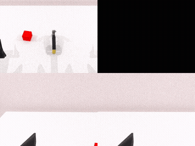
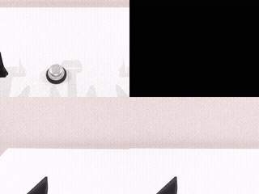
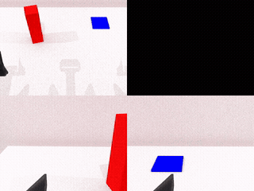
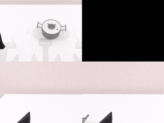
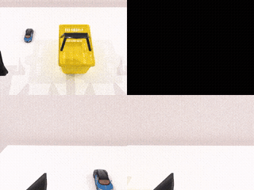

# FastWAM — RoboTwin 2.0

Closed-loop [RoboTwin 2.0](https://github.com/RoboTwin-Platform/RoboTwin) evaluation of
FastWAM on AMD Strix Halo (`gfx1151`), rendered with SAPIEN offscreen Vulkan ray
tracing. Layers on the `fastwam` image; curobo (CUDA-only) is replaced by mplib and the
OIDN denoiser is disabled — see `docs/PORTING.md`. RoboTwin sim assets are third-party
and fetched at runtime by `scripts/setup_robotwin.sh`, never baked into the image.

## Build

Built as a chain on top of the core `fastwam` package:

```sh
ryzers build fastwam fastwam-robotwin --name fastwam-robotwin
ryzers run --name fastwam-robotwin     # test.py: ROCm torch + SAPIEN/mplib + Vulkan sign-of-life
```

## Fetch weights

```sh
ryzers run --name fastwam-robotwin "/ryzers/scripts/download_checkpoints.sh robotwin"   # ~12 GB
```

The Wan2.2 base and RoboTwin sim assets download on the first demo run.

## Demo

```sh
ryzers run --name fastwam-robotwin /ryzers/demos/demo_closedloop_robotwin.sh
TASKS="click_bell lift_pot" ryzers run --name fastwam-robotwin /ryzers/demos/demo_closedloop_robotwin.sh
```

`demo_closedloop_robotwin.sh` runs closed-loop rollouts (default 5 tasks × 10 episodes),
writing per-task rollout videos + results under `workspace/fastwam/outputs`.

## Expected outputs

Five-task suite, 10 episodes each — **38/50 (76%)** overall:
`beat_block_hammer` 100%, `click_bell` 100%, `handover_block` 80%, `lift_pot` 60%,
`place_object_basket` 40%.







## References

- RoboTwin: https://github.com/RoboTwin-Platform/RoboTwin · assets: https://huggingface.co/datasets/TianxingChen/RoboTwin2.0
- Model: https://huggingface.co/yuanty/fastwam

Copyright (C) 2026 Advanced Micro Devices, Inc. All rights reserved.
SPDX-License-Identifier: MIT
