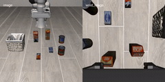
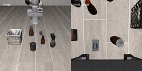
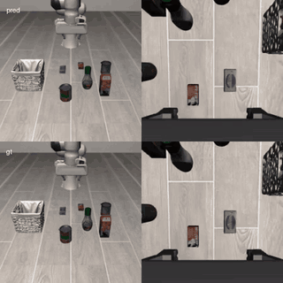
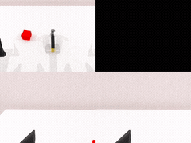
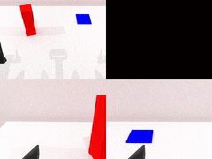
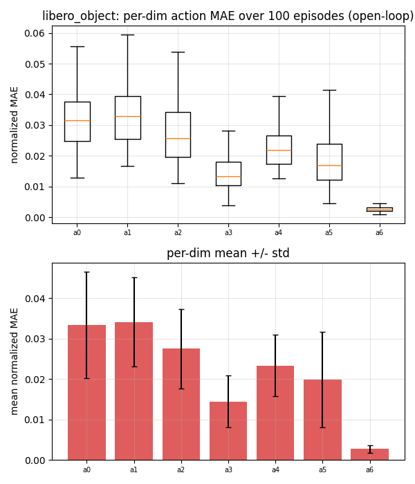
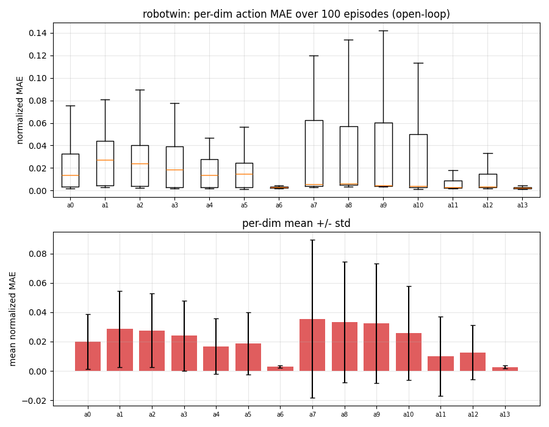
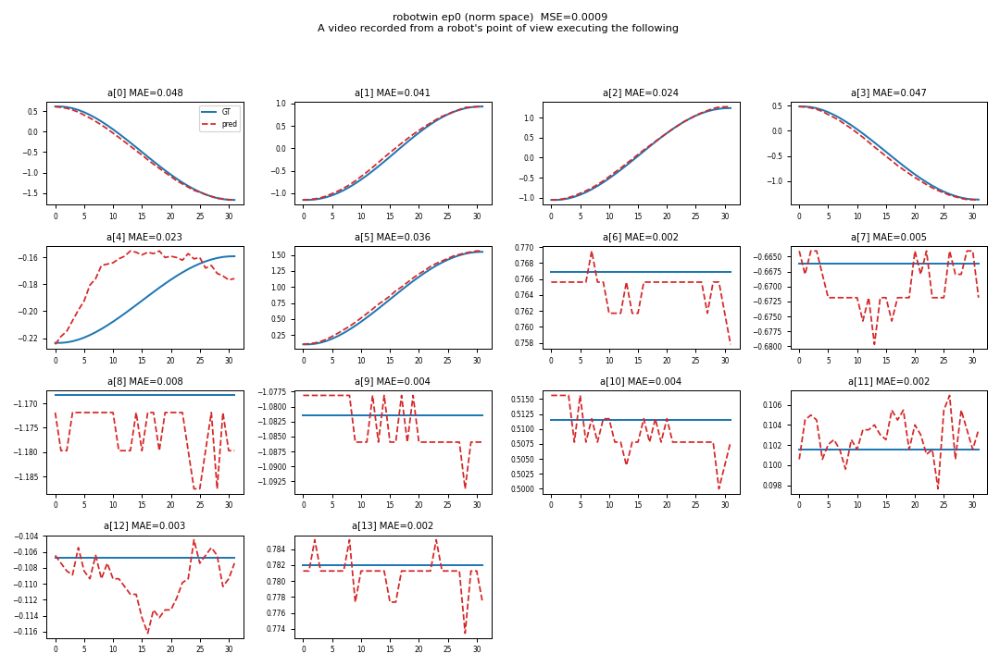

### FastWAM

This package runs [FastWAM](https://github.com/yuantianyuan01/FastWAM) on AMD Ryzen AI Max+
395 (Strix Halo, gfx1151) under ROCm 7.14. FastWAM is a Wan2.2-TI2V-5B world-action model
(T5 text encoder, Wan VAE, and a joint video/action DiT) that can plan actions with the video
head skipped for speed, or imagine future frames alongside the action plan. This is a direct
PyTorch port: upstream runs on the base image's ROCm torch and only the CUDA torch pins are
stripped.

FastWAM ships no simulator. It is a slim policy layer that the model-agnostic simulation bases
attach to through a runtime `Policy` adapter (`adapters/fastwam_{libero,robotwin}_policy.py`,
selected by `POLICY_FACTORY`). It chains on top of a simulator base for closed-loop and
interactive runs, or runs standalone on the plain base for the non-sim demos.

### Build

```sh
ryzers build fastwam --name fastwam                       # model layer: non-sim demos (open-loop / videogen)
ryzers run --name fastwam                                 # test.py: ROCm torch + GPU + deps check

ryzers build simulation/libero   fastwam --name fastwam-libero       # chain the model on the LIBERO base
ryzers build simulation/robotwin fastwam --name fastwam-robotwin     # chain the model on the RoboTwin base
```

Artifacts are written to `workspace/*/outputs`. Set `HF_TOKEN` for faster or gated downloads.
The ~12 GB Wan2.2 base is fetched on the first model run.

```sh
ryzers run --name fastwam /ryzers/scripts/download_checkpoints.sh    # LIBERO + RoboTwin ckpts
ryzers run --name fastwam /ryzers/scripts/download_datasets.sh       # open-loop / video data
```

### Demos

| Demo | Base | What it does |
|---|---|---|
| `demos/demo_interactive_libero.sh` / `_rt.sh` | `libero` | Interactive LIBERO over HTTP. |
| `demos/demo_interactive_robotwin.sh` / `_rt.sh` | `robotwin` | Interactive RoboTwin over HTTP. |
| `demos/demo_closedloop_libero.sh` | `libero` | Closed-loop LIBERO rollouts (MuJoCo/EGL) + success rate. |
| `demos/demo_closedloop_robotwin.sh` | `robotwin` | Closed-loop RoboTwin 2.0 rollouts (SAPIEN/Vulkan) + success rate. |
| `demos/demo_videogen.sh` | plain | Imagine future frames from the first observation, GT-vs-imagined clips. |
| `demos/demo_openloop.sh` | plain | Replay observations, overlay predicted vs GT action chunks + MAE. |

### Interactive and closed-loop LIBERO

Drive the robot live in a browser, or run a batch rollout for a success rate. The interactive
server streams the MuJoCo view over HTTP and prints its `http://localhost:PORT` URL.

```sh
ryzers run --name fastwam-libero /ryzers/demos/demo_interactive_libero.sh      # live browser control
ryzers run --name fastwam-libero /ryzers/demos/demo_closedloop_libero.sh       # batch rollouts + success rate
```

Closed-loop `libero_object`, 10 tasks x 20 trials: 199/200 (99.5%) success, rendered headless via EGL.

<p align="center">
  
  
  
  
  <br><em>Closed-loop LIBERO-object rollouts.</em>
</p>

With `VISUALIZE_FUTURE=true` the slow path also renders the imagined future next to the real
rollout (ground truth left, imagined right, PSNR about 27.3 dB).

<p align="center">
  
  <br><em>Slow path: real rollout vs the model's imagined future.</em>
</p>

### Interactive and closed-loop RoboTwin 2.0

RoboTwin 2.0 runs under the SAPIEN Vulkan renderer.

```sh
ryzers run --name fastwam-robotwin /ryzers/demos/demo_interactive_robotwin.sh  # live browser control
TASKS="click_bell lift_pot" NUM_EPISODES=10 \
  ryzers run --name fastwam-robotwin /ryzers/demos/demo_closedloop_robotwin.sh # batch rollouts + success rate
```

<p align="center">
  
  
  
  
  <br><em>Closed-loop RoboTwin rollouts: beat block hammer, click bell, lift pot, handover block.</em>
</p>

### Video imagination

The joint path imagines the future video and actions together (ground truth left, imagined
right). Steady-state joint latency is about 18.6 s (LIBERO) and 21.9 s (RoboTwin) for a
33-frame clip at 20 denoise steps.

```sh
DATASET=libero ryzers run --name fastwam /ryzers/demos/demo_videogen.sh
```

<p align="center">
  
  
  <br><em>Ground truth vs imagined future, LIBERO (left) and RoboTwin (right).</em>
</p>

### Open-loop replay

Predicted action chunks track ground truth over 100 episodes: mean normalized MAE 0.0222
(LIBERO) and 0.0208 (RoboTwin), action inference about 1.5 s.

```sh
DATASET=libero ryzers run --name fastwam /ryzers/demos/demo_openloop.sh
```

<p align="center">
  
  
  <br><em>LIBERO: per-dimension normalized MAE (left) and GT (solid) vs predicted (dashed) chunks, episode 0 (right).</em>
</p>
<p align="center">
  
  
  <br><em>RoboTwin: per-dimension normalized MAE (left) and GT vs predicted chunks, episode 0 (right).</em>
</p>

### Useful knobs

- Non-sim: `DATASET=libero|robotwin` (open-loop / videogen), `NUM_STEPS`, `SEED`.
- Closed-loop LIBERO: `SUITE`, `NUM_TASKS`, `NUM_TRIALS`, `VISUALIZE_FUTURE`.
- Closed-loop RoboTwin: `TASKS`, `TASK_CONFIG`, `NUM_EPISODES`.
- Interactive: `PORT`, `CKPT`, `DATASET_STATS`, `REPLAN_STEPS`, `NUM_INFERENCE_STEPS`.
- `HF_TOKEN` for faster or gated downloads.

### Optimization

Caching step-invariant and episode-invariant compute (context and cross-attention K/V across
denoise steps, text encoder across replans) ships default-on for a 1.43x to 1.45x bit-exact
speedup. See `RUNTIME_OPTIMIZATION.md` for the full study, including the general levers that
transfer to other diffusion world models and the ones that did not help on this hardware.

### References

- Upstream: https://github.com/yuantianyuan01/FastWAM (pinned in `docs/UPSTREAM_PIN.commit.txt`)
- Model: https://huggingface.co/yuanty/fastwam
- Datasets: https://huggingface.co/datasets/yuanty/LIBERO-fastwam, https://huggingface.co/datasets/yuanty/robotwin2.0-fastwam

Copyright (C) 2026 Advanced Micro Devices, Inc. All rights reserved.
SPDX-License-Identifier: MIT
