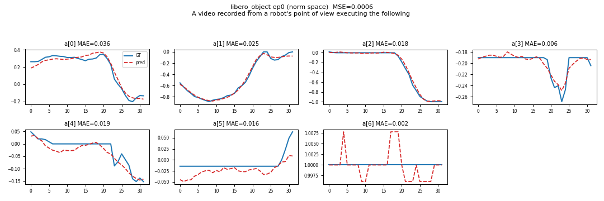
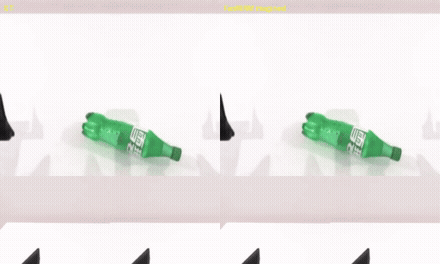
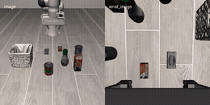

# FastWAM

[FastWAM](https://github.com/yuantianyuan01/FastWAM) — a Wan2.2-TI2V-5B world-action
model (T5 text encoder + Wan VAE + video/action DiT) — running on AMD Ryzen AI Max+
395 (Strix Halo, `gfx1151`) under ROCm 7.2.2. Direct PyTorch port: upstream code runs
on the base image's ROCm torch; only the CUDA torch pins are stripped. Weights,
datasets and LIBERO assets are fetched by the scripts below, never baked into the image.

This package covers the model smoke test, latency breakdown, open-loop replay, future
video imagination and closed-loop LIBERO. RoboTwin 2.0 closed-loop lives in the
companion `fastwam-robotwin` package.

## Build

```sh
ryzers build fastwam --name fastwam
ryzers run --name fastwam          # test.py: ROCm torch + GPU + deps sign-of-life (no weights)
```

## Fetch weights & datasets

```sh
ryzers run --name fastwam /ryzers/scripts/download_checkpoints.sh    # LIBERO + RoboTwin ckpts (~24 GB)
ryzers run --name fastwam /ryzers/scripts/download_datasets.sh       # LIBERO open-loop / video data
```

Set `HF_TOKEN` for faster/gated downloads. The ~12 GB Wan2.2 base is fetched
automatically on the first model run into `/models/diffsynth`.

## Demos

| Demo | What it does |
|---|---|
| `demos/demo_smoke.sh` | Load the LIBERO checkpoint, one end-to-end `infer_action`; cold/steady latency + VRAM. |
| `demos/demo_latency.sh` | Per-part latency (T5 / VAE / world prefill / plan) and SDPA backend comparison. |
| `demos/demo_openloop.sh` | Replay GT observations, overlay predicted vs GT action chunks + aggregate MAE. |
| `demos/demo_videogen.sh` | Imagine future frames from the first observation; side-by-side GT-vs-imagined clips. |
| `demos/demo_closedloop_libero.sh` | Closed-loop LIBERO rollouts in MuJoCo (headless EGL) + success rate. |

Each demo takes `DATASET=libero|robotwin` (open-loop/videogen/latency) or the
`SUITE`/`NUM_TASKS`/`NUM_TRIALS`/`VISUALIZE_FUTURE` knobs (closed-loop). Outputs are
written under `workspace/fastwam/outputs`.

```sh
ryzers run --name fastwam /ryzers/demos/demo_smoke.sh
DATASET=robotwin ryzers run --name fastwam /ryzers/demos/demo_openloop.sh
ryzers run --name fastwam /ryzers/demos/demo_closedloop_libero.sh
```

## Expected outputs

### Open-loop replay (`demo_openloop.sh`)

Predicted action chunks track ground truth over 100 episodes: mean normalized MAE
**0.0222** (LIBERO) / **0.0208** (RoboTwin), action inference ~1.5 s.




### Video imagination (`demo_videogen.sh`)

Joint path imagines the future video + actions. Ground truth (left) vs imagined (right).
Steady-state joint latency ~18.6 s (LIBERO) / ~21.9 s (RoboTwin) for a 33-frame clip at
20 denoise steps (the first call pays a one-time ROCm warmup).




### Closed-loop LIBERO (`demo_closedloop_libero.sh`)

`libero_object` suite, 10 tasks × 20 trials: **199/200 (99.5%)** success, rendered
headless via EGL.



With `VISUALIZE_FUTURE=true` the slow path also renders the model's imagined future
alongside the real rollout (GT left, imagined right; PSNR ~27.3 dB).


## References

- Upstream: https://github.com/yuantianyuan01/FastWAM (pinned in `docs/UPSTREAM_PIN.commit.txt`)
- Model: https://huggingface.co/yuanty/fastwam
- Datasets: https://huggingface.co/datasets/yuanty/LIBERO-fastwam · https://huggingface.co/datasets/yuanty/robotwin2.0-fastwam

Copyright (C) 2026 Advanced Micro Devices, Inc. All rights reserved.
SPDX-License-Identifier: MIT
