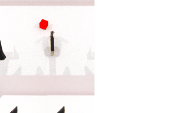

### FlowWAM

This package runs [FlowWAM](https://github.com/YixiangChen515/FlowWAM) on AMD Ryzen AI Max+ 395 (Strix Halo, `gfx1151`) under ROCm 7.14. FlowWAM is a Wan2.2-TI2V-5B **dual-stream world-action model** whose unique output is dense **optical flow as a unified action representation**: a dual-stream Wan DiT jointly generates a future RGB video *and* a predicted flow field, an IDM action expert decodes a 14-DoF robot action chunk from that flow, and RoboTwin 2.0 embodiments are rendered headless via SAPIEN. It ships no simulator, so it chains on the RoboTwin 2.0 base for closed-loop control and the interactive browser demo.

Upstream is a trimmed DiffSynth (the same Wan-video framework FastWAM builds on), so this reuses FastWAM's ROCm playbook: strip the base-owned CUDA/torch/numpy/sapien pins, hold them via `PIP_CONSTRAINT`, and install upstream on the base image's ROCm torch. No flash-attn/apex/cuBLAS are added -- DiffSynth's `flash_attention()` falls back to torch SDPA on ROCm.

### Build

FlowWAM requires SAPIEN robot rendering + RoboTwin embodiments, so chain it on the RoboTwin 2.0 base (Vulkan SAPIEN, headless on gfx1151):

```sh
ryzers build robotwin flowwam --name flowwam-robotwin   # chain the model on the RoboTwin 2.0 base
ryzers run   --name flowwam-robotwin /ryzers/demos/demo_smoke.sh   # env sign-of-life: ROCm torch + Wan dual-stream deps
```

Artifacts are written to `workspace/flowwam/outputs`. Set `HF_TOKEN` for faster/gated downloads. The Wan2.2-TI2V-5B base (~24 GB) + FlowWAM RoboTwin checkpoint are fetched on the first run, or explicitly:

```sh
ryzers run --name flowwam-robotwin /ryzers/scripts/download_checkpoints.sh base      # Wan2.2-TI2V-5B + UMT5-XXL enc
ryzers run --name flowwam-robotwin /ryzers/scripts/download_checkpoints.sh robotwin  # FlowWAM action policy ckpt
```

### Interactive RoboTwin

Drive the robot live in a browser. The interactive server (from the RoboTwin base) streams the composed 4-view over HTTP/MJPEG and prints its `http://localhost:PORT` URL; the FlowWAM policy is wired in via `POLICY_FACTORY`, which launches the dual-stream flow-action server (the same model + checkpoint as the closed loop) behind the model-agnostic policy seam.

```sh
ryzers run --name flowwam-robotwin /ryzers/demos/demo_interactive_robotwin.sh     # live browser control (port 8082)
ryzers run --name flowwam-robotwin /ryzers/demos/demo_interactive_robotwin_rt.sh  # real-time variant: arms HOLD while planning (8083)
```

View at `http://localhost:PORT` (`ssh -L 8082:localhost:8082 <host>`).

### Closed-loop RoboTwin 2.0

Genuine control loop: the dual-stream DiT generates flow-conditioned video latents, the IDM action expert decodes a 14-DoF action chunk, and RoboTwin steps the SAPIEN env, replanning every `EXECUTE_WINDOW` actions until success or timeout. RoboTwin scores task success and writes a per-episode video.

```sh
ryzers run --name flowwam-robotwin /ryzers/demos/demo_closedloop_robotwin.sh            # default: beat_block_hammer
TASK=beat_block_hammer NUM_EPISODES=3 \
  ryzers run --name flowwam-robotwin /ryzers/demos/demo_closedloop_robotwin.sh
```

<p align="center">
  
  <br><em>Closed-loop RoboTwin 2.0 <code>beat_block_hammer</code> rollout on Strix Halo (gfx1151),
  rendered headless via SAPIEN.</em>
</p>

### Flow imagination

FlowWAM's defining output is the predicted flow field. This renders the model's imagined future RGB alongside its predicted optical-flow field (dual-stream stage-1, same model + checkpoint as the closed loop), from a RoboTwin first-frame observation:

```sh
ryzers run --name flowwam-robotwin /ryzers/demos/demo_flowgen.sh            # -> workspace/flowwam/outputs/flowgen/
TASK=lift_pot ryzers run --name flowwam-robotwin /ryzers/demos/demo_flowgen.sh
```

<p align="center">
  
  <br><em>RoboTwin: imagined future RGB (left) vs the model's predicted optical-flow field (right).</em>
</p>

### References

- Upstream (dual-stream world-action policy): https://github.com/YixiangChen515/FlowWAM
- World-model variant: https://github.com/YixiangChen515/FlowWAM_WorldArena
- Model + checkpoints: https://huggingface.co/YixiangChen/FlowWAM
- Base model: https://huggingface.co/Wan-AI/Wan2.2-TI2V-5B

Copyright (C) 2026 Advanced Micro Devices, Inc. All rights reserved.
SPDX-License-Identifier: MIT
