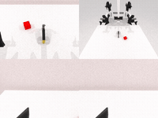
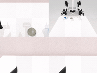
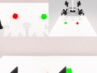
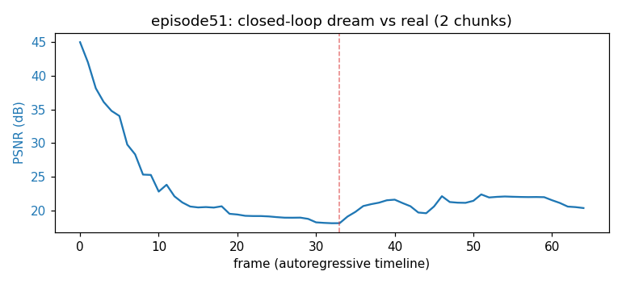
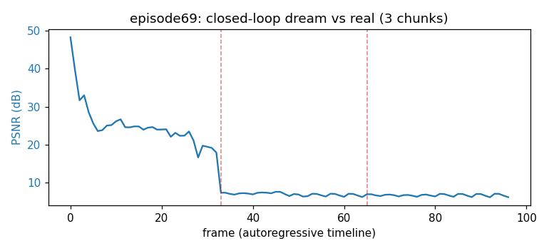

### FlowWAM

This package runs [FlowWAM](https://github.com/YixiangChen515/FlowWAM_WorldArena) on AMD Ryzen AI
Max+ 395 (Strix Halo, gfx1151) under ROCm 7.14. FlowWAM is a Wan2.2-TI2V-5B dual-stream
world-action model that uses dense optical flow as a unified action representation: one shared
dual-stream Wan DiT jointly generates a future RGB video and a flow field, RAFT plus a reversible
flow codec make that flow the action carrier, and an IDM action expert turns generated flow into
14-D robot actions. This is a direct PyTorch port: upstream (a trimmed DiffSynth) runs on the base
image's ROCm torch and only the base-owned CUDA torch, numpy, and sapien pins are stripped, so
DiffSynth attention falls back to torch SDPA and the SeedVR2 refiner (apex, CUDA only) is deferred.

FlowWAM ships no simulator. It is a slim model layer that renders robot-only frames from RoboTwin
2.0 embodiments through SAPIEN, so it requires the SAPIEN Vulkan renderer and composes on top of
the `simulation/robotwin` sim base for every demo.

### Build

```sh
ryzers build simulation/robotwin flowwam --name flowwam-robotwin    # chain the model on the RoboTwin sim base
ryzers run   --name flowwam-robotwin                     # test.py: ROCm torch + GPU + Wan dual-stream deps
```

Artifacts are written to `workspace/flowwam/outputs`. Set `HF_TOKEN` for faster or gated downloads.
The ~12 GB Wan2.2-TI2V-5B base, FlowWAM checkpoints, and RoboTwin embodiments are fetched from the
original HF repos on the first model run, never re-hosted.

```sh
ryzers run --name flowwam-robotwin /ryzers/scripts/download_checkpoints.sh all   # base | stage1 | robotwin | embodiments
```

### Demos

| Demo | Base | What it does |
|---|---|---|
| `demos/demo_closedloop_robotwin.sh` | `robotwin` | Closed-loop RoboTwin 2.0 rollouts (SAPIEN/Vulkan) + success rate. |
| `scripts/wm_autoregressive_eval.py` | `robotwin` | Imagine future video from the first observation, GT-vs-dream clips. |
| `scripts/open_loop_eval.py` | `robotwin` | Open-loop world-model prediction vs GT video, PSNR over the horizon. |

### Closed-loop RoboTwin 2.0

The genuine closed loop drives RoboTwin 2.0 under the SAPIEN Vulkan renderer: the dual-stream DiT
generates flow-conditioned video, the IDM action expert turns the generated flow into a 14-D action
chunk over a websocket server, and the robot replans every `EXECUTE_WINDOW` steps from a fresh
observation. Warm steady-state replan is about 81 s (video 25 steps, action 50 steps), with the
video DiT forward at about 91% of a replan.

```sh
TASK=beat_block_hammer NUM_EPISODES=5 \
  ryzers run --name flowwam-robotwin /ryzers/demos/demo_closedloop_robotwin.sh
```

Six aloha-agilex tasks, `demo_clean`, seed 0, 5 episodes each: 26/30 (86.7%) overall
(beat_block_hammer 5/5, place_empty_cup 5/5, stack_blocks_two 5/5, click_bell 4/5, handover_block
4/5, lift_pot 3/5).

<p align="center">
  
  
  
  
  <br><em>Closed-loop RoboTwin rollouts: beat block hammer, click bell, place empty cup, stack blocks.</em>
</p>

### World-model video imagination

The dual-stream world model imagines future video from the first observation and the action-derived
flow (ground truth left, dream right). A single 33-frame chunk anchored to the real first frame
reproduces the scene faithfully; chained autoregressively (each chunk anchored on the previous
dream) the video drifts over the horizon. Generation is decode-dominant at about 43 to 68 s/episode
after a one-time ~525 s VAE warmup.

```sh
ryzers run --name flowwam-robotwin python /ryzers/scripts/wm_autoregressive_eval.py
```

<p align="center">
  
  
  <br><em>Ground truth (left) vs autoregressive dream (right), episodes 51 and 199.</em>
</p>

### Open-loop world-model rollout

Dream-vs-real PSNR over the autoregressive timeline: the first real-anchored chunk is faithful
(about 20 to 48 dB) and quality degrades stepwise at each chunk hand-off, since consistency depends
on re-anchoring to real frames, which the closed loop does every replan.

```sh
MAX_ROLLOUTS=3 ryzers run --name flowwam-robotwin python /ryzers/scripts/wm_autoregressive_eval.py
```

<p align="center">
  
  
  <br><em>PSNR vs frame (dashed = chunk boundary): episode 51 (2 chunks) and episode 69 (3 chunks).</em>
</p>

### Useful knobs

- Closed-loop RoboTwin: `TASK`, `TASK_CONFIG`, `NUM_EPISODES`, `SEED`, `EXECUTE_WINDOW`, `VIDEO_INFERENCE_STEPS`, `ACTION_INFERENCE_STEPS`, `PORT`.
- World-model / open-loop: `NUM_OUTPUT_FRAMES`, `NUM_INFERENCE_STEPS`, `SIGMA_SHIFT`, `MAX_ROLLOUTS`, `EPISODES`, `MAX_EPISODES`, `CAMERA`, `FLOW_METHOD`, `TEST_DATASET_DIR`.
- Optimization: `FLOWWAM_OPT=0` (disable all), `FLOWWAM_CACHE=0`, `FLOWWAM_COMPILE=0`; opt-in fast preset `FLOW_GRID=18x16`.
- `HF_TOKEN` for faster or gated downloads.

### Optimization

The closed-loop route ships two quality-preserving speedups default-on: a bit-exact cross-attention
K/V plus text-embedding cache and a `torch.compile` of the dual-stream block fn, together about
1.04x on the video-DiT loop (91% of a replan) with closed-loop success preserved. An opt-in fast
preset (`FLOW_GRID=18x16`, mild flow-stream asymmetry) adds about 1.28x end-to-end. See
`RUNTIME_OPTIMIZATION.md` for the full study, including the levers that did not help on this hardware.

### References

- Upstream world model: https://github.com/YixiangChen515/FlowWAM_WorldArena (pinned in `docs/UPSTREAM_PIN.commit.txt`)
- Upstream action policy: https://github.com/YixiangChen515/FlowWAM
- Model: https://huggingface.co/YixiangChen/FlowWAM
- Datasets: https://huggingface.co/datasets/TianxingChen/RoboTwin2.0 (RoboTwin 2.0 embodiments), WorldArena RoboTwin 2.0 test split

Copyright (C) 2026 Advanced Micro Devices, Inc. All rights reserved.
SPDX-License-Identifier: MIT
