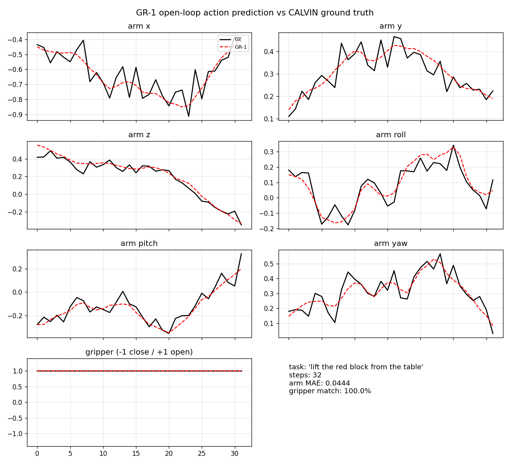
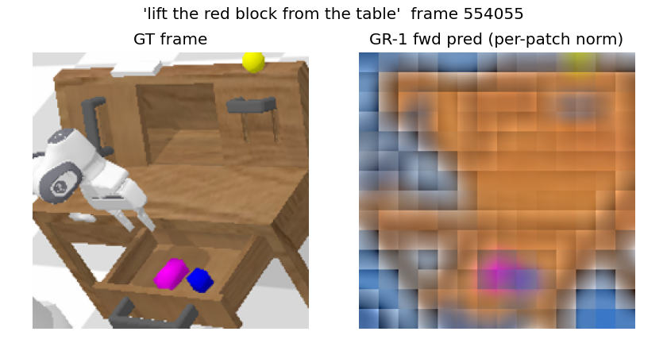
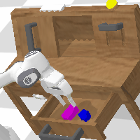
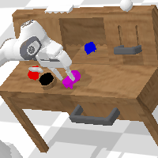
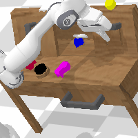
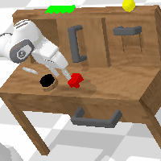
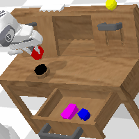
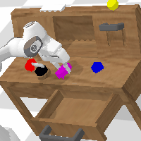

### GR-1

This package runs [GR-1](https://github.com/bytedance/GR-1) on AMD Ryzen AI Max+ 395
(Strix Halo, gfx1151) under ROCm 7.14. GR-1 is a GPT-style world-action model: a single
autoregressive transformer that takes a short observation history and a language goal and
predicts the next arm and gripper action together with future frames. It ships as one
self-contained image with the CALVIN PyBullet simulator baked in and rendered headless via
EGL on the iGPU.

The upstream code runs on the base image's ROCm torch. Upstream's CUDA `torch==1.12.1` pin
is dropped and only minimal ROCm and transformers-API source patches are applied
(`patches/rocm_port.py`, `patches/calvin_port.py`).

### Build

```sh
ryzers build gr1 --name gr1     # GR-1 model path + CALVIN sim in one image
ryzers run --name gr1           # test.py: ROCm torch + GPU + full GR-1 forward, no weights
```

Artifacts are written to `workspace/gr1/outputs`. `test.py` needs no weights or sim.

### Weights and dataset

Fetched at runtime into the mounted volumes:

```sh
ryzers run --name gr1 /ryzers/scripts/download_checkpoints.sh     # GR-1 (ABCD-D) + MAE ViT-B/16
ryzers run --name gr1 /ryzers/scripts/download_calvin_debug.sh    # CALVIN debug subset (~1.3 GB)
```

### Demos

| Demo | Needs | What it does |
|---|---|---|
| `demos/demo_openloop.sh` | weights + dataset | Replay a real CALVIN window offline, dump a GT-vs-predicted action overlay and a future-frame comparison. |
| `demos/demo_calvin.sh` | weights + dataset | Closed-loop CALVIN control in the headless PyBullet sim, rollout gifs + success rate. |
| `demos/demo_bench.sh` | weights + dataset | Time the closed-loop step path and report latency + arm MAE for the selected optimization config. |

```sh
WINDOW_IDX=0 MAX_STEPS=32 ryzers run --name gr1 /ryzers/demos/demo_openloop.sh
ryzers run --name gr1 /ryzers/demos/demo_calvin.sh
GR1_AMP=fp16 GR1_SDPA=1 GR1_TAG=fp16sdpa ryzers run --name gr1 /ryzers/demos/demo_bench.sh
```

### Open-loop replay

Predicted actions overlaid on ground truth, and the predicted next frame next to the real one.

<p align="center">
  
  <br><em>Ground truth (solid) vs predicted (dashed) actions on a CALVIN window.</em>
</p>
<p align="center">
  
  <br><em>Real frame (left) vs GR-1 predicted future frame (right).</em>
</p>

### Closed-loop CALVIN

Closed-loop control on the CALVIN debug validation tasks: 8/8 tasks solved, rendered headless via EGL.

<p align="center">
  
  
  
  <br>
  
  
  
  <br><em>Closed-loop CALVIN rollouts on the debug validation suite.</em>
</p>

### Useful knobs

- Eval: `NUM_TASKS` (0 = all debug tasks), `EP_LEN`, `SPLIT` (`training`|`validation`), `SEED`.
- Open-loop: `WINDOW_IDX`, `MAX_STEPS`.
- Paths: `POLICY_CKPT`, `MAE_CKPT`, `DATASET_DIR`, `CALVIN_ROOT`.
- Optimization: `GR1_AMP` (`off`|`bf16`|`fp16`, default `fp16`), `GR1_SDPA` (default `1`),
  `GR1_FLASH` (default `1`), `GR1_COMPILE`.

### Optimization

The image defaults to the fast path (fp16 + the ROCm AOTriton FLASH SDPA backend), which
gives about 6.8x faster per-step inference than the fp32 reference while holding closed-loop
8/8 and unchanged action quality. See `RUNTIME_OPTIMIZATION.md` for the full speed and
quality study.

### References

- Upstream: https://github.com/bytedance/GR-1, CALVIN sim: https://github.com/mees/calvin
  (both pinned in `docs/UPSTREAM_PIN.commit.txt`)
- Paper: ICLR 2024, https://arxiv.org/abs/2312.13139
- Weights: GR-1 ABCD-D / ABC-D (ByteDance), MAE ViT-B/16, CLIP ViT-B/32, fetched at runtime.

Copyright (C) 2026 Advanced Micro Devices, Inc. All rights reserved.
SPDX-License-Identifier: MIT
