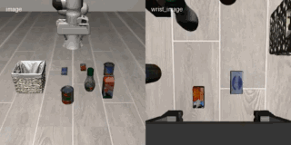
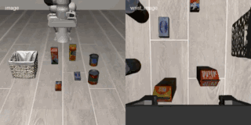

### ImageWAM

This package runs [ImageWAM](https://github.com/yuyangalin/ImageWAM) — *"Do World Action
Models Really Need Video Generation, or Just Image Editing?"* — on AMD Ryzen AI Max+ 395
(Strix Halo, `gfx1151`) under ROCm 7.14. Instead of generating a future *video*, ImageWAM
"dreams" a single edited future frame with an image-editing DiT and conditions its action
head on it. We port the **FLUX.2 klein-base-4B** variant (Qwen3 text encoder + FLUX.2
autoencoder + image-editing DiT + ActionDiT) — the variant with released checkpoints. It is a
slim policy/model layer that ships no simulator and chains on a simulator base for closed-loop
rollouts.

The autoencoder (`ae.safetensors`) is derived from the **public** klein-base VAE by
`scripts/convert_klein_vae.py` (strict-load into the flux2 `AutoEncoder`, 31.4 dB
reconstruction), so no gated FLUX.2-dev access is required; only the FLUX.2 klein-base DiT
itself is gated.

### Build

```sh
ryzers build libero imagewam --name imagewam-libero   # chain the model on the LIBERO base
ryzers run --name imagewam-libero                     # test.py: ROCm torch + GPU + deps check
```

Artifacts are written to `workspace/imagewam/outputs`. The FLUX.2 klein-base DiT is gated on
Hugging Face — set `HF_TOKEN` (with granted access) before fetching weights. The download
seeds the ImageWAM checkpoint, the FLUX.2 klein-base DiT, and the derived AE (Qwen3-4B is
fetched by the loader on the first model run):

```sh
HF_TOKEN=... ryzers run --name imagewam-libero /ryzers/scripts/download_checkpoints.sh libero 4b
```

### Closed-loop LIBERO

Run a batch of LIBERO rollouts in MuJoCo (headless, EGL) and report a success rate. Override
the suite/sweep from the host with `SUITE=`, `NUM_TASKS=`, `NUM_TRIALS=`.

```sh
ryzers run --name imagewam-libero /ryzers/demos/demo_closedloop_libero.sh                         # libero_object, 3 tasks x 5 trials
SUITE=libero_object NUM_TASKS=2 NUM_TRIALS=5 \
  ryzers run --name imagewam-libero /ryzers/demos/demo_closedloop_libero.sh                       # narrow the sweep
```

Verified on Strix Halo (Radeon 8060S, `gfx1151`, ROCm 7.14): `libero_object`, 3 tasks x 5
trials, **15/15 (100%)**.

<p align="center">
  
  <br>
  
  <br><em>Closed-loop LIBERO-object rollouts: alphabet soup (top), cream cheese (bottom) — 15/15 (100%).</em>
</p>

The package also ships open-loop, dreamed-frame, interactive, and RoboTwin closed-loop demos
under `demos/` (chain on the matching `simulation/*` base).

### References

- Upstream: https://github.com/yuyangalin/ImageWAM
- FLUX.2: https://github.com/black-forest-labs/flux
- Model: https://huggingface.co/yuyangalin/ImageWAM-FLUX.2-4B-LIBERO
- FLUX.2 klein-base: https://huggingface.co/black-forest-labs/FLUX.2-klein-base-4B

Copyright (C) 2026 Advanced Micro Devices, Inc. All rights reserved.
SPDX-License-Identifier: MIT
