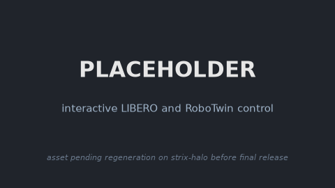
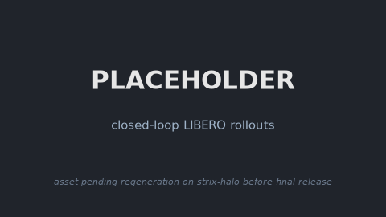
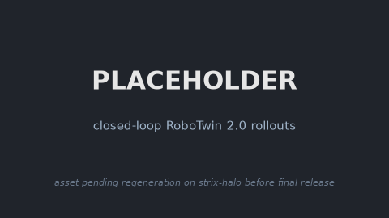
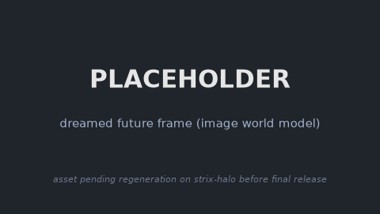
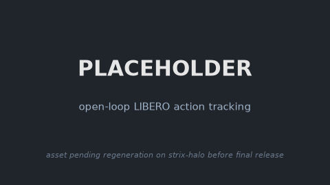

### ImageWAM

This package runs [ImageWAM](https://github.com/yuyangalin/ImageWAM) on AMD Ryzen AI Max+
395 (Strix Halo, gfx1151) under ROCm 7.14. ImageWAM is an image world-action model built on
a FLUX.2 klein-base-4B stack (Qwen3-4B text encoder, FLUX.2 autoencoder, an image-editing
DiT, and an action DiT). Instead of generating a future video it dreams a single edited
future frame and conditions its action head on that frame. This is a direct PyTorch port:
upstream runs on the base image's ROCm torch, only the CUDA torch pins are stripped and
`transformers` is bumped to the FLUX.2-compatible `4.56.1`.

ImageWAM ships no simulator. It is a slim policy layer that reuses the shared LIBERO/RoboTwin
datasets and attaches to the model-agnostic simulation bases through their `Policy` seam. It
chains on `simulation/libero` and `simulation/robotwin` for closed-loop and interactive runs,
or runs standalone on the plain base for the non-sim demos.

### Build

```sh
ryzers build simulation/libero   imagewam --name imagewam-libero    # chain on the LIBERO base: closed-loop + interactive
ryzers build simulation/robotwin imagewam --name imagewam-robotwin  # chain on the RoboTwin base: closed-loop + interactive
ryzers build imagewam --name imagewam                    # plain base: non-sim demos (open-loop / dream)
ryzers run --name imagewam                               # test.py: ROCm torch + GPU + deps check
```

Artifacts are written to `workspace/*/outputs`. The FLUX.2 base and autoencoder are gated
(`black-forest-labs`), so set `HF_TOKEN` (with granted access) before fetching them.

```sh
HF_TOKEN=... ryzers run --name imagewam /ryzers/scripts/download_checkpoints.sh libero 4b
```

This fetches the public ImageWAM checkpoint (`model.pt`, `dataset_stats.json`,
`train_config.yaml`), the gated FLUX.2 klein-base-4B DiT and autoencoder, and (on the first
model run) the Qwen3-4B text encoder.

### Demos

| Demo | Base | What it does |
|---|---|---|
| `demos/demo_interactive_libero.sh` / `_rt.sh` | `libero` | Interactive LIBERO over HTTP (synchronous and real-time). |
| `demos/demo_interactive_robotwin.sh` / `_rt.sh` | `robotwin` | Interactive RoboTwin over HTTP (synchronous and real-time). |
| `demos/demo_closedloop_libero.sh` | `libero` | Closed-loop LIBERO rollouts (MuJoCo/EGL) + success summary. |
| `demos/demo_closedloop_robotwin.sh` | `robotwin` | Closed-loop RoboTwin 2.0 rollouts (SAPIEN/Vulkan) + success summary. |
| `demos/demo_dreamvideo_closedloop_libero.sh` | `libero` | Dream-vs-sim video: actual sim frame (left) + re-dreamed future at each replan (right). |
| `demos/demo_dreamvideo_closedloop_robotwin.sh` | `robotwin` | RoboTwin dream-vs-sim video, 3-cam compact layout. |
| `demos/demo_dreamvideo_openloop.sh` | plain | Open-loop dream video: every frame is `[obs \| GT future \| dream]`. |
| `demos/demo_openloop_libero.sh` | plain | Replay LIBERO episodes, dreamed stills + predicted vs GT action chunks. |

### Interactive and closed-loop LIBERO

Drive the robot live in a browser, or run a batch rollout for a success rate. The interactive
server streams the MuJoCo view over HTTP and prints its `http://localhost:PORT` URL; the
`_rt` variant steps at wall-clock rate so planner latency is visible.

```sh
ryzers run --name imagewam-libero /ryzers/demos/demo_interactive_libero.sh   # live browser control
ryzers run --name imagewam-libero /ryzers/demos/demo_closedloop_libero.sh    # batch rollouts + success summary
```

<!-- TODO(release): regenerate on strix-halo; see docs/RELEASE_TODO.md -->
<p align="center">
  
  <br><em>PLACEHOLDER: interactive control over HTTP, pending regeneration on strix-halo.</em>
</p>

<!-- TODO(release): regenerate on strix-halo; see docs/RELEASE_TODO.md -->
<p align="center">
  
  <br><em>PLACEHOLDER: closed-loop LIBERO rollouts, pending regeneration on strix-halo.</em>
</p>

### Interactive and closed-loop RoboTwin 2.0

RoboTwin 2.0 runs under the SAPIEN Vulkan renderer.

```sh
ryzers run --name imagewam-robotwin /ryzers/demos/demo_interactive_robotwin.sh   # live browser control
TASKS="click_bell beat_block_hammer" NUM_EPISODES=10 \
  ryzers run --name imagewam-robotwin /ryzers/demos/demo_closedloop_robotwin.sh  # batch rollouts + success summary
```

<!-- TODO(release): regenerate on strix-halo; see docs/RELEASE_TODO.md -->
<p align="center">
  
  <br><em>PLACEHOLDER: closed-loop RoboTwin 2.0 rollouts, pending regeneration on strix-halo.</em>
</p>

### Dreamed-frame imagination

ImageWAM's world model is a single image-editing step: from the current observation it dreams
one edited future frame (ground truth left, dreamed frame right) rather than a full video. The
dream path is for visualization only and never runs during control.

```sh
DATASET=libero DATA_DIR=/libero_data/libero_object_no_noops_lerobot \
  ryzers run --name imagewam -v /host/libero:/libero_data /ryzers/demos/demo_dreamvideo_openloop.sh
```

<!-- TODO(release): regenerate on strix-halo; see docs/RELEASE_TODO.md -->
<p align="center">
  
  <br><em>PLACEHOLDER: ground truth vs the single dreamed future frame, pending regeneration on strix-halo.</em>
</p>

### Open-loop replay

Replay real LIBERO episodes with no simulator: feed real observations, proprio, and the task
prompt to the model, then compare predicted action chunks against the dataset ground truth and
render a few dreamed stills.

```sh
ryzers run --name imagewam -v /host/libero:/libero_data /ryzers/demos/demo_openloop_libero.sh
```

<!-- TODO(release): regenerate on strix-halo; see docs/RELEASE_TODO.md -->
<p align="center">
  
  <br><em>PLACEHOLDER: ground truth vs predicted action chunks, pending regeneration on strix-halo.</em>
</p>

### Useful knobs

- Non-sim: `DATASET=libero|robotwin` (open-loop / dream), `DATA_DIR` / `LIBERO_SUITE_DIR` for the mounted dataset, `NUM_STEPS`, `SEED`, `TAG`.
- Open-loop: `OL_NUM_SAMPLES`, `OL_NUM_DREAMS`.
- Closed-loop LIBERO: `SUITE`, `NUM_TASKS`, `NUM_TRIALS`, `ACTION_HORIZON`, `REPLAN_STEPS`.
- Closed-loop RoboTwin: `TASKS`, `TASK_CONFIG`, `NUM_EPISODES`, `NUM_INFERENCE_STEPS`.
- Interactive: `PORT`, `SUITE`, `TASK_ID`, `SEED`, `REPLAN_STEPS`, `RT_HZ` (real-time variant).
- Weights: `FLUX2_VARIANT=4b|9b` (LIBERO ships 4b and 9b, RoboTwin 4b only), `CKPT_PATH`, `DATASET_STATS_PATH`.
- `HF_TOKEN` for the gated FLUX.2 base and autoencoder downloads.

### References

- Upstream: https://github.com/yuyangalin/ImageWAM (pinned in `docs/UPSTREAM_PIN.commit.txt`)
- Backbone: https://github.com/black-forest-labs/flux2 (pinned in `docs/UPSTREAM_PIN.commit.txt`)
- Models: https://huggingface.co/collections/yuyangalin/imagewam
- Datasets (shared with FastWAM): https://huggingface.co/datasets/yuanty/LIBERO-fastwam, https://huggingface.co/datasets/yuanty/robotwin2.0-fastwam

Copyright (C) 2026 Advanced Micro Devices, Inc. All rights reserved.
SPDX-License-Identifier: MIT
