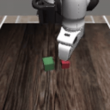
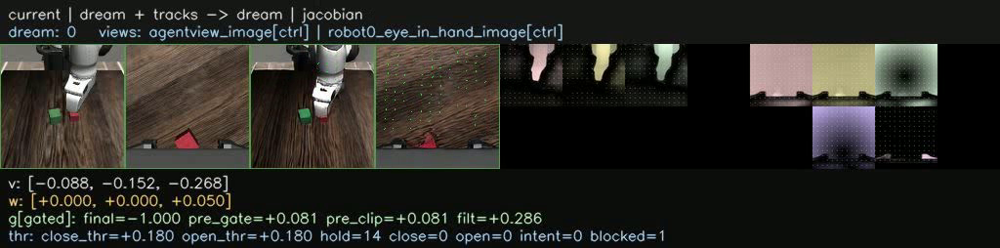
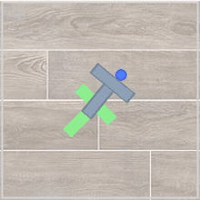
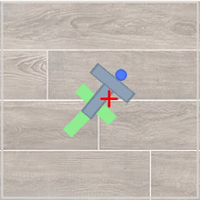
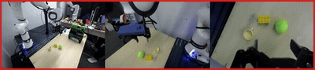

### VERA

This package runs [VERA](https://github.com/sizhe-li/VERA) on AMD Ryzen AI Max+ 395 (Strix Halo,
`gfx1151`) under ROCm 7.14. VERA (Turning Video Models into Generalist Robot Policies, MIT 2026) is a
two-stage video-to-action policy: a WAN video diffusion planner dreams the future from the current
observation, then a VGGT-1B Jacobian inverse-dynamics model (IDM) turns that dream into low-level
actions. This is a direct PyTorch port: the upstream code runs on the base image's ROCm torch, the
CUDA `torch==2.6.0` pin is dropped, and flash-attn is omitted (the WAN planner falls back to torch
SDPA / AOTriton on gfx1151).

VERA is the model layer. It builds on top of the model-agnostic `simulation/mimicgen` base (robosuite
/ robomimic / MuJoCo plus the `sim_mimicgen` harness), adding only the WAN planner, the VGGT Jacobian
IDM, the policy server, and the DROID video-generation and PushT closed-loop paths. For MimicGen the
closed loop runs across a `Policy` seam: VERA serves the WAN+IDM policy over a websocket and the sim
base harness steps the env against it (`POLICY_FACTORY=vera_mimicgen_policy:build_policy`). PushT
(`gym-pusht`, no MuJoCo) and DROID video generation stay wholly in this image. Weights and the frozen
upstream bases (Wan2.1 T2V/I2V, VGGT-1B) are fetched at runtime into a mounted HF cache.

### Build

```sh
ryzers build simulation/mimicgen vera --name vera    # chain: MimicGen sim base -> VERA model layer
ryzers run --name vera                                # test.py: ROCm torch + GPU + VERA import check
ryzers run --name vera python /ryzers/test_eval.py   # + MuJoCo/robosuite import and EGL render check
```

Artifacts are written to `workspace/vera/outputs`. Set `HF_TOKEN` for faster or gated downloads.
Weights and the frozen bases are fetched on the first model run.

```sh
ryzers run --name vera /ryzers/scripts/download_checkpoints.sh wave1   # MimicGen + PushT ckpts, ~15 GB
ryzers run --name vera /ryzers/scripts/download_checkpoints.sh droid   # + DROID 14B planner, ~31 GB
ryzers run --name vera /ryzers/scripts/download_mimicgen_datasets.sh   # MimicGen task hdf5 (sim base)
```

### Demos

All demos run in the single `vera` image (`--name vera`); the Base column names the environment each
one exercises. The closed-loop demos also serve a live MJPEG viewer: forward its port with
`ssh -L <VIS_PORT>:localhost:<VIS_PORT> <host>` and open `http://localhost:<VIS_PORT>` to watch the
rollout live (observation, dream + tracks, dream, Jacobian field). Each run also dumps a `*_vis.mp4`
of the viewer buffer.

| Demo | Base | What it does |
|---|---|---|
| `demos/demo_closedloop_mimicgen.sh` | mimicgen | MimicGen closed-loop across the model/sim seam. Preferred. |
| `demos/demo_mimicgen.sh` | mimicgen | Single MimicGen task via the upstream in-package controller. |
| `demos/demo_mimicgen_suite.sh` | mimicgen | Full 9-task MimicGen suite against one warm server. |
| `demos/demo_pusht.sh` | pusht | PushT closed-loop (DFoT planner + Jacobian IDM, no MuJoCo). |
| `demos/demo_videogen.sh` | droid | DROID WAN-14B language-conditioned video generation (no sim). |
| `demos/demo_img2vid.sh` | droid | Image to video: one still primed, the planner dreams the rollout. |

### Closed-loop MimicGen

robosuite/MuJoCo tasks driven by the WAN-1.3B planner and the MimicGen Jacobian IDM, all inference
server-side, rendered headless under EGL with an OSMesa fallback. The task-balanced IDM covers all
four families (coffee, square nut-assembly, stack, three-piece stack), and the nine-task suite runs
end to end against one warm server.

```sh
# closed-loop across the model/sim seam (short viewer clip for one task):
TASK=stack_d0 NUM_DEMOS=1 ROLLOUT_HORIZON=100 ryzers run --name vera /ryzers/demos/demo_closedloop_mimicgen.sh
# verified success at upstream defaults (stack_d0, H=700, 40 denoise steps):
TASK=stack_d0 NUM_DEMOS=1 ROLLOUT_HORIZON=700 SAMPLE_STEPS=40 ryzers run --name vera /ryzers/demos/demo_mimicgen.sh
```

At the upstream defaults (`stack_d0`, `H=700`, `sample_steps=40`) the task succeeds 1/1 with max
reward 1.000, success latched at env step ~491; a 10-demo `stack_d0` rollout scores 8/10, in line
with upstream ~94%.

<p align="center">
  
  <br><em>MimicGen stack_d0 closed-loop rollout (agentview): the green cube stacked onto the red.</em>
</p>
<p align="center">
  
  <br><em>Live viewer dashboard: current view, dream + motion tracks, dream, and the Jacobian field the IDM inverts to actions.</em>
</p>

### Closed-loop PushT

The light embodiment: a DFoT U-Net3D flow planner plus the Jacobian IDM on `gym-pusht`, no MuJoCo.

```sh
ryzers run --name vera /ryzers/demos/demo_pusht.sh
```

3 rollouts from replay state 3664 (horizon 200, seed 42): 100% success, 100% mean max-reward, 82%
mean coverage.

<p align="center">
  
  
  <br><em>PushT closed-loop: the gym-pusht env rollout (left) and the planner's dream with the tracked contact point (right).</em>
</p>

### Video imagination

The WAN video planner dreams future frames action-free. DROID runs are language-conditioned from a
few real context frames (14B planner); image-to-video primes a single held still and dreams the
rollout forward.

```sh
# language-conditioned DROID generation (needs the droid ckpts + frozen Wan2.1-I2V-14B base):
VERA_WAN14B_CKPT_ROOT=/models/wan2.1-i2v-14b-480p ryzers run --name vera /ryzers/demos/demo_videogen.sh
# image to video from a single still + prompt:
IMAGE=/inputs/start.png TEXT="a white robot arm picks up the red block" \
  VERA_WAN14B_CKPT_ROOT=/models/wan2.1-i2v-14b-480p ryzers run --name vera /ryzers/demos/demo_img2vid.sh
```

<p align="center">
  
  <br><em>Image to video: the held input views (left, blue) and the dreamed rollout (right, green).</em>
</p>
<p align="center">
  
  <br><em>DROID language-conditioned generation: real context frames (red border) flow into the dreamed future ("the gripper closes on the tennis ball").</em>
</p>

### Useful knobs

- `PORT` / `VIS_PORT`: policy websocket and MJPEG viewer ports (PushT 8820/8821, MimicGen 8800/8801).
- MimicGen: `TASK` (e.g. `stack_d0`, `coffee_d0`, `square_d0`, `stack_three_d0`), `NUM_DEMOS`, `ROLLOUT_HORIZON`, `RENDER_SIZE`, `SAMPLE_STEPS` (denoise steps).
- PushT: `ZARR_PATH`, `FRAME_INDICES`, `N_REPEATS`, `HORIZON`, `SEED`.
- Video generation: `TEXT`, `MODE` (`scene1`/`scene2`/`both`), `NUM_STEPS`, `SEED`, `IMAGE` / `VIEWS` (img2vid).
- `VERA_DISABLE_CUDNN` / `VERA_IDM_BF16`: gfx1151 speedup kill-switches, default on (see Optimization).
- `HF_TOKEN` for faster or gated downloads.

### Optimization

Two gfx1151 levers ship default-on: routing convolutions through im2col + GEMM (`VERA_DISABLE_CUDNN`)
and a bf16 autocast for the VGGT Jacobian IDM (`VERA_IDM_BF16`). Together they take a warm MimicGen
closed-loop step from about 150 s to about 15.5 s (9.66x) with task success preserved (10-demo
`stack_d0`: 8/10). See `RUNTIME_OPTIMIZATION.md` for the full study, the post-optimization bottleneck
split (the WAN DiT denoise loop is now the dominant 56%), and the portable levers that did and did not
transfer on this hardware.

### References

- Upstream: https://github.com/sizhe-li/VERA (pinned in `docs/UPSTREAM_PIN.commit.txt`)
- Paper: Turning Video Models into Generalist Robot Policies (MIT, 2026)
- Model: https://huggingface.co/sizhe-lester-li/VERA
- Bases: `Wan-AI/Wan2.1-T2V-1.3B`, `Wan-AI/Wan2.1-I2V-14B-480P`, `facebook/VGGT-1B`
- Datasets: MimicGen task hdf5 (`amandlek/mimicgen_datasets`), PushT replay zarr, DROID demo clips (bundled in the VERA weights repo)

Copyright (C) 2026 Advanced Micro Devices, Inc. All rights reserved.
SPDX-License-Identifier: MIT
