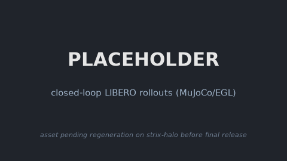
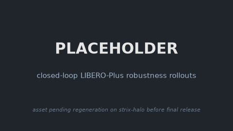
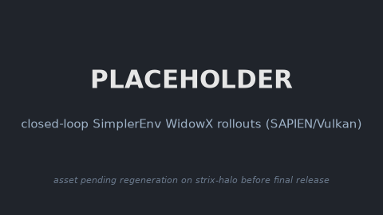
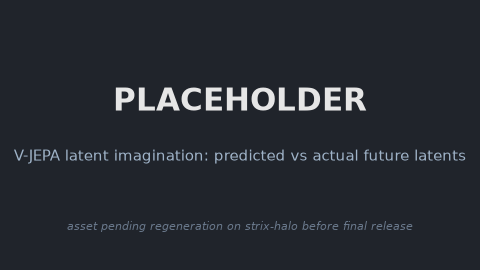
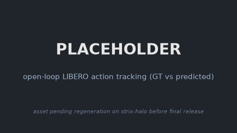

### VLA-JEPA

This package runs [VLA-JEPA](https://github.com/ginwind/VLA-JEPA) on AMD Ryzen AI Max+ 395
(Strix Halo, gfx1151) under ROCm 7.14. VLA-JEPA is a vision-language-action model: a
[Qwen3-VL-2B-Instruct](https://huggingface.co/Qwen/Qwen3-VL-2B-Instruct) VLM feeds a GR00T-style
flow-matching action head, regularized at training time by a
[V-JEPA2](https://github.com/facebookresearch/vjepa2) latent world model (the V-JEPA2 encoder and
world-model predictor run at train time only; inference is the VLM prefill plus the action head).
This is a direct PyTorch port: it keeps the base image's ROCm torch and only strips the CUDA-only
pins (torch, flash-attn, deepspeed), with one ROCm bug fix that flips Qwen3-VL from
`flash_attention_2` to SDPA (`scripts/apply_rocm_patches.py`).

VLA-JEPA ships no simulator. It is a slim policy layer that the model-agnostic simulation bases
attach to through a runtime `Policy` adapter
(`adapters/vlajepa_{libero,liberoplus,simplerenv}_policy.py`, selected by `POLICY_FACTORY`). It
chains on top of `simulation/libero`, `simulation/libero-plus`, and `simulation/simplerenv` for
closed-loop and interactive runs, or runs standalone on the plain base for the latent-imagination
and open-loop demos.

### Build

```sh
ryzers build vlajepa                              # model layer: non-sim demos (imagine / open-loop)
ryzers run                                        # test.py: ROCm torch + GPU + deps check

ryzers build simulation/libero vlajepa                       # chain the model on the LIBERO base
ryzers build simulation/libero-plus vlajepa                  # chain the model on the LIBERO-Plus base
ryzers build simulation/simplerenv vlajepa        # chain the model on the SimplerEnv base
```

`ryzers run` with no command is a light ROCm environment check (no weights). Artifacts are written
to `workspace/vlajepa/outputs`. Set `HF_TOKEN` for faster or gated downloads. The VLA-JEPA
checkpoint, Qwen3-VL-2B, and the V-JEPA2 encoder download once into the mounted HF cache on the
first model run.

```sh
ryzers run /ryzers/download.sh              # preload all base assets (checkpoints + Qwen3-VL + V-JEPA2)
ryzers run /ryzers/download_openloop.sh     # add one LIBERO demo HDF5 for the open-loop replay
```

### Demos

| Demo | Base | What it does |
|---|---|---|
| `demos/demo_interactive_libero.sh` / `_rt.sh` | `libero` | Interactive LIBERO over HTTP (`_rt`: robot holds while planning). |
| `demos/demo_interactive_liberoplus.sh` / `_rt.sh` | `libero-plus` | Interactive LIBERO-Plus on a perturbed scene over HTTP. |
| `demos/demo_interactive_simplerenv.sh` / `_rt.sh` | `simplerenv` | Interactive SimplerEnv (WidowX) over HTTP. |
| `demos/demo_closedloop_libero.sh` | `libero` | Closed-loop LIBERO rollouts (MuJoCo/EGL) + success rate. |
| `demos/demo_closedloop_liberoplus.sh` | `libero-plus` | Closed-loop LIBERO-Plus robustness rollouts + per-dimension summary. |
| `demos/demo_closedloop_simplerenv.sh` | `simplerenv` | Closed-loop SimplerEnv rollouts (SAPIEN/Vulkan) + success rate. |
| `demos/demo_imagine.sh` | plain | Visualize the V-JEPA latent imagination: predicted vs actual future latents. |
| `demos/demo_openloop.sh` | plain | Replay a demo episode, overlay predicted vs ground-truth action chunks. |

### Interactive and closed-loop LIBERO

Drive the robot live in a browser, or run a batch rollout for a success rate. Both interactive
servers stream the MuJoCo view over HTTP and print a `http://localhost:PORT` URL; the `_rt` variant
steps the sim at wall-clock `RT_HZ` so the robot visibly holds ("THINKING") while VLA-JEPA plans the
next action chunk, exposing planner latency.

```sh
ryzers build simulation/libero vlajepa
ryzers run /ryzers/demos/demo_interactive_libero.sh         # live browser control (:8080)
ryzers run /ryzers/demos/demo_interactive_libero_rt.sh      # real-time: robot holds while planning (:8081)
ryzers run /ryzers/demos/demo_closedloop_libero.sh          # batch rollouts + success rate
SUITE=libero_goal NUM_TASKS=2 NUM_TRIALS=10 \
  ryzers run /ryzers/demos/demo_closedloop_libero.sh
```

Closed-loop LIBERO success (10 trials/task, 10 tasks/suite, seed 1000, gfx1151): `object` 100/100,
`spatial` 100/100, `goal` 97/100, `10` (long-horizon) 100/100, 397/400 (99.25%) overall.
Preprocessing (180-deg image rotation, 8-d `[eef_pos, quat2axisangle, gripper_qpos]` state, gripper
`1-2*g` remap to LIBERO `{-1 open, +1 close}`) matches upstream `examples/LIBERO/eval_libero.py`.

<!-- TODO(release): regenerate on strix-halo; see docs/RELEASE_TODO.md -->
<p align="center">
  
  <br><em>PLACEHOLDER: closed-loop LIBERO rollout, pending regeneration on strix-halo.</em>
</p>

### Interactive and closed-loop LIBERO-Plus

[LIBERO-Plus](https://github.com/sylvestf/LIBERO-plus) is a drop-in LIBERO replacement that expands
the suites into 10,030 perturbation instances across 7 robustness dimensions (camera viewpoints,
robot initial states, language instructions, light conditions, background textures, sensor noise,
objects layout) and 5 difficulty levels. It chains on the
[`simulation/libero-plus`](../../simulation/libero-plus) base through the same seam, with
preprocessing identical to the LIBERO adapter.

```sh
ryzers build simulation/libero-plus vlajepa
ryzers run /ryzers/demos/demo_closedloop_liberoplus.sh        # 1 trial/task -> robustness_summary.json
CATEGORY="Camera Viewpoints" MAX_TASKS=60 \
  ryzers run /ryzers/demos/demo_closedloop_liberoplus.sh      # slice by perturbation dimension
SUITE=libero_goal DIFFICULTY=3 \
  ryzers run /ryzers/demos/demo_closedloop_liberoplus.sh      # slice by difficulty level
ryzers run /ryzers/demos/demo_interactive_liberoplus.sh       # live browser demo on a perturbed scene (:8080)
ryzers run /ryzers/demos/demo_interactive_liberoplus_rt.sh    # real-time: robot holds while planning (:8081)
```

The runner selects tasks by `CATEGORY` / `DIFFICULTY` from the upstream `task_classification.json`,
runs a single trial per task (the LIBERO-Plus convention), and writes an aggregate
`robustness_summary.json` with overall, per-dimension, and per-difficulty success rates. Since a
full suite is thousands of tasks, `MAX_TASKS` (default 40) caps/samples the selection (`SAMPLE=1`,
seeded); set `MAX_TASKS=0` for the whole slice.

<!-- TODO(release): regenerate on strix-halo; see docs/RELEASE_TODO.md -->
<p align="center">
  
  <br><em>PLACEHOLDER: closed-loop LIBERO-Plus robustness rollout, pending regeneration on strix-halo.</em>
</p>

### Interactive and closed-loop SimplerEnv

SimplerEnv (WidowX / BridgeData v2) runs the ManiSkill3 real2sim digital twin under the SAPIEN
offscreen Vulkan renderer (CPU PhysX) on gfx1151. It chains on the
[`simulation/simplerenv`](../../simulation/simplerenv) base via
`adapters/vlajepa_simplerenv_policy.py`, loading the SimplerEnv sub-checkpoint
(`SimplerEnv/checkpoints/VLA-JEPA-SimplerEnv.pt`, `oxe_bridge` un-normalization).

```sh
ryzers build simulation/simplerenv vlajepa
ryzers run /ryzers/demos/demo_closedloop_simplerenv.sh        # batch rollouts + success rate
TASKS=widowx_put_eggplant_in_basket NUM_TRIALS=10 \
  ryzers run /ryzers/demos/demo_closedloop_simplerenv.sh
ryzers run /ryzers/demos/demo_interactive_simplerenv.sh       # live browser control (:8084)
ryzers run /ryzers/demos/demo_interactive_simplerenv_rt.sh    # real-time: arm holds while planning (:8085)
```

<!-- TODO(release): regenerate on strix-halo; see docs/RELEASE_TODO.md -->
<p align="center">
  
  <br><em>PLACEHOLDER: closed-loop SimplerEnv (WidowX) rollout, pending regeneration on strix-halo.</em>
</p>

### Latent imagination

VLA-JEPA's V-JEPA2 world model predicts future latents rather than pixels (there is no upstream
pixel decoder), so this demo overlays the predicted vs actual future latents on a real episode
(cosine and L1 curves plus PCA token maps).

```sh
ryzers run /ryzers/demo_imagine.sh
SUITE=libero_object TASK_ID=0 EPISODE=0 T0=0 ryzers run /ryzers/demo_imagine.sh
```

<!-- TODO(release): regenerate on strix-halo; see docs/RELEASE_TODO.md -->
<p align="center">
  
  <br><em>PLACEHOLDER: predicted vs actual future latents, pending regeneration on strix-halo.</em>
</p>

### Open-loop replay

Feed a recorded LIBERO demo episode's observations to `predict_action` and overlay the predicted vs
ground-truth 7-DoF action chunks per dimension.

```sh
ryzers run /ryzers/demo_openloop.sh
SUITE=libero_object TASK_ID=0 EPISODE=0 ryzers run /ryzers/demo_openloop.sh
```

<!-- TODO(release): regenerate on strix-halo; see docs/RELEASE_TODO.md -->
<p align="center">
  
  <br><em>PLACEHOLDER: ground truth (solid) vs predicted (dashed) actions, pending regeneration on strix-halo.</em>
</p>

### Useful knobs

- `MODEL_REPO` / `CKPT_REL`: VLA-JEPA HF repo + which sub-checkpoint to load (default
  `ginwind/VLA-JEPA` / `LIBERO/checkpoints/VLA-JEPA-LIBERO.pt`; the SimplerEnv demos force the
  SimplerEnv checkpoint).
- `BASE_VLM` / `BASE_ENCODER`: base models the checkpoint config is repointed to
  (`Qwen/Qwen3-VL-2B-Instruct`, `facebook/vjepa2-vitl-fpc64-256`).
- `DTYPE`: `bfloat16` (default), `float16`, or `float32`.
- `VLAJEPA_NO_OPT=1`: fall back to the stock (unoptimized) predict path.
- Closed-loop: `SUITE`, `NUM_TASKS`, `TASK_ID`, `NUM_TRIALS`, `SEED`, `MAX_STEPS`, `REPLAN_STEPS`,
  `NUM_STEPS_WAIT`, `IMAGE_SIZE`, `SAVE_VIDEO` / `NUM_VIDEOS`, `TAG`.
- LIBERO-Plus: `CATEGORY` (one of the 7 dimensions, or `all`), `DIFFICULTY` (1-5, or `all`),
  `MAX_TASKS` (default 40; 0 = all), `SAMPLE` (1 = random-sample the cap, seeded).
- SimplerEnv: `TASKS`, `ENSEMBLE_HORIZON` / `ENSEMBLE_ALPHA`, `USE_DDIM` / `NUM_DDIM_STEPS`,
  `GRIPPER_OPEN_SIGN`.
- Interactive: `PORT`, `RT_HZ` (real-time variants).
- Open-loop / imagine: `GT_REPO`, `GT_FILE` / `GT_LOCAL`, `INSTRUCTION`, `UNNORM_KEY`, `REPLAN`,
  `FLIP180`, `T0`.
- `HF_TOKEN` for faster or gated downloads.

### Optimization

Four algorithmically near-lossless speedups (bf16 flow-matching head, skipped `lm_head`,
cross-attention K/V cache, conv3d-to-matmul patch embed) cut `predict_action` latency about 2.3x to
3.3x per call with no closed-loop success regression. They ship default-on; set `VLAJEPA_NO_OPT=1`
to restore the stock path. See `RUNTIME_OPTIMIZATION.md` for the full study, including the levers
that did not help on this hardware.

### References

- Upstream: https://github.com/ginwind/VLA-JEPA (pinned in `docs/UPSTREAM_PIN.commit.txt`)
- Model: https://huggingface.co/ginwind/VLA-JEPA (base VLM https://huggingface.co/Qwen/Qwen3-VL-2B-Instruct, encoder https://huggingface.co/facebook/vjepa2-vitl-fpc64-256)
- Datasets: https://huggingface.co/datasets/yifengzhu-hf/LIBERO-datasets

Copyright (C) 2026 Advanced Micro Devices, Inc. All rights reserved.
SPDX-License-Identifier: MIT
