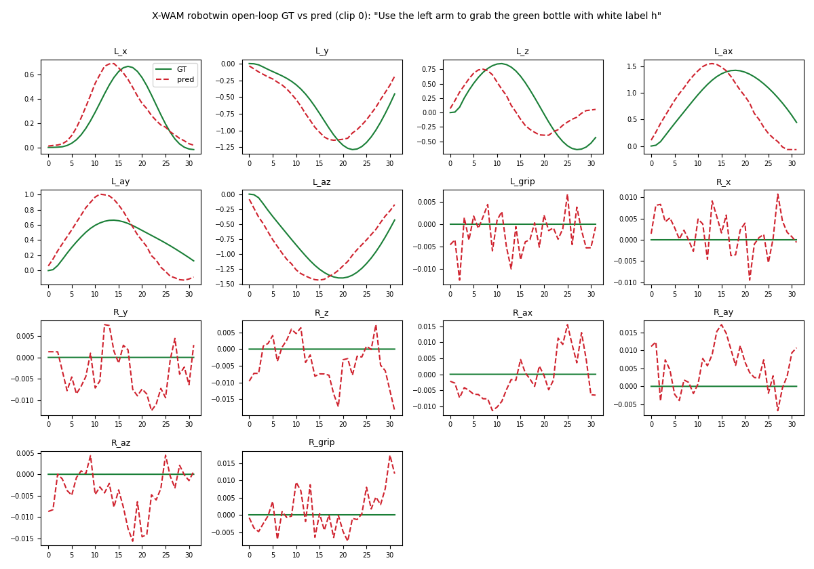
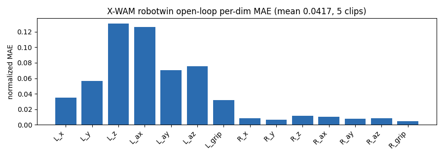

### X-WAM

This package runs [X-WAM](https://github.com/sharinka0715/X-WAM) on AMD Ryzen AI Max+ 395 (Strix Halo, gfx1151) under ROCm 7.2.2 (7.14 when chained on the RoboTwin base). X-WAM is a Wan2.2-TI2V-5B unified 4D world-action model (umt5-xxl text encoder, Wan VAE, and a joint video/action DiT) that predicts action chunks with an asynchronous, decoupled video/action denoising schedule. It is a slim policy layer that ships no simulator: it runs standalone on the plain base for the non-sim demos, or chains on top of a simulator base for closed-loop rollouts on RoboTwin 2.0 (SAPIEN Vulkan) and RoboCasa (robosuite / MuJoCo kitchens). Upstream comments out its own torch/flash-attn pins, so the base ROCm torch is preserved; flash-attn has no gfx1151 wheel, so attention falls back to torch SDPA.

### Build

```sh
ryzers build xwam --name xwam                            # model layer: non-sim demos (smoke / open-loop)
ryzers run --name xwam                                   # test.py: ROCm torch + GPU + deps check
```

For closed-loop rollouts, chain the model on a simulator base.

```sh
ryzers build robotwin xwam --name xwam-robotwin          # chain on the RoboTwin 2.0 base
ryzers build robocasa xwam --name xwam-robocasa          # chain on the RoboCasa base
```

Artifacts are written to `workspace/xwam/outputs`. Set `HF_TOKEN` for faster or gated downloads.
The Wan2.2 base (~32 GB) and the X-WAM SFT checkpoints are fetched on the first model run.

```sh
EXP=robotwin_sft ryzers run --name xwam /ryzers/scripts/download_checkpoints.sh robotwin
```

### Model smoke and open-loop replay

These run on the standalone image. Smoke loads a released X-WAM SFT checkpoint and runs one
end-to-end prediction (video-context prefill + action chunk); open-loop replay overlays the
predicted action chunks against ground-truth X-WAM RoboTwin episodes.

```sh
EXP=robotwin_sft ryzers run --name xwam /ryzers/demos/demo_smoke.sh                    # load ckpt + one prediction
DATASET=robotwin NUM_EPISODES=5 ryzers run --name xwam /ryzers/demos/demo_openloop.sh  # GT replay + MAE
```

The 13.06 B-parameter model runs end-to-end on ROCm (action chunk `(32, 14)`, ~10 s steady-state,
peak ~29 GB). Over 5 clips the predicted chunks track ground truth with mean normalized MAE 0.0417 —
the idle arm is near-perfect (per-dim MAE ~0.004–0.012) while the acting arm carries the larger error.

<p align="center">
  
  <br>
  
  <br><em>Open-loop RoboTwin replay: predicted (dashed) vs ground-truth (solid) chunk (top), per-dimension MAE (bottom).</em>
</p>

### Closed-loop RoboTwin 2.0

RoboTwin 2.0 runs under the SAPIEN Vulkan renderer; X-WAM drives it in-process via the
`xwam_policy` plugin (delta-EE control, screw-mode planning) through RoboTwin's own `eval_policy.py`.

```sh
TASKS="beat_block_hammer" NUM_EPISODES=1 \
  ryzers run --name xwam-robotwin /ryzers/demos/demo_closedloop_robotwin.sh   # rollout + success rate
```

On this run `beat_block_hammer` scored 1/1 (100%).

<p align="center">
  
  <br><em>Closed-loop RoboTwin 2.0 rollout: beat block hammer.</em>
</p>

### Closed-loop RoboCasa

RoboCasa kitchen tasks run under robosuite / MuJoCo (headless EGL); X-WAM drives the model-agnostic
`sim_robocasa.Policy` seam (7-D delta-EE via OSC_POSE). The chain builds and the closed-loop demo
runs end-to-end, capturing a per-episode rollout video and a `_result.json`.

```sh
TASK=TurnOnSinkFaucet ryzers run --name xwam-robocasa /ryzers/demos/demo_closedloop_robocasa.sh
```

On the sampled seed `TurnOnSinkFaucet` did not complete (`_result.json`: `num_success` 0/1); the rollout
below shows the policy driving the 7-DOF arm through the kitchen scene. The chain and closed-loop demo are
validated end-to-end — the per-episode rollout video and result JSON are written to
`workspace/xwam/outputs/robocasa`.

<p align="center">
  
  <br><em>Closed-loop RoboCasa rollout (headless MuJoCo, OSC_POSE): TurnOnSinkFaucet.</em>
</p>

### References

- Upstream: https://github.com/sharinka0715/X-WAM (commit pinned in `config.yaml`)
- Checkpoints: https://huggingface.co/sharinka0715/X-WAM-checkpoints
- Dataset: https://huggingface.co/datasets/sharinka0715/X-WAM-RoboTwin
- Base model: https://huggingface.co/Wan-AI/Wan2.2-TI2V-5B

Copyright (C) 2026 Advanced Micro Devices, Inc. All rights reserved.
SPDX-License-Identifier: MIT
