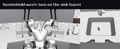
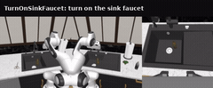
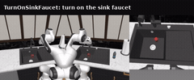
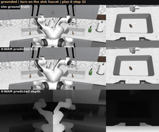
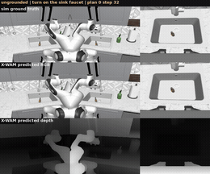

### X-WAM

This package runs [X-WAM](https://github.com/sharinka0715/X-WAM) on AMD Ryzen AI Max+ 395
(Strix Halo, gfx1151) under ROCm 7.14. X-WAM is a Wan2.2-TI2V-5B unified 4D world-action model
(UMT5-XXL text encoder, Wan2.2 VAE, and a joint video/depth/action DiT) that jointly generates
future video, depth, robot states, and actions. It uses Asynchronous Noise Sampling (ANS):
few action denoise steps for real-time control and full denoise steps for high-fidelity video.
This is a direct PyTorch port: upstream runs on the base image's ROCm torch and only the CUDA
torch and flash-attn pins are dropped (attention falls back to torch SDPA on gfx1151).

X-WAM ships no simulator. It is a slim policy layer that the model-agnostic simulation bases
attach to through a runtime `Policy` adapter (selected by `POLICY_FACTORY`). It chains on top
of the `simulation/robocasa` base for closed-loop and interactive RoboCasa, the
`simulation/robotwin` base for RoboTwin 2.0, or runs standalone on the plain base for the
non-sim demos (open-loop replay and video imagination).

### Build

```sh
ryzers build xwam --name xwam                             # model layer: non-sim demos (open-loop / video imagination)
ryzers run --name xwam                                    # test.py: ROCm torch + GPU + X-WAM import check

ryzers build simulation/robocasa xwam --name xwam-robocasa           # chain the model on the RoboCasa base
ryzers build simulation/robotwin xwam --name xwam-robotwin           # chain the model on the RoboTwin base
```

Artifacts are written to `workspace/xwam/outputs`. Set `HF_TOKEN` for faster or gated
downloads. The Wan2.2-TI2V-5B base (about 32 GB) plus the selected X-WAM SFT checkpoint are
fetched on the first model run.

```sh
ryzers run --name xwam /ryzers/scripts/download_checkpoints.sh robocasa   # Wan2.2 base + robocasa_sft (or: robotwin)
ryzers run --name xwam /ryzers/scripts/download_datasets.sh robotwin      # small open-loop replay subset
```

### Demos

| Demo | Base | What it does |
|---|---|---|
| `demos/demo_interactive_robocasa.sh` / `_rt.sh` | `robocasa` | Interactive RoboCasa over HTTP (chunk-replay, plus a real-time async planner). |
| `demos/demo_interactive_robotwin.sh` / `_rt.sh` | `robotwin` | Interactive RoboTwin 2.0 over HTTP (chunk-replay, plus a real-time async planner). |
| `demos/demo_closedloop_robocasa.sh` | `robocasa` | Closed-loop RoboCasa kitchen rollouts (MuJoCo/EGL) + success rate. |
| `demos/demo_closedloop_robotwin.sh` | `robotwin` | Closed-loop RoboTwin 2.0 rollouts (SAPIEN/Vulkan) + success rate. |
| `demos/demo_openloop.sh` | plain | Replay observations, overlay predicted vs GT action chunks + MAE. |

### Interactive and closed-loop RoboCasa

Drive the robot live in a browser, or run a batch rollout for a success rate. The interactive
server streams the RoboCasa view over HTTP at `http://localhost:PORT` (default 8082, or 8083
for the real-time variant).

```sh
TASK=TurnOnSinkFaucet ryzers run --name xwam-robocasa /ryzers/demos/demo_interactive_robocasa.sh   # live browser control
TASK=TurnOnSinkFaucet NUM_EVALS=10 \
  ryzers run --name xwam-robocasa /ryzers/demos/demo_closedloop_robocasa.sh                         # batch rollouts + success rate
```

Closed-loop `TurnOnSinkFaucet`, 10 randomized episodes (seeds 0 to 9): 9/10 (90%) success,
single-arm delta-EE through the robosuite OSC_POSE controller, rendered headless via EGL.
Successful runs early-stop in 5 to 9 model calls.

<p align="center">
  
  
  
  <br><em>Closed-loop RoboCasa TurnOnSinkFaucet rollouts (seeds 1, 4, 6).</em>
</p>

### Interactive and closed-loop RoboTwin 2.0

RoboTwin 2.0 runs under the SAPIEN Vulkan renderer; X-WAM drives dual-arm end-effector control
through RoboTwin IK.

```sh
TASK=beat_block_hammer ryzers run --name xwam-robotwin /ryzers/demos/demo_interactive_robotwin.sh   # live browser control
TASKS="beat_block_hammer" NUM_EPISODES=1 \
  ryzers run --name xwam-robotwin /ryzers/demos/demo_closedloop_robotwin.sh                          # batch rollouts + success rate
```

Closed-loop `beat_block_hammer` (`demo_clean` config), 1 episode: 1/1 success.

<p align="center">
  
  <br><em>Closed-loop RoboTwin 2.0 rollout: beat block hammer.</em>
</p>

### Video imagination

X-WAM is a world model: the full-video path runs all `DENOISE_STEPS` denoise steps and decodes
the multi-view RGB and depth latents, so it renders what the model imagines while planning
(about 41 s per plan including VAE decode). Grounded mode re-observes the sim every
`REPLAN_STEPS` and re-anchors each plan to reality; ungrounded mode feeds the model its own
predicted last frame as the next observation, an open-loop world-model dream. Over 10
`TurnOnSinkFaucet` episodes: grounded 8/10, ungrounded 4/10 (the dream drifts once it stops
re-grounding).

```sh
# On the RoboCasa chain (run the closed-loop demo once first to fetch weights + kitchen assets):
ryzers run --name xwam-robocasa bash -lc '
  export PYTHONPATH=/ryzers/experiments/robocasa_xwam/xwam_policy:/ryzers/experiments:/opt/sim
  TASK=TurnOnSinkFaucet MODES=grounded,ungrounded NUM_EVALS=1 \
    python -u /ryzers/experiments/robocasa_xwam/xwam_policy/video_rollout.py'
```

<p align="center">
  
  
  <br><em>Each montage top to bottom: sim ground truth, X-WAM imagined RGB, imagined depth (3 views each). Grounded (left) tracks reality; ungrounded (right) is the open-loop dream.</em>
</p>

### Open-loop replay

Predicted action chunks track ground truth on the X-WAM-RoboTwin dataset: mean normalized MAE
0.0417 over 5 clips, action inference about 10 s per clip after warmup. The idle right arm is
near-perfect; the acting left arm carries almost all of the error as a small phase and
amplitude lag on the motion arc.

```sh
DATASET=robotwin NUM_EPISODES=5 ryzers run --name xwam /ryzers/demos/demo_openloop.sh
```

<p align="center">
  
  
  <br><em>RoboTwin: per-dimension normalized MAE (left) and GT (solid) vs predicted (dashed) action chunks, clip 0 (right).</em>
</p>

### Useful knobs

- Non-sim: `DATASET=robotwin|robocasa` (open-loop), `EXP` (`robotwin_sft` | `robocasa_sft` | `pretrained`), `SEED`, `PROMPT`.
- Async denoising: `DENOISE_STEPS` (video, default 50), `ACTION_DENOISE_STEPS` (action, default 10), `CFG`, `RUN_DEPTH`, `FRAME_NUM`.
- Closed-loop RoboCasa: `TASK`, `NUM_EVALS`, `SEED_BASE`, `REPLAN_STEPS`.
- Closed-loop RoboTwin: `TASKS`, `TASK_CONFIG`, `NUM_EPISODES`.
- Interactive: `PORT`, `TASK`, `REPLAN_STEPS`.
- `HF_TOKEN` for faster or gated downloads.

### Optimization

The bf16 stack (bf16 VAE and DiT plus cached text and cross-attention K/V) is bf16-equivalent
and gives about 2.0x per plan; `XWAM_OPT=1` enables it (run under `python -O`). The opt-in
`XWAM_KV=1` video-prefill and cross-step K/V reuse knob adds about 1.6x more. Leave `XWAM_OPT`
unset for the bit-exact upstream path. See `RUNTIME_OPTIMIZATION.md` for the full study,
including the per-stage FLOP and latency breakdown and the closed-loop A/B results.

### References

- Upstream: https://github.com/sharinka0715/X-WAM (pinned in `docs/UPSTREAM_PIN.commit.txt`)
- Model: https://huggingface.co/sharinka0715/X-WAM-checkpoints, Wan2.2 base: https://huggingface.co/Wan-AI/Wan2.2-TI2V-5B
- Datasets: https://huggingface.co/datasets/sharinka0715/X-WAM-RoboCasa, https://huggingface.co/datasets/sharinka0715/X-WAM-RoboTwin

Copyright (C) 2026 Advanced Micro Devices, Inc. All rights reserved.
SPDX-License-Identifier: MIT
