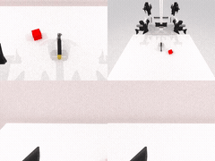
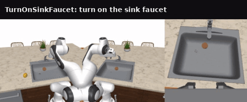
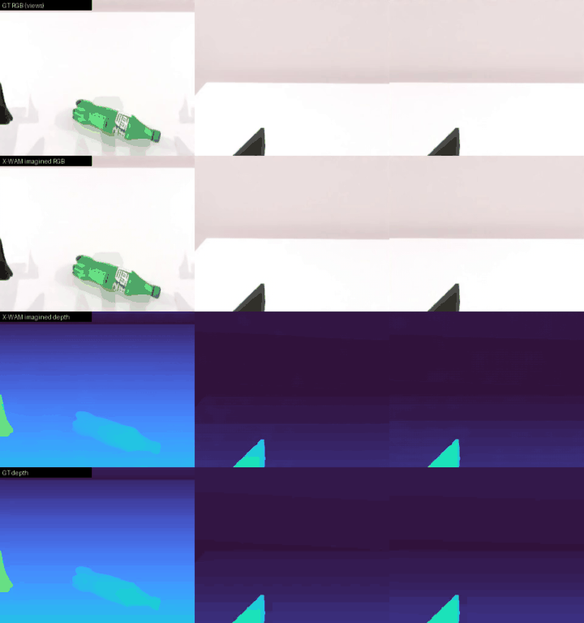
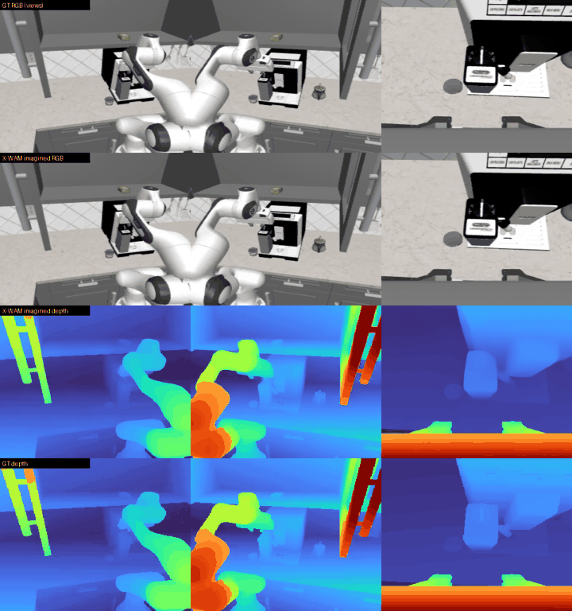

### X-WAM

This package runs [X-WAM](https://github.com/sharinka0715/X-WAM) on AMD Ryzen AI Max+ 395 (Strix Halo, gfx1151) under ROCm 7.2.2 (7.14 on the RoboTwin base). X-WAM is a Wan2.2-TI2V-5B unified 4D world-action model (UMT5-XXL text encoder, Wan2.2 VAE, and a joint video/action DiT) that predicts action chunks with an asynchronous, decoupled video/action denoising schedule. Its headline capability over an action-only WAM is a joint **RGB + depth** future: the DiT forks depth-modality branches (`extra_blocks`/`extra_heads`) off the shared RGB backbone and reads out a depth latent alongside the video, so the same model that plans the action chunk also *imagines* the future RGB and depth together. It is a slim policy layer that ships no simulator: it runs standalone on the plain base for the non-sim demos, or chains on a simulator base for interactive and closed-loop runs on RoboTwin 2.0 (SAPIEN Vulkan) and RoboCasa (robosuite / MuJoCo kitchens). Upstream comments out its own torch/flash-attn pins, so the base ROCm torch is preserved; flash-attn has no gfx1151 wheel, so attention falls back to torch SDPA.

### Build

```sh
ryzers build xwam --name xwam                            # model layer: non-sim demos (smoke / depth imagination)
ryzers run --name xwam                                   # test.py: ROCm torch + GPU + deps check
```

For interactive and closed-loop rollouts, chain the model on a simulator base.

```sh
ryzers build robotwin xwam --name xwam-robotwin          # chain on the RoboTwin 2.0 base
ryzers build robocasa xwam --name xwam-robocasa          # chain on the RoboCasa base
```

Artifacts are written to `workspace/xwam/outputs`. Set `HF_TOKEN` for faster or gated downloads. The
Wan2.2 base (~32 GB) and the X-WAM SFT checkpoints are fetched on the first model run. A full-model smoke
loads a released SFT checkpoint and runs one end-to-end action prediction (the fast async-denoising action
path) on ROCm:

```sh
EXP=robotwin_sft ryzers run --name xwam /ryzers/demos/demo_smoke.sh   # load ckpt + one prediction (PASS)
```

### Interactive RoboTwin 2.0

RoboTwin 2.0 runs under the SAPIEN Vulkan renderer; X-WAM drives it in-process via the `xwam_policy` plugin
(dual-arm delta-EE control through RoboTwin IK). Pick a task, press Run, and watch X-WAM roll it out live.
The chunk-replay server executes each predicted chunk before replanning; the real-time server runs the sim
at wall-clock speed so you *see* the planning latency (arms hold pose = thinking, then resume as the action
buffer refills). Both stream over HTTP/MJPEG — view at `http://localhost:PORT`
(`ssh -L PORT:localhost:PORT <host>`).

```sh
ryzers run --name xwam-robotwin /ryzers/demos/demo_interactive_robotwin.sh      # chunk-replay (PORT 8082)
ryzers run --name xwam-robotwin /ryzers/demos/demo_interactive_robotwin_rt.sh   # real-time  (PORT 8083)
```

### Interactive RoboCasa

RoboCasa kitchen tasks run under robosuite / MuJoCo (headless EGL); X-WAM drives the model-agnostic
`sim_robocasa.Policy` seam (single-arm 7-D delta-EE via OSC_POSE). The same two servers stream over
HTTP/MJPEG — view at `http://localhost:PORT`.

```sh
ryzers run --name xwam-robocasa /ryzers/demos/demo_interactive_robocasa.sh      # chunk-replay (PORT 8082)
ryzers run --name xwam-robocasa /ryzers/demos/demo_interactive_robocasa_rt.sh   # real-time  (PORT 8083)
```

### Closed-loop RoboTwin 2.0

X-WAM drives RoboTwin's own model-agnostic `script/eval_policy.py` in-process (delta-EE control, screw-mode
planning), writing per-episode videos + a success rate.

```sh
TASKS="beat_block_hammer" NUM_EPISODES=1 \
  ryzers run --name xwam-robotwin /ryzers/demos/demo_closedloop_robotwin.sh   # rollout + success rate
```

On this run `beat_block_hammer` scored 1/1 (100%).

<p align="center">
  
  <br><em>Closed-loop RoboTwin 2.0 rollout: beat block hammer.</em>
</p>

### Closed-loop RoboCasa

RoboCasa kitchen tasks run under robosuite / MuJoCo (headless EGL); X-WAM drives the model-agnostic
`sim_robocasa.Policy` seam (7-D delta-EE via OSC_POSE), writing a per-episode rollout video + `_result.json`.

```sh
TASK=TurnOnSinkFaucet NUM_EVALS=1 \
  ryzers run --name xwam-robocasa /ryzers/demos/demo_closedloop_robocasa.sh
```

On the sampled seed `TurnOnSinkFaucet` scored 0/1; the rollout below shows the policy driving the 7-DOF arm
through the kitchen scene. The chain and closed-loop demo are validated end-to-end — the per-episode
rollout video and result JSON are written to `workspace/xwam/outputs/robocasa`.

<p align="center">
  
  <br><em>Closed-loop RoboCasa rollout (headless MuJoCo, OSC_POSE): TurnOnSinkFaucet.</em>
</p>

### Depth imagination (RoboTwin + RoboCasa)

X-WAM's unique feature. From a single ground-truth start frame (+ proprio + prompt) it denoises the future
RGB latents and, in the same forward pass, reads out the depth-modality latents, then VAE-decodes both into
a joint imagined rollout. `demo_videogen.sh` renders each clip as ground-truth RGB, X-WAM's imagined RGB,
its imagined depth, and ground-truth depth (turbo-colormapped), and reports per-clip depth MAE vs ground
truth in `imagination_summary.json`. Runs on the standalone image (no simulator).

```sh
DATASET=robotwin NUM_VIDEOS=2 ryzers run --name xwam /ryzers/demos/demo_videogen.sh   # RoboTwin RGB+depth imagination
DATASET=robocasa NUM_VIDEOS=2 ryzers run --name xwam /ryzers/demos/demo_videogen.sh   # RoboCasa RGB+depth imagination
```

<p align="center">
  
  <br><em>RoboTwin imagined rollout — top to bottom: GT RGB, X-WAM imagined RGB, imagined depth, GT depth (3 camera views side by side).</em>
  <br>
  
  <br><em>RoboCasa imagined rollout — top to bottom: GT RGB, X-WAM imagined RGB, imagined depth, GT depth.</em>
</p>

### References

- Upstream: https://github.com/sharinka0715/X-WAM (commit pinned in `config.yaml`)
- Checkpoints: https://huggingface.co/sharinka0715/X-WAM-checkpoints
- Datasets: https://huggingface.co/datasets/sharinka0715/X-WAM-RoboTwin, https://huggingface.co/datasets/sharinka0715/X-WAM-RoboCasa
- Base model: https://huggingface.co/Wan-AI/Wan2.2-TI2V-5B

Copyright (C) 2026 Advanced Micro Devices, Inc. All rights reserved.
SPDX-License-Identifier: MIT
