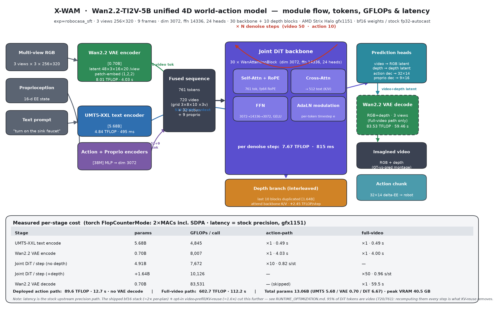

# X-WAM runtime optimizations on Strix Halo (ROCm)

A living overview of the runtime optimizations applied to **X-WAM** - the unified 4D
world-action model (Wan2.2-TI2V-5B; UMT5-XXL text encoder + Wan2.2 VAE + joint
video/depth/action/proprio DiT) - on **AMD Ryzen AI Max+ 395 (Strix Halo, `gfx1151`),
ROCm 7.2.2, PyTorch + bf16**. Levers are grouped into **portable** ones (generalize to the
WAM / video-DiT / diffusion-policy family) and **X-WAM-specific** ones.

> Method note: before/after numbers were measured **same-process / same machine-state** (to
> control for this GPU's launch-bound run-to-run variance) on real captured inputs. The bf16
> stack (§3) is bf16-equivalent and ships **default-on**; the KV-reuse knob (§4.1) is
> *approximate* (freezes the video branch mid-sample) and ships **opt-in, default-off**. All
> optimizations are applied as reversible monkeypatches on a live runner - no upstream edits
> (rule 2.1). Source data (kept local, rule 4): `artifacts/xwam_latency/`,
> `artifacts/xwam_video_rollout/`.

---

## 1. TL;DR - what worked, and how much

| Optimization | Class | Metric | Gain | Lossless? |
|---|---|---|---|---|
| bf16 VAE encoder (`vae_bf16`) | precision | VAE conv encode | ~3.3× on VAE encode | yes (bf16-equiv) |
| bf16 DiT + encoders/decoders (`bf16_all`) | precision | modulation / embed / GEMMs | part of the 2.03× per-plan | yes (bf16-equiv) |
| Cross-attn K/V + text-embed cache (`context_cache`) | redundant compute | per denoise step | bit-identical reuse | yes (bit-exact) |
| Text-encode cache by prompt (`text_cache`) | redundant compute | per replan | removes UMT5 re-encode | yes (bit-exact) |
| **bf16 stack net (above four)** | - | per-plan (isolated) / e2e closed-loop | **~2.03× per-plan · 1.46× e2e** | yes; **9/10→9/10** |
| **Video-prefill + cross-step K/V reuse** (`XWAM_KV`, K=3) | structural | action-denoise loop | **~1.62× per-plan** on top of bf16 | approx; **9/10 (same episodes)** |

**Headline:** the bf16 stack is bit/behavior-preserving and default-on (2.03× isolated
per-plan, 1.46× end-to-end closed-loop, RoboCasa `TurnOnSinkFaucet` 9/10 → 9/10 unchanged).
The opt-in KV-reuse knob adds a further **~1.62× per-plan** by freezing the video branch after
K denoise steps and running only the action+proprio tokens against the cached video K/V - at
**K=3 the closed-loop success and per-episode replan cadence are unchanged** (9/10, identical
episodes); K=1 is too aggressive (8/10, one seed flips).

---

## 2. The model (context)

X-WAM jointly denoises **video + depth + robot proprio + actions** in one DiT, using
**Asynchronous Noise Sampling (ANS)**: the video branch runs the full `DENOISE_STEPS`
(default 50) for fidelity while actions/proprio run few `ACTION_DENOISE_STEPS` (default 10) for
control. One forward fuses **720** multi-view video tokens (Wan2.2 VAE latent 48×3×16×20 per
view → patch-embed (1,2,2) → grid 3×8×10 × 3 views) with the tiny **32** action + **9** proprio
streams (**761** total), cross-attending to **512** UMT5 text tokens. **Depth is output-only** - 
an interleaved branch (the last 10 DiT blocks, duplicated) predicts depth latents from the
video-token stream + the backbone's cached K/V; the model never *ingests* depth (not at
train, where real depth is only the loss target, nor at inference). The deployed policy path
(`infer_action`, `early_stop`, no VAE decode) only needs the action chunk; the full-video path
(`infer_video`, all steps + Wan2.2 multi-view VAE decode) is used for visualization (§4.2).

### 2.1 Measured architecture & per-stage cost

Per-module numbers measured on-device (one `robocasa_sft` model, `gfx1151`) - GFLOPs via
`torch.utils.flop_counter.FlopCounterMode` (each stage isolated; matmul/conv = 2×MACs, SDPA
included), latency cuda-synced over one real `generate()`, token shapes captured live from the
forward pass:

| Stage | Params | GFLOPs / call | Action path | Full-video path |
|---|---:|---:|---|---|
| UMT5-XXL text encode | 5.68 B | 4,845 | ×1 · 0.49 s | ×1 · 0.49 s |
| Wan2.2 VAE encode | 0.70 B | 8,007 | ×1 · 4.03 s | ×1 · 4.00 s |
| Joint DiT / step (no depth) | 4.91 B (30 blk) | 7,672 | ×10 · 0.82 s/st | - |
| Joint DiT / step (+depth) | +1.64 B (10 blk) | 10,126 | - | ×50 · 0.96 s/st |
| Wan2.2 VAE decode (RGB+depth, 3 views) | 0.70 B | 83,531 | - (skipped) | ×1 · 59.5 s |

**Totals:** deployed action path **≈ 89.6 TFLOP · 12.7 s** (no VAE decode); full-video path
**≈ 602.7 TFLOP · 112.2 s**. Total params **13.06 B** (UMT5 5.68 / VAE 0.70 / DiT 6.67, of which
the depth branch is 1.64). Peak VRAM **40.5 GB**. Latency above is the **stock** upstream
precision path - the bf16 stack (§3, ~2×) and the opt-in KV-reuse knob (§4.1, ~1.6×) cut it
further. Note **~95 % of the 761 DiT tokens are video (720)** and are recomputed every denoise
step in stock - exactly the redundancy §4.1 removes.

---

## 3. Portable optimizations (the bf16 stack - shipped default-on)

Env-gated by `XWAM_OPT=1` (constructor hook in `experiments/xwam_core.py` →
`experiments/xwam_opts.py`); unset leaves the runner bit-exact-identical to upstream.

- **`vae_bf16`** - upstream forces the Wan2.2 VAE conv encoder to fp32 (`Wan2_2_VAE.dtype`)
  despite bf16 weights, so the ~4 s MIOpen conv never touches the bf16 matrix cores. Setting
  the VAE dtype to bf16 is the single biggest precision lever (~3.3× on VAE encode).
- **`bf16_all`** - rewrites `torch.amp.autocast(dtype=float32)` → bf16 so DiT modulation,
  per-token timestep embed+proj, and the action/proprio encoders/decoders also hit the bf16
  cores. ⚠️ the DiT asserts `e.dtype==float32` inside every block, so the optimized arm must run
  under **`python -O`** (asserts stripped); `xwam_opts` warns if bf16 is on with asserts live.
- **`context_cache`** - memoize the text-embedding projection + per-block cross-attn K/V (the
  text condition is constant across denoise steps). Bit-exact; cleared at the start of every
  `generate()` so a new observation/instruction never reuses stale K/V.
- **`text_cache`** - memoize the UMT5 encode by prompt string (bit-exact; the instruction is
  constant across an episode, so it persists across replans, keyed by prompt not pointer).

**bf16 stack result (RoboCasa `TurnOnSinkFaucet`, 10 seeds, paired A/B, only `XWAM_OPT` varies):**
success **9/10 → 9/10** with the **same per-episode replan counts** (bf16 drift never flipped a
discrete outcome); **~2.03× per-plan** isolated, **1.46× end-to-end** wall clock
(20m49s → 14m15s; e2e dilutes the per-plan win with fixed model-load + sim physics/EGL render).

---

## 4. X-WAM-specific optimizations

### 4.1 Video-prefill + cross-step K/V reuse (the structural knob, opt-in)
Op-level profiling of one full-video forward (`run_depth=False`, incl. VAE encode) shows the
work is **overwhelmingly GEMM-bound**, and almost all of those GEMMs are the *video* tokens
being recomputed every denoise step:

| aten leaf-kernel bucket | GPU ms | % of 12.30 s |
|---|---:|---:|
| **GEMM (QKV/FFN/proj)** | 10019.5 | **81.5%** |
| dtype cast (bf16/fp32/fp64) | 938.8 | 7.6% |
| conv3d (VAE + patch-embed) | 603.8 | 4.9% |
| attention (flash/SDPA) | 252.2 | 2.1% |
| elementwise (RMSNorm/mod/act) | 239.4 | 1.9% |
| copy/reshape | 110.1 | 0.9% |
| complex/RoPE (fp64) | 53.9 | 0.4% |
| LayerNorm (fp32) | 45.6 | 0.4% |

(Semantic regions: VAE encode **4.0 s**, DiT forward **7.9 s**, RoPE 0.2 s.) Attention,
complex-RoPE and LayerNorm are each <2.1% - **not worth optimizing**; the win is removing
redundant video-token GEMMs.

**The knob** (`XWAM_KV=1`, `XWAM_KV_PREFILL_STEPS`=K, default 3): the first **K** denoise steps
are normal full joint forwards that also cache each layer's **video-token K/V** into
`model._kv_cache`; the remaining steps **freeze the video branch** and run a *reduced* forward
over only the action+proprio queries, attending to the frozen video K/V. This skips ~99% of the
per-step token GEMMs after step K. Approximate (video stops denoising early), so it's opt-in.

- **Latency:** ~**1.62× per-plan** (in-process) on top of the bf16 stack.
- **Closed-loop A/B** (RoboCasa `TurnOnSinkFaucet`, 10 seeds, 3 arms):
  bf16-baseline **9/10** · KV **K=3 → 9/10** (identical successful episodes; per-episode replan
  counts within ±2) · KV **K=1 → 8/10** (seed 3 flips to failure). **K=3 is the recommended
  default**; K=1 trades a task for marginal extra speed.

**Transferable lesson:** any conditional diffusion sampler with a big constant-ish context and a
small per-step query loop can freeze/prefill the context K/V - validate closed-loop, since it's
not bit-exact.

### 4.2 Full-video rollout harness (visualization)
`experiments/robocasa_xwam/xwam_policy/video_rollout.py` exercises the *full* video-diffusion
path (all sample steps + multi-view RGB+depth VAE decode) so we can see what X-WAM imagines
while planning. Each frame is an upstream-style vertical montage (row0 = sim ground truth,
row1 = predicted RGB, row2 = predicted depth, 3 views each). Two modes per episode:
- **grounded** - standard cadence: re-observe the real sim every `REPLAN_STEPS` and re-anchor
  each plan to reality.
- **ungrounded** - open-loop world-model dream: after the first real frame, feed the model its
  **own** predicted last frame + proprio as the next observation (never re-grounding).

Result (10 episodes, `TurnOnSinkFaucet`, ~41 s/plan incl. decode): **grounded 8/10**,
**ungrounded 4/10** - the dream drifts (especially the wrist view) once it stops re-grounding,
which is the expected accumulation of world-model error and a useful qualitative check of the
video branch. Videos are pulled small to `artifacts/xwam_video_rollout/` and stay local (rule 3).

---

## 5. Why these work - bottleneck classes

| Bottleneck class | Symptom | Fix used |
|---|---|---|
| fp32 casts on bf16-capable cores | VAE/DiT autocast pinned to fp32 | **bf16 stack** (§3) |
| Redundant static compute | text embed / cross-attn K/V recomputed every step | **context/text cache** (§3) |
| Redundant video-token GEMMs | 81.5% GEMM, video recomputed every step | **video-prefill + K/V reuse** (§4.1) |

Attention, complex-RoPE and LayerNorm are already cheap here (<2.1% each) - low ROI.

---

## 6. Reproduce / toggles

- **bf16 stack (default-on when `XWAM_OPT=1`):** per-lever gates
  `XWAM_OPT_VAE_BF16` / `XWAM_OPT_BF16` / `XWAM_OPT_CONTEXT_CACHE` / `XWAM_OPT_TEXT_CACHE`
  (all default-on). `bf16_all` requires **`python -O`** (strips the DiT fp32 asserts).
- **KV-reuse knob (opt-in):** `XWAM_KV=1`, tune `XWAM_KV_PREFILL_STEPS` (K, default 3).
- **Baseline:** leave `XWAM_OPT` unset for the bit-exact upstream path.
- **Video rollout:** run `experiments/robocasa_xwam/xwam_policy/video_rollout.py`
  (env: `TASK`, `NUM_EVALS`, `MODES="grounded,ungrounded"`, `REPLAN_STEPS`, `OUT_DIR`, …).
- Drivers / raw data (local, rule 4): `agent_scripts/latency_opt/` (op profiler, KV probe,
  closed-loop A/B, `xwam_arch/` FlopCounterMode probe + figure renderer); results under
  `artifacts/xwam_latency/` (incl. `arch_robocasa_sft.json`) and `artifacts/xwam_video_rollout/`.

---

*Scope note: numbers are for Strix Halo `gfx1151` / ROCm 7.2.2 / bf16.*
