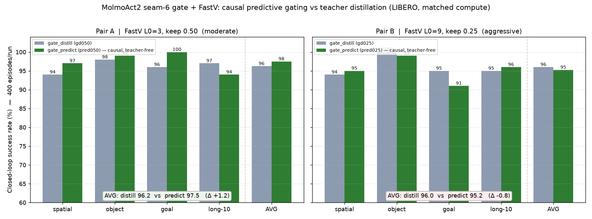
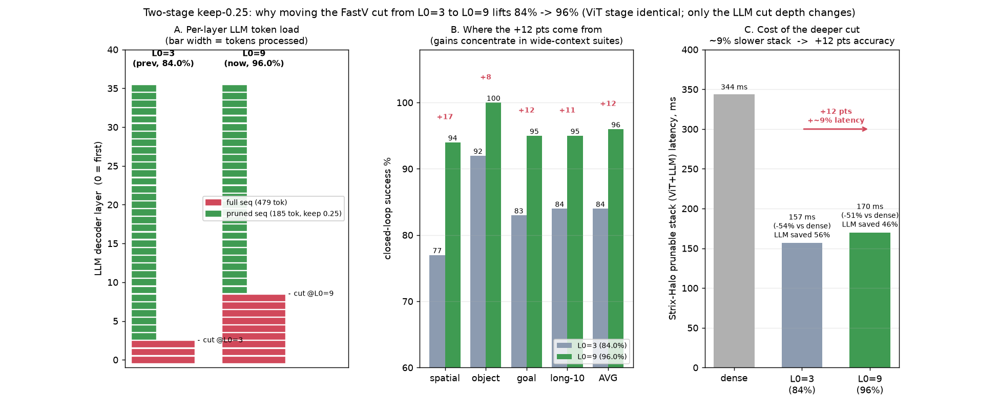
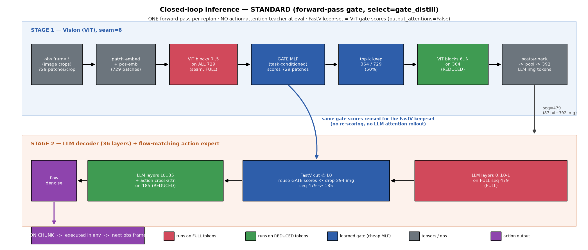
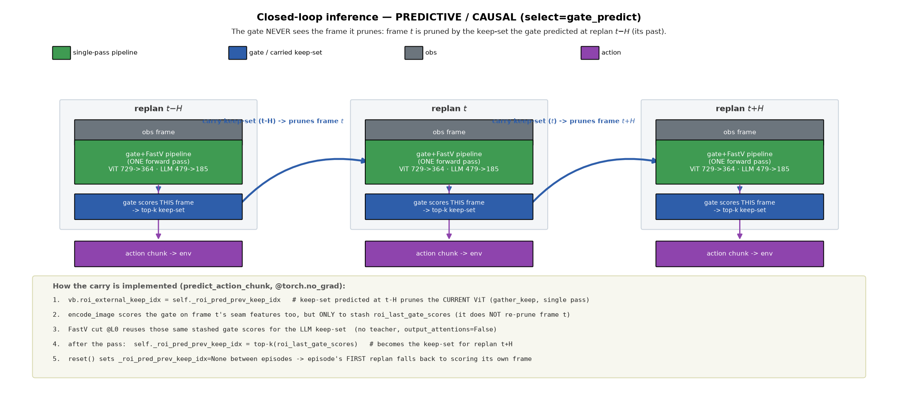

# Causal Predictive Gating for MolmoAct2 — Closed-Loop Results

**Date:** 2026-07-11  ·  **Benchmark:** LIBERO (closed-loop, 4 suites × 10 tasks × 10 episodes = 400 episodes/run)
**Compute:** AMD Instinct MI210 (eval) / MI300X (gate_predict training), single-GPU per run, Apptainer SIF.

## TL;DR

At **matched compute**, the **causal, teacher-free** predictive gate (`gate_predict`) **matches or beats**
the teacher-distilled gate (`gate_distill`) on closed-loop LIBERO success, while removing the teacher
dependency at inference:

- **Pair A** (moderate prune, FastV L0=3 / keep 0.5): **gate_predict 97.5 % vs gate_distill 96.2 % (+1.3)**
- **Pair B** (aggressive prune, FastV L0=9 / keep 0.25): **gate_predict 95.2 % vs gate_distill 96.0 % (−0.8, within noise)**

## What was trained

Two-stage pruning pipeline (the proven seam-6 student gate + FastV setup; **no pre-ViT self-distillation**):

1. **Stage 1 — mid-ViT gate @ seam=6**: a small student gate selects the important patches before the
   upper ViT layers (keeps 50 % of the 729 patches/crop).
2. **Stage 2 — in-LLM FastV cut @ L0**: low-importance visual tokens are dropped inside the LLM decoder
   after layer L0.

`gate_predict` differs from `gate_distill` only in *how the gate is supervised/scored*:
- `gate_distill`: gate is BCE-distilled toward a teacher ROI on the **current** frame.
- `gate_predict` (**this work**): gate is scored on the **past** frame to predict the **next** frame's ROI
  (horizon H=10). Teacher supervises only the future frame at *training*; at *inference* the pipeline is
  **fully causal and teacher-free** — each replan's ViT is pruned with the keep-set carried from the
  previous replan (bootstrapped by self-gating on the first frame).

All four runs trained to **12 000 steps** with identical curriculum (keep 0.9→target over 4 000 steps),
`roi_distill_weight=20`, last-4 decoder layers unfrozen.

| run label | select | FastV L0 | FastV keep | role |
|---|---|---|---|---|
| `gd050` (`roi_fastv_keep050_fv050`) | gate_distill | 3 | 0.50 | Pair A baseline |
| `pred050` (`roi_predict_keep050_fv050_l03`) | gate_predict | 3 | 0.50 | Pair A causal |
| `gd025` (`roi_fastv_keep050_fv025_l0_9`) | gate_distill | 9 | 0.25 | Pair B baseline |
| `pred025` (`roi_predict_keep050_fv025_l09`) | gate_predict | 9 | 0.25 | Pair B causal |

## Closed-loop accuracy (% success, 10 episodes/task)

| run | spatial | object | goal | long-10 | **AVG** |
|---|---|---|---|---|---|
| gd050  (distill, L0=3) | 94.0 | 98.0 | 96.0 | 97.0 | **96.2** |
| **pred050 (causal, L0=3)** | 97.0 | 99.0 | 100.0 | 94.0 | **97.5** |
| gd025  (distill, L0=9) | 94.0 | 100.0 | 95.0 | 95.0 | **96.0** |
| **pred025 (causal, L0=9)** | 95.0 | 99.0 | 91.0 | 96.0 | **95.2** |

## Compute reduction (measured at the final 12k checkpoints, `ROI_PRUNE_DEBUG`)

Token-drop is **identical between gate_predict and gate_distill within each pair** (same seam-6 keep + same
FastV L0/keep), so the accuracy comparison above is strictly at matched compute.

| budget | pre-ViT gate (patches kept) | in-LLM FastV (LLM seq kept) |
|---|---|---|
| L0=3, keep 0.5 (Pair A) | 364 / 729 = **49.9 %** | 479 → 283 = **59.1 %** |
| L0=9, keep 0.25 (Pair B) | 364 / 729 = **49.9 %** | 479 → 185 = **38.6 %** |

> Note on wall-clock: per-episode eval time from the LIBERO harness is **render-dominated** (OSMesa CPU
> rendering under 8-way worker contention, different physical nodes per run), so it is *not* a clean
> inference-latency metric and is intentionally omitted as a headline number. Because the prune budgets
> are matched within each pair, gate_predict and gate_distill have essentially equal inference cost by
> construction; the compute saving is versus the dense (unpruned) model, quantified above.

## Why L0=9 beats L0=3 (compute vs accuracy of the cut depth)

The two-stage pipeline is identical across cut depths except the FastV layer `L0`; the ViT stage
(seam-6 gate, keep 50 %) is byte-for-byte the same. Moving the cut from `L0=3` to `L0=9` lets 6 more
decoder layers integrate the full token set before pruning, recovering the wide-context suites
(spatial 77→94, goal 83→95, long 84→95) — a **+12 pt** 4-suite jump (84→96) for only ~**+23 %** LLM
token-layer work (still ~46 % of dense). On the compute-bound Strix-Halo stack this is ~+9 % wall-clock;
on overhead-bound MI300 batch-1 it is negligible.

## Causal-correctness validation

- Smoke closed-loop run on an early gate_predict checkpoint confirmed the inference path installs
  `select=gate_predict`, prunes the ViT via the carried keep-set (`[roi-prune] ACTIVE ... keep=364/729`),
  applies the in-LLM FastV cut, and completes episodes with a written rollout — **teacher-free**.
- Full 400-episode evals ran with **0 processor/inference errors** across both gate_predict runs.
- **Code-level dataflow audit** of the deployed eval overlay confirmed both pipelines execute in a
  **single forward pass**: (a) the ViT gate physically `gather_keep`s patches; (b) the in-LLM FastV cut
  runs once at `L0` with `output_attentions=False` and derives its keep-set from the **stashed ViT gate
  scores** (no LLM attention rollout); (c) the action-attention teacher is gated by `self.training` so it
  **never runs at inference**. For `gate_predict`, the current ViT is pruned by the keep-set carried from
  the previous replan (`_roi_pred_prev_keep_idx`), and `reset()` clears the carry between episodes — the
  gate never sees the frame it prunes.

**Standard (forward-pass) closed-loop dataflow:**

**Predictive (causal) closed-loop dataflow:**

- Sample rollout videos (`pred050_spatial_t08_ep0.mp4`, `pred025_long10_t00_ep0.mp4`) are kept on the
  remote compute store, not in the repo (large binaries stay out of version control).

## Takeaways

1. **Causal predictive gating is viable and competitive.** Predicting the next frame's ROI from the past
   frame — with the teacher used only at training — matches or exceeds teacher-distilled gating at equal
   compute, and is preferable because inference needs no teacher.
2. **It shines at moderate pruning** (Pair A: +1.3), and stays within noise at aggressive pruning
   (Pair B: −0.8), where the deeper FastV cut (LLM seq → 38.6 %) is the harder regime for both methods.
3. **Reproducibility:** eval overlay = the validated training overlay (md5-matched), 4 LIBERO suites,
   seeds fixed (SEED=1000, per-episode seeding). Merged results: `artifacts/predict_eval/merged_results.csv`.

## Artifacts (committed under `research/roi_lora_lerobot/`)

- `report_figs/14_predict_vs_distill.png` — predict-vs-distill comparison bar chart
- `report_figs/15_l0_3_vs_9_explained.png` — cut-depth compute/accuracy explanation
- `report_figs/16_closed_loop_standard.png`, `report_figs/17_closed_loop_predictive.png` — closed-loop dataflow
- `report_figs/merged_results.csv` — all unit results (4 runs)
- `artifacts_gen/plot_predict_vs_distill.py`, `plot_l0_explain.py`, `plot_closedloop_dataflow.py` — figure generators
- Rollout videos are kept on the remote compute store (not versioned).
