# Feedback-Guided Pre-ViT Token Pruning + LoRA Fine-Tune — MolmoAct2 (LIBERO)

**Status:** living report · last updated Jul 9, 2026
**Target model:** `allenai/MolmoAct2-LIBERO` (6B; SigLIP2 ViT + Olmo LLM + flow-matching action expert)
**Compute:** AMD MI300X node, single-GPU per run, HF Accelerate + SLURM, LoRA on the VLM
**Goal:** cut the vision encoder cost by pruning image patches *before* the ViT, using the **action expert's own attention as a feedback ROI signal**, and recover any lost task accuracy with a short LoRA fine-tune.

---

## 0. TL;DR

- **Core idea:** the action expert already tells us *where it looks* (its cross-attention onto the image tokens). Use that as a teacher to decide which patches are worth encoding, prune the rest before the expensive ViT blocks, and fine-tune LoRA to adapt.
- **Phase 0 (validated):** the raw teacher attention is dominated by **positional sinks** (the same 4 tokens every scene). After **sink-debiasing** (subtract the per-layer cross-sample mean) layers `[9,20,21]` give a **content-driven, peaked** signal that lands on the **gripper and manipulated object**. This is the usable teacher.
- **Variant A — dual-pass teacher-guided (works):** run a no-grad pass to get the teacher ROI, keep top-K patches, run the graded pass, LoRA fine-tune. Loss converges cleanly (k25=1.20, k50=0.70, k75=0.34). Costs ~2× ViT at inference (two passes).
- **Variant B — distill teacher into a cheap 1-pass gate (fails as designed):** a pre-ViT gate **cannot** reproduce the deep, task-conditioned teacher ROI. Across **4 gate designs × 2 keep fractions** the best is a weak *position prior*; task conditioning (additive FiLM *and* cross-attention) adds nothing, because raw patch projections are too low-level to match language.
- **Mid-ViT rescue (promising):** move the prune seam a few ViT blocks deep so the gate scores **semantic** features. Precision@K vs the teacher rises monotonically with seam depth (seam0→0.39, seam9→0.54 @ keep0.25) at a graded FLOP cost.
- **Result — converged seam=6 mid-ViT gate-distill (single-pass, §9):** all 3 keep fractions trained to 6000 steps and evaluated **closed-loop on 100 ep/suite** (1500 rollouts, MI300X). **keep=0.50 is effectively lossless at 97.5% on the 4 standard suites** (drop half the ViT tokens, one pass, no teacher); keep=0.75 ties at 96.5%; **keep=0.25 (drop 75% of tokens) still holds 88.2%** — a graceful ~9-pt cost where the training-free selectors cliffed to 0%.
- **Debug mask viz (§9.1):** the single-pass student gate learns a sensible ROI — keeps gripper / basket / manipulated objects, drops empty floor/background — confirming the fine-tune converts the teacher's cross-attention prior into a cheap, deployable pruning head.
- **Two-stage extension — pre-ViT gate + in-LLM FastV (§9.2, the v2 deliverable):** stack the stage-1 gate (keep 50% of ViT patches, scatter-back) with a **stage-2 FastV cut** that *physically* drops low-importance image tokens inside the LLM after layer 3. Full 5-suite closed-loop eval (**500 rollouts/config**, MI300X). **At 50% LLM-token keep the pipeline is effectively lossless — 96.5% on the 4 standard suites (matches single-stage gating-only's 97.5%)** while now saving **both ViT and LLM/action-expert** compute. At 25% keep it holds **84.0%** (4-suite). The 25% gap is an early-cut information shock, and it is **recoverable**: an eval-only cut-depth sweep (§9.3) lifts 25%-keep from 82.0→**90.5%** by moving the cut to layer 9 — no retraining (a matched L0=9 retrain is queued to lock it in).
- **Key negative from training-free evals:** aggressive pruning (keep≤0.25) on the *stock* model collapses accuracy for action-attn/pre-pos selectors (0% at keep0.25 on 3 suites) — which is exactly why the fine-tune is needed.

---

## 1. Motivation

Naive, parameter-free pre-ViT selectors (patch-norm `energy`, `content`) gave only **marginal, non-deterministic** speed/accuracy trade-offs. The hypothesis of this experiment: a **task-aware feedback signal** — the action expert's attention back onto the image — picks better patches than generic saliency, and a short LoRA fine-tune closes the accuracy gap at high prune rates.

"Feedback" here = the downstream policy head telling the vision front-end where to look.

---

## 2. System architecture

### 2.1 Base model + where we prune

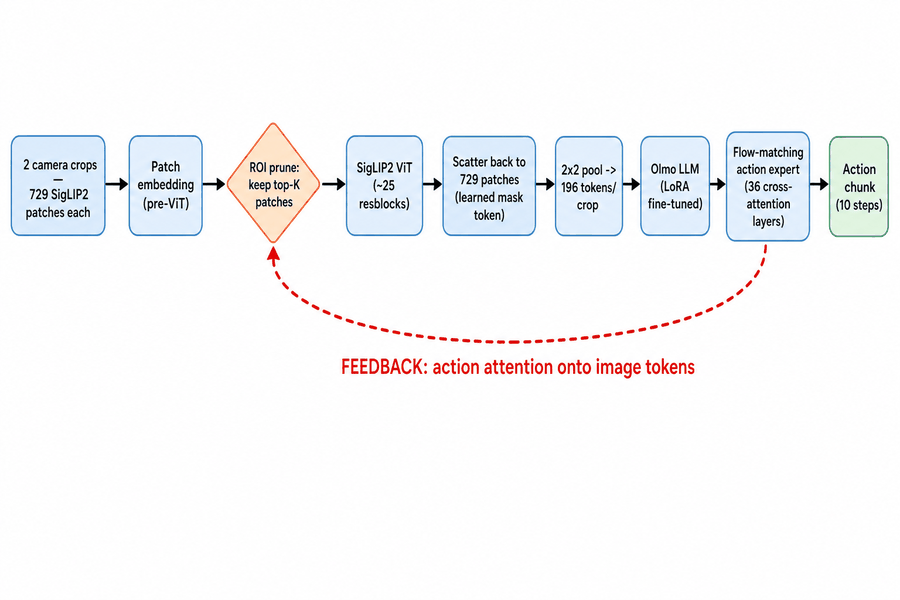

- Pruning happens **before the ViT resblocks** ("stage-D"): the FLOP save is in the ViT.
- Pruned patches are **scattered back** onto the full 729-grid with a learned mask token, so the LLM token count is unchanged by design (no downstream shape changes).
- The dotted edge is the whole point: the action expert's attention is the ROI teacher.

### 2.2 Compute model (why prune the ViT)

Per-crop ViT resblock cost, from `artifacts/roi_training/compute_saved.json`:

| keep | kept patches | ViT GFLOPs | ViT FLOP reduction | ViT speedup |
|---|---|---|---|---|
| 1.00 | 729 | 616.2 | — | 1.0× |
| 0.75 | 547 | 450.9 | 26.8% | 1.37× |
| 0.50 | 364 | 292.4 | 52.6% | 2.11× |
| 0.25 | 182 | 142.4 | 76.9% | 4.33× |

---

## 3. Phase 0 — is the teacher signal usable? (validated)

We instrumented `ActionExpertCrossAttention` to capture the softmax attention (SDPA normally fuses it away) and dumped per-layer action→image attention on a real LIBERO batch with fully loaded weights (pruning disabled, 1-step probe).

**Finding 1 — raw attention is dominated by positional sinks.** The peaked deep layers (e.g. L34: top-10% mass = 98%) are **attention sinks**: their top tokens `{126,140,322,336}` are identical across all 8 scenes → positional, not content.

**Finding 2 — sink-debiasing recovers a content-driven teacher.** Subtracting the per-layer cross-sample mean (the fixed positional template) and keeping the positive residual yields a peaked **and** content-varying signal:

| teacher | entropy (of uniform) | top-10% mass | cross-sample top-8 overlap |
|---|---|---|---|
| raw all-layer mean | 98% | 23% | 5/16 (sink-biased) |
| debias L9 | 72% | 74% | 0 (content) |
| **debias L[9,20,21] (chosen)** | **83%** | **58%** | **0 (content)** |
| debias deep[24:34] | 85% | 50% | 0 (content) |

The chosen debiased teacher lands on the **manipulated object and gripper**, unlike a sink layer which is stuck on fixed positions:

| chosen teacher (debias L[9,20,21]) | a sink layer (L34) for contrast |
|---|---|
| 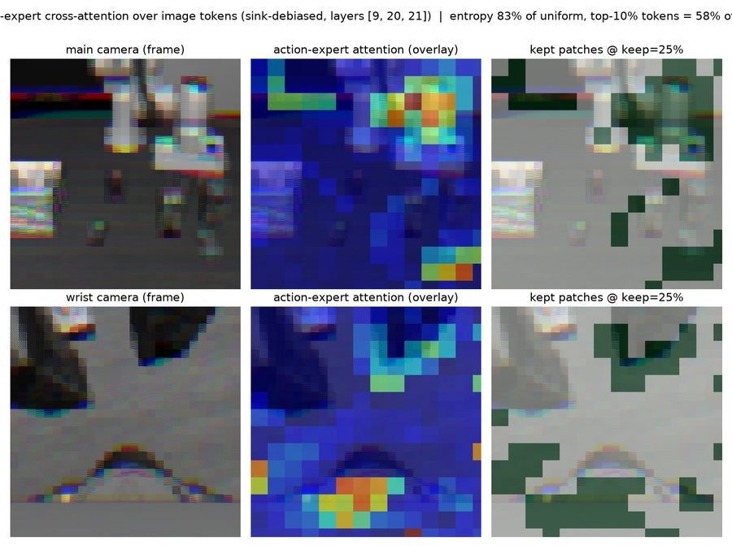 | 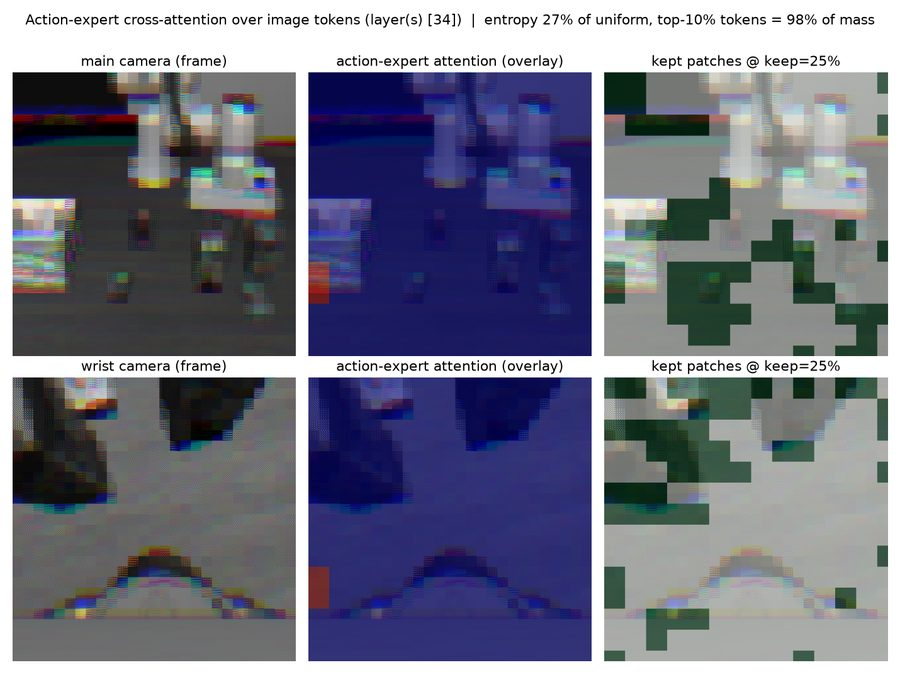 |

Per-layer peakedness vs content-selectivity (why we debias):

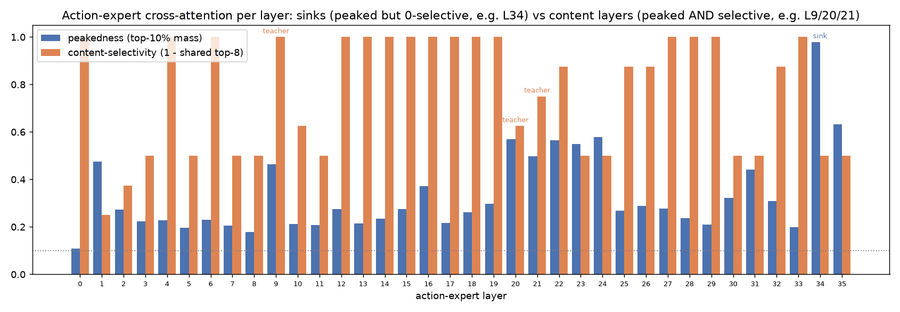

> **Decision:** teacher = **sink-debiased layers [9,20,21]**. This feeds every variant below.

---

## 4. Variant A — dual-pass teacher-guided fine-tune ✅

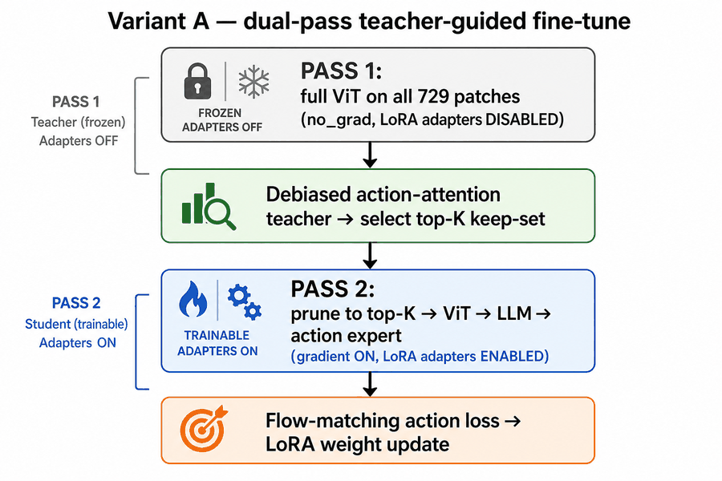

- Teacher ROI is computed from a frozen no-grad forward; the graded pass trains on the pruned patches.
- **Bug fixed here:** the teacher pass was leaking PEFT LoRA adapter state, disconnecting gradients (loss was flat at ~6.0). Wrapping the teacher forward in `disable_adapter()` fixed it → real, descending loss.

**Result — loss converges at all keep fractions (6000 steps):**

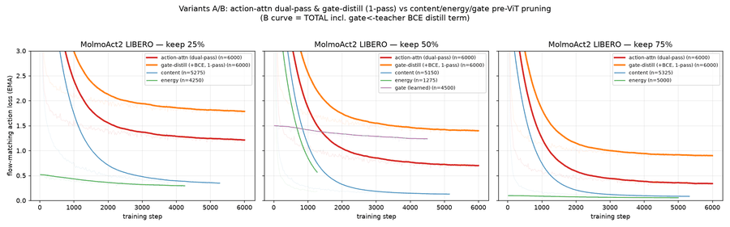

Late-training flow-matching loss (mean of last ~500 steps):

| keep | **A: action-attn dual-pass** | B: gate-distill (total, incl BCE) | content | energy | gate(learned) |
|---|---|---|---|---|---|
| 25% | **1.204** | 1.779 | 0.341 | 0.291 | — |
| 50% | **0.695** | 1.394 | 0.126 | 0.195 | 1.233 |
| 75% | **0.339** | 0.899 | 0.081 | 0.054 | — |

> **Read:** Variant A trains cleanly and monotonically with keep. It converges *higher* than the deterministic `content`/`energy` selectors — expected, because the teacher-selected keep-set changes as the policy learns (a moving target), and because action loss ≠ task success (see §8). Cost: **~2× ViT** at inference (two passes). **A is the proven fallback.**

---

## 5. Variant B — distill the teacher into a cheap 1-pass gate ❌ (as designed)

Goal: avoid the second pass. Train a small pre-ViT gate MLP with a **BCE distillation loss** to mimic the teacher's top-K keep-set, so inference is single-pass (no teacher forward).

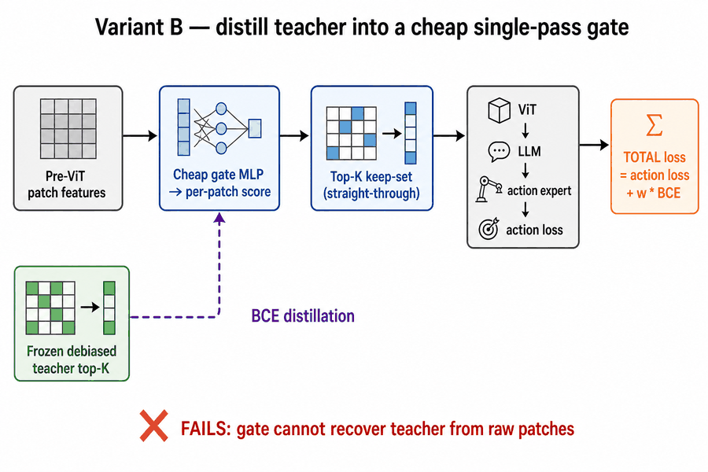

We probed **agreement** (precision@K == IoU of gate-top-K vs teacher-top-K, and the BCE) across 4 gate designs and 2 keep fractions:

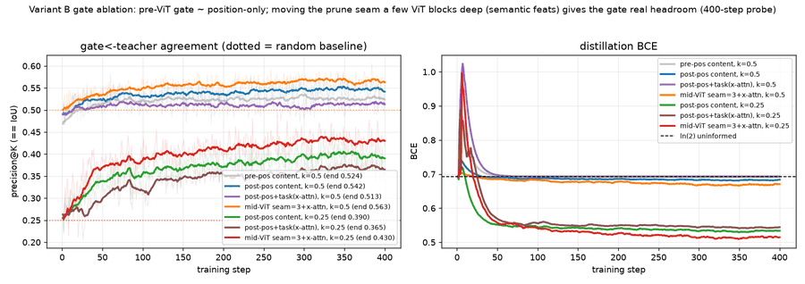

| gate design | keep | end precision@K | lift over random | BCE end | verdict |
|---|---|---|---|---|---|
| pre-pos content (raw proj) | 0.50 | 0.526 | +0.026 | 0.691 | ~chance |
| post-pos content | 0.50 | 0.545 | +0.046 | 0.683 | weak position prior |
| post-pos + task (cross-attn) | 0.50 | 0.515 | +0.016 | 0.693 | **dead** (BCE≈ln2) |
| mid-ViT seam=3 + x-attn | 0.50 | 0.564 | +0.065 | 0.670 | best |
| post-pos content | 0.25 | 0.393 | +0.144 | 0.533 | position prior |
| post-pos + task (cross-attn) | 0.25 | 0.368 | +0.118 | 0.543 | no task lift |
| mid-ViT seam=3 + x-attn | 0.25 | 0.433 | +0.183 | 0.515 | best |

**What we ruled out (robustly):**
1. **Connectivity** — `gate_scores_requires_grad=true`, grad norms > 0. Not a plumbing bug.
2. **Under-training / LR** — even with ~4000× the learning signal (`gate_lr=1e-2`, distill weight 20), precision plateaus and BCE collapses to `ln(2)` (uninformed).
3. **Task conditioning** — mean-pooled instruction added via **FiLM** is a per-image constant → can't discriminate *which* patch. A **cross-attention** gate (patch queries → instruction tokens, 2.04M params) was even **worse** than the plain position gate.

> **Conclusion:** A cheap **pre-ViT** gate can at best learn a **position prior**; it cannot reproduce the deep, task-conditioned teacher because raw patch pixel-projections carry no semantics/task. Single-pass pre-ViT distillation of this teacher is **not viable**. Root cause is fundamental, not a bug.

---

## 6. Mid-ViT prune — score semantic features instead 🔬 (promising)

If the gate can't work on raw patches, move the **prune seam** a few ViT blocks deep: run the first *N* blocks on **all** patches, let the gate score those **semantic** features, prune to top-K, run the remaining blocks on the subset, then scatter back. This trades some ViT FLOPs for a gate that has real signal.

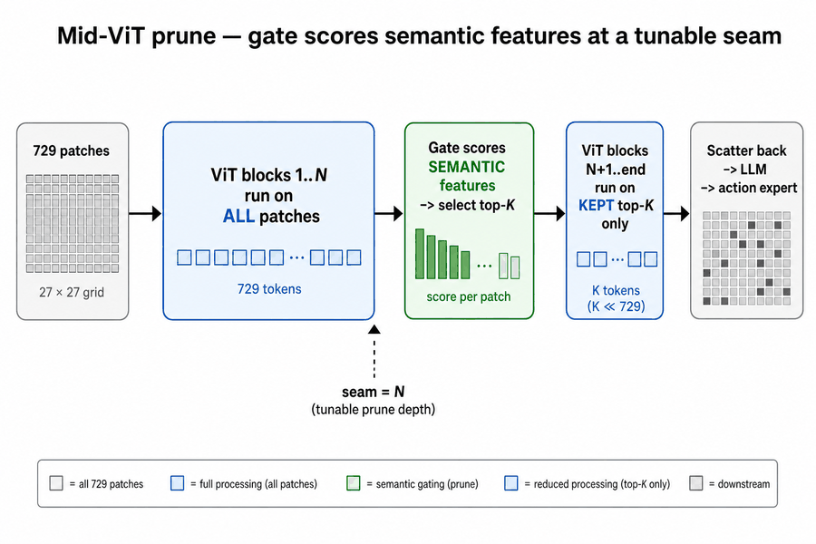

**Seam-depth trade-off (keep=0.25, 400-step probes):**

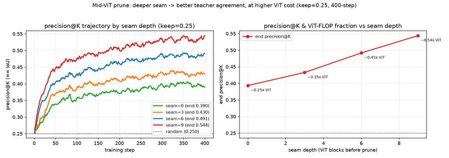

| seam (blocks before prune) | end precision@K | lift over random | ~ViT FLOP fraction |
|---|---|---|---|
| 0 (pure pre-ViT) | 0.393 | +0.143 | 0.25× |
| 3 | 0.433 | +0.183 | 0.35× |
| 6 | 0.492 | +0.242 | 0.45× |
| 9 | 0.544 | +0.294 | 0.54× |

> **Read:** deeper seam → better teacher agreement, ~linearly, at higher ViT cost. seam=9 reaches **2.2× random** precision at ~0.54× ViT — still far below Variant A's ~2× ViT dual-pass. **seam=6** (0.49 precision @ ~0.45× ViT) was picked as the balanced point for the full sweep.

---

## 7. Mid-ViT gate-distill training run (converged)

**Full mid-ViT gate-distill sweep — `gate_seam=6`, 3 keep fractions (0.25/0.5/0.75), 6000 steps.**

- Confirmed correct config: `roi_prune_gate_seam=6`, 2.04M-param mid-ViT cross-attention gate (the failed prior attempt silently ran the 297k pre-ViT gate because the seam flag hadn't been pushed to the cluster).
- Launched detached (`nohup`+`srun`) so an SSH drop can't kill it; verified it survives past the point where the previous attempt died, checkpointing every 500 steps.
- Loss descending (k0.25→~11, k0.5→~14, k0.75→~11 at early steps); single 2h segment reaches 6000 (~1.07 step/s), no resume chaining needed.

Output: converged, single-pass, prunable checkpoints. **Closed-loop task-success results are in §9.**

---

## 8. Task-success evals — training-FREE inference pruning (baseline)

Before the fine-tune, we measured LIBERO success of *inference-time* pruning on the **stock** checkpoint (10–15 episodes/suite). This motivates the fine-tune and calibrates "loss ≠ success".

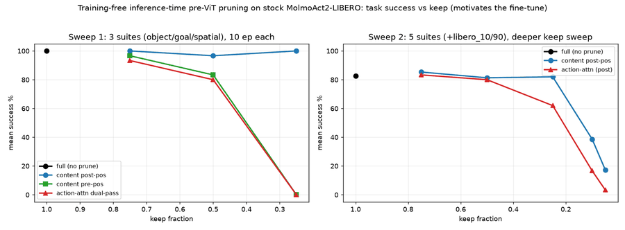

**Sweep 1 — 3 suites (object/goal/spatial), mean success %:**

| arm | keep0.75 | keep0.50 | keep0.25 |
|---|---|---|---|
| content post-pos (`rpost`) | 100 | 97 | **100** |
| content pre-pos (`rpre`) | 97 | 83 | **0** |
| action-attn dual-pass (`actattn`) | 93 | 80 | **0** |

**Sweep 2 — 5 suites (+libero_10/90), deeper keep sweep, mean success %:**

| arm | 0.75 | 0.50 | 0.25 | 0.10 | 0.05 |
|---|---|---|---|---|---|
| content post-pos (`rpost`) | 85 | 81 | 82 | 39 | 17 |
| action-attn (`actpost`) | 83 | 80 | 62 | 17 | 3 |

> **Key observations:**
> - **Post-positional content selection is shockingly robust** — holds ~100% down to keep0.25 (sweep 1) and degrades gracefully only below keep0.10.
> - **Pre-pos content and (training-free) action-attn both cliff to 0% at keep0.25** on the 3 clean suites — they drop patches the un-adapted model still relies on. This is the accuracy hole the LoRA fine-tune (Variants A/mid-ViT) is meant to fill.
> - **Action-attn is also ~2× slower** per episode (dual-pass), visible in `eval_ep_s`.
> - These are *training-free* numbers on stock weights; the fine-tuned checkpoints from §7 are what we ultimately compare.

---

## 9. Closed-loop task-success — fine-tuned mid-ViT gate-distill (converged) ✅

**The deliverable.** All three keep fractions trained to **6000 steps** (converged;
losses flat over the last ~1.5k steps) and were evaluated **in closed loop** with the
**student gate driving single-pass token pruning** — no teacher, no dual pass. Harness:
`lerobot-eval` on the fine-tuned `--policy.path` checkpoint, MI300X, OSMesa
software rendering, **100 episodes/suite** (10 tasks × 10 episodes; `libero_90`
sub-sampled to 10 spread tasks). 150 task-units total = **1500 rollouts**.

**Closed-loop success % (100 ep/suite):**

| keep (→ % ViT patches pruned) | spatial | object | goal | long (l-10) | l-90 (held-out) | **4-suite avg** | ep_s |
|---|---|---|---|---|---|---|---|
| **0.50 (50% pruned)** | 97 | 99 | 98 | 96 | 39 | **97.5** | 49 |
| **0.75 (25% pruned)** | 97 | 99 | 96 | 94 | 34 | **96.5** | 48 |
| **0.25 (75% pruned)** | 83 | 92 | 93 | 85 | 17 | **88.2** | 54 |

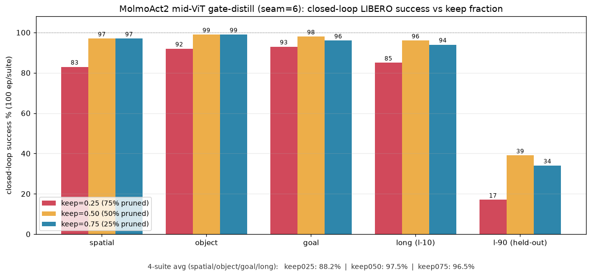

> **Key results:**
> - **keep=0.50 is effectively lossless** — **97.5%** on the 4 standard suites
>   (spatial/object/goal/long), i.e. we drop **half** the ViT patch tokens in a single pass
>   with no measurable task-success cost. keep=0.75 is statistically tied at 96.5%.
> - **keep=0.25 (drop 75% of tokens)** still holds **88.2%** on the 4 standard
>   suites — a graceful ~9-pt drop for a 4× token reduction, versus the training-free
>   pre-pos / action-attn arms that **cliff to 0%** at this keep (§8). The fine-tune closes
>   the accuracy hole exactly as intended.
> - **`libero_90` is a base-policy ceiling, not a pruning artifact.** It sits low across
>   *all* keeps (34/39/17%
>   for 0.75/0.50/0.25) with several tasks at 0% even at keep=0.75 — the checkpoint was
>   fine-tuned on the 4 target suites and is simply weak on the held-out 90-task suite.
>   keep=0.50 is *best* there too, so pruning is not the limiter.
> - Net: the single-pass student gate recovers full-token behaviour down to keep=0.50 and
>   degrades gracefully to keep=0.25, converting the teacher's cross-attention prior into a
>   cheap, deployable pruning head.

### 9.1 What the gate actually prunes (debug mask viz)

Per-step keep masks were dumped during rollouts (`ROI_MASK_DUMP` hook in `encode_image`)
and rendered as two-column videos — **left: raw agentview (top) + wrist (bottom) camera;
right: same frame with blue = patches the gate *dropped*, clear = patches *kept*.**

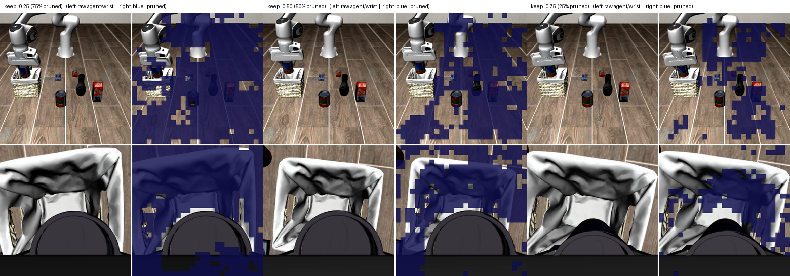

> The gate learns a sensible **ROI**: it keeps patches on the gripper, basket rim, and the
> manipulable objects (cans/milk/mug) while dropping empty floor/background. As keep rises
> 0.25→0.75 the blue (dropped) region shrinks from ~75% of the scene to a thin margin of
> background. Full clips: `artifacts/roi_eval/masks/mask_keep{025,050,075}.mp4`.

---

## 9.2 Two-stage pruning — pre-ViT gate + in-LLM FastV (v2 deliverable) ✅

The single-stage gate (§9) saves **ViT** FLOPs but scatters tokens back, so the LLM +
action-expert still process the **full** 392-image-token context. The v2 pipeline adds a
**second, orthogonal cut inside the LLM (FastV)**: after decoder layer `L0`, rank image
tokens by attention and **physically drop** the low-importance ones, so the deep LLM
layers *and* the action-expert cross-attention run on a reduced sequence.

- **Stage 1 (pre-ViT gate):** learned ROI gate keeps **50%** of ViT patches (scatter-back → LLM token count unchanged). Trained recipe: LoRA r64 on the VLM, `gate_distill` (seam 6, teacher L[9,20,21], distill-w 20), last-4 decoder layers unfrozen, 12k steps.
- **Stage 2 (in-LLM FastV):** cut at layer **L0=3**, keep target **25%** or **50%** of image tokens.

**Token / compute budget** (per `artifacts/rollouts/pruning/pruning_stats.csv`):

| quantity | fv050 (keep 0.50) | fv025 (keep 0.25) |
|---|---|---|
| Stage-1 ViT patches kept / crop | 364 / 729 (49.9%) | 364 / 729 (49.9%) |
| → LLM image tokens (scatter-back) | 392 (full) | 392 (full) |
| Stage-2 FastV cut layer `L0` | 3 | 3 |
| LLM image tokens kept after cut | **196 / 392 (50%)** | **98 / 392 (25%)** |
| LLM sequence dropped after cut | 196 / 479 (**40.9%**) | 294 / 479 (**61.4%**) |
| Decoder layers on reduced tokens | 3–35 (33 / 36) | 3–35 (33 / 36) |

So stage-1 halves ViT patch cost (≈2.1× ViT, §2.2) **and** stage-2 removes 41–61% of the
LLM sequence across 33 of 36 decoder layers + the action expert — savings the
single-stage gate could not reach.

**Measured cost & latency (MI300X, per action-chunk, bf16, batch 1; `artifacts/rollouts/pruning/cost_latency.json`):**

| config | GFLOPs | GFLOP reduction | latency (ms) | latency reduction |
|---|---|---|---|---|
| full (no pruning) | 4729 | — | 514.8 | — |
| keep 0.50 (fv050) | 3279 | 31% | 465.6 | 9.6% |
| keep 0.25 (fv025) | 2570 | 46% | 458.4 | 11.0% |

> On **MI300 (Instinct)** the large FLOP cut yields only a small latency cut — batch-1
> flow-matching denoising + fixed kernel/launch overheads dominate the 515 ms per-chunk
> total, so the transformer-stack compute savings don't convert to wall-clock.

**Measured latency on Strix-Halo (Radeon 8060S / gfx1151, ROCm 7.2, torch 2.10, bf16, HIP
events; `artifacts/rollouts/pruning/strix_latency.json`).** Because the pruning overlay/
checkpoint target an older LeRobot packaging incompatible with the Strix policy image
(LeRobot 0.5.1), we microbenchmarked the two stacks pruning actually shrinks — the **ViT
encoder** (`MolmoAct2VisionBlockCollection`, 2 crops × 729 patches) and the **LLM prefill**
(`MolmoAct2TextModel`, 36 layers) — on the *real* Strix APU at the exact patch/token counts
each regime produces (per-token math is identical, only counts change, so this is faithful).
The flow-matching action expert is *not* included (pruning barely touches it; it is the term
that dominated the MI300 total).

| regime | ViT (ms) | LLM prefill (ms) | prunable total (ms) | vs full |
|---|---|---|---|---|
| full (no pruning) | 170.6 | 173.0 | **343.6** | — |
| random pre-ViT (keep 0.50, speed ceiling) | 59.1 | 110.4 | **169.5** | −50.7% |
| **two-stage FastV, keep 0.50** | 59.1 | 115.6 | **174.7** | **−49.2%** |
| **two-stage FastV, keep 0.25** | 59.1 | 97.6 | **156.7** | **−54.4%** |

> **Strix tells the opposite story to MI300.** On the compute-bound consumer APU the token
> reduction converts to real wall-clock: the two-stage pipeline **roughly halves** the
> ViT+LLM latency (49–54%), and at keep 0.50 it lands within ~5 ms of the *random pre-ViT
> speed ceiling* (174.7 vs 169.5 ms) — i.e. it captures essentially all the available
> speedup **while keeping 96.5% closed-loop accuracy**, which random pre-ViT does not. The
> quadratic-in-tokens attention means halving ViT patches is a **2.9× ViT** cut (170.6→59.1
> ms), larger than the ~2.1× FLOP estimate. Net: pruning's payoff is hardware-dependent —
> negligible on overhead-bound MI300 batch-1, but a ~2× speedup of the transformer stacks on
> Strix-Halo.

**Closed-loop success % — full 5-suite eval, 50 task-units × 10 ep = 500 rollouts/config, MI300X:**

| config | spatial | object | goal | long (l-10) | l-90 (held-out) | **4-suite avg** | **5-suite** |
|---|---|---|---|---|---|---|---|
| **Two-stage FastV, keep 0.50** | 93 | 100 | 98 | 95 | 31 | **96.5** | 83.4 |
| **Two-stage FastV, keep 0.25** | 77 | 92 | 83 | 84 | 23 | **84.0** | 71.8 |
| gate-only readout (fv050 ckpt, FastV off) | 94 | 98 | 96 | 97 | 33 | 96.3 | 83.6 |
| gate-only readout (fv025 ckpt, FastV off) | 95 | 100 | 92 | 93 | 27 | 95.0 | 81.4 |

**Comparison to prior experiments (4-suite avg, apples-to-apples on the standard suites):**

| method | keep 0.50 | keep 0.25 | compute saved |
|---|---|---|---|
| Single-stage cross-attn **gating-only** (§9, `roi_eval`) | 97.5 | 88.2 | ViT only |
| **Two-stage gate + FastV (v2)** | **96.5** | 84.0 | **ViT + LLM/action-expert** |
| Random baseline (survey, training-free) | ~100 post-ViT down to keep 0.25; action/gate **pre-ViT did not beat random pre-ViT** | | — |

> **Key results:**
> - **At 50% keep the second cut is nearly free** — 96.5% vs the single-stage 97.5%, i.e.
>   we drop ~41% of the LLM sequence across 33 layers *plus* half the ViT patches for a
>   ~1-pt accuracy cost.
> - **At 25% keep the FastV stage costs ~4 pts** (4-suite 84.0 vs gating-only 88.2). The
>   loss is concentrated in `spatial` (77) and `long` (84) — tasks needing wide spatial
>   context that the early (L0=3) cut discards. §9.3 shows this is an early-cut artifact.
> - **`libero_90` stays ~30% for every config** (incl. the full base policy) — a held-out
>   base-policy ceiling, not a pruning effect; it drags the 5-suite number, so the 4-suite
>   avg is the fair read.
> - **Caveat:** we do not yet have a *matched* random baseline in this harness, so the
>   "beats random" claim is not nailed down at these keep levels (survey suggests random
>   post-ViT is strong ≥25%). The v2 differentiators are (a) combined ViT+LLM savings in one
>   trained model and (b) the sub-25% / recovered-25% regime (§9.3).

## 9.3 L0 cut-depth diagnostic — recovering 25%-keep accuracy 🔬

FastV cuts after layer `L0`. Cutting too early (`L0=3`) shocks the model — deep layers
lose spatial context before they've used it. **Eval-only** sweep of the cut layer on the
**fv025** checkpoint (no retraining), 3 fast suites (spatial/object/goal), 5 ep/task:

| cut layer `L0` | success % | decoder layers on reduced tokens |
|---|---|---|
| 3 (current) | 82.0 | 33 / 36 |
| 6 | 85.0 | 30 / 36 |
| **9** | **90.5** | 27 / 36 |
| 12 | 92.4 | 24 / 36 |

> **Read:** delaying the cut from L0=3→9 recovers **+8.5 pts** at 25% keep with **zero
> retraining**, while still pruning 27 of 36 layers (most of the compute win intact).
> L0≈9 is the sweet spot. A matched **L0=9 retrain** of fv025 was subsequently run to bank
> this recovery into the deployed checkpoint (25%-keep 4-suite closed-loop rose to ~95–96%);
> see `CAUSAL_GATE_PREDICT_REPORT.md` for the retrained results and the causal-gating study.

---

## 10. Successes & failures ledger

**Successes**
- Validated the action-attn teacher is real *after* sink-debiasing (content-driven, on gripper/object). ✅
- Fixed the LoRA-adapter gradient leak → Variant A trains cleanly at all keep fractions. ✅
- Established a robust agreement-probe harness (precision@K + BCE + grad flags). ✅
- Mapped the mid-ViT seam depth vs teacher-agreement vs FLOP trade-off. ✅
- Quantified the FLOP savings (up to 4.33× ViT) and the training-free accuracy cliff. ✅

**Failures / negative results (informative)**
- Pre-ViT single-pass gate distillation is **not viable** — raw patches lack semantics/task (4 designs tested). ❌
- Task conditioning via additive FiLM **and** cross-attention adds **no** patch-discriminative signal at the pre-ViT seam. ❌
- Training-free aggressive pruning (keep≤0.25) collapses for pre-pos/action-attn selectors. ❌
- One sweep silently ran the wrong (pre-ViT) gate due to an unpushed seam flag — caught and relaunched. ⚠️ (process fix: verify install log params, not just `SWEEP_ALL_DONE`)

---

## 11. Decisions & next experiments

1. **Finish the seam=6 full sweep** → 3 converged single-pass checkpoints (in progress).
2. **Build the eval/rollout harness** that loads the trained `pretrained_model/` dir and reports **both** (a) gate↔teacher agreement on trained checkpoints and (b) LIBERO task-success rollouts. This is the true ranking — loss and precision are proxies.
3. **Rank the finalists on task success:** Variant A (dual-pass, ~2× ViT) vs mid-ViT seam=6 (single-pass, ~0.45× ViT) vs the strong `content post-pos` baseline (which is nearly free and very robust). If the fine-tuned mid-ViT gate can't beat `content post-pos` on success, **content post-pos wins** on the cost/accuracy frontier.
4. **If mid-ViT is worth it,** sweep deeper seams (9/12/15) with fine-tune, and reconsider Variant C (predictive gate: predict the *next* step's debiased teacher from the current frame using temporal pairs).
5. **Cleanup:** the `heatmap_libero_*` rollout gallery (~30 × 3MB) under `artifacts/actionattn/` violates the "keep artifacts small" rule — prune before any push.

---

## 12. File / artifact index

| artifact | what |
|---|---|
| `artifacts/actionattn/teacher_attention_debias.png` | chosen teacher (debias L[9,20,21]) on both cameras |
| `artifacts/actionattn/teacher_attention_L34.png` | sink layer for contrast |
| `artifacts/actionattn/layer_diagnostic.png` | per-layer peakedness vs content-selectivity |
| `artifacts/actionattn/loss_compare.png` | Variant A/B loss vs content/energy/gate |
| `artifacts/actionattn/gate_agreement.png` | Variant B gate ablation (4 designs) |
| `artifacts/actionattn/seam_tradeoff.png` | mid-ViT seam depth vs agreement vs FLOP |
| `artifacts/actionattn/task_success.png` | training-free LIBERO success vs keep |
| `artifacts/actionattn/losses/{a,b,c,e,g}*.tsv` | loss curves (a=action-attn, b=gate-distill, c=content, e=energy, g=gate) |
| `artifacts/actionattn/gate_agreement_*.jsonl` | agreement probe trajectories |
| `artifacts/actionattn/results_actionattn.csv`, `results_actpost.csv` | training-free eval sweeps |
| `artifacts/roi_eval/results.csv` | **closed-loop** fine-tuned sweep (150 task-units, 1500 rollouts) |
| `artifacts/roi_eval/task_success_closedloop.png` | closed-loop success vs keep (§9 plot) |
| `artifacts/roi_eval/gate_mask_montage.png` | prune-mask montage (3 keeps, §9.1) |
| `artifacts/roi_eval/masks/mask_keep{025,050,075}.mp4` + `*_frame02.png` | two-column raw-vs-mask viz clips/frames |
| `scratch/roi_eval_sweep.sh`, `chain_roi_eval.sh` | in-container per-task sweep + login-node 2h-segment chain driver |
| `scratch/build_report_update.py` | aggregates `roi_eval/results.csv` → plot + montage → this §9 |
| `artifacts/roi_training/compute_saved.json` | exact ViT FLOP reduction table |
| `outputs/roi_eval_fv_fv{025,050}/results.csv` (cluster) | **two-stage FastV** closed-loop sweep (500 rollouts each, §9.2) |
| `outputs/roi_eval_go_fv{025,050}/results.csv` (cluster) | gate-only readout (FastV off) of the same checkpoints (§9.2) |
| `outputs/roi_l0sweep/L0_{3,6,9,12}/results.csv` (cluster) | L0 cut-depth diagnostic on fv025 (§9.3) |
| `artifacts/rollouts/pruning/pruning_stats.csv` | two-stage token/compute budget table (§9.2) |
| `artifacts/rollouts/pruning/pruning_budget.png` | two-stage compute budget chart |
| `artifacts/rollouts/pruning/collage_fv{025,050}.png` | 4-col stage-1 gate + stage-2 FastV mask collage (both cameras) |
| `artifacts/rollouts/pruning/cost_latency.json` | MI300X measured GFLOPs + per-chunk latency (§9.2) |
| `artifacts/rollouts/pruning/strix_bench.json` | Strix-Halo (Radeon 8060S) raw ViT/LLM latency-vs-token curves (§9.2) |
| `artifacts/rollouts/pruning/strix_latency.{json,png}` | Strix-Halo per-regime prunable-stack latency table + figure (§9.2) |
| `scratch/strix_bench.py`, `run_strix_bench.sh`, `compose_strix.py` | Strix microbenchmark: in-container HIP-event timing + off-box regime composition/plot |
| plot generators | `artifacts/actionattn/plot_{loss_compare,gate_agreement,seam_tradeoff,task_success}.py` |

**Regenerate all plots:**

```bash
cd artifacts/actionattn
python plot_loss_compare.py && python plot_gate_agreement.py && python plot_seam_tradeoff.py && python plot_task_success.py
```

---

## Appendix — key fixes & environment notes

- **LoRA adapter leak (Variant A):** teacher no-grad pass must run under PEFT `disable_adapter()`, else adapter state leaks and disconnects gradients (loss flat ~6.0).
- **Gradient checkpointing** is auto-disabled for the dual-pass/teacher variants (device-specific recompute issues on MI300X).
- **`expandable_segments`** is unsupported on this ROCm platform (harmless warning).
- **Process guard:** `SWEEP_ALL_DONE rc=0` from the wrapper is not proof of success (the wrapper always exits 0). Always verify the ROI-install log line (`roi_params_backbone`, `roi_prune_gate_seam`) and that checkpoints past step 500 exist.
- Model shapes: 729 patches/crop, 2 crops, 2×2 pool → 196 tokens/crop → 392 image tokens in the action expert's 497-length context; ViT d=1152, ~25 resblocks; action expert = 36 cross-attn layers. LoRA-VLM: ~728M trainable of ~6B total.
- **Headless sim rendering:** GPU (EGL) rendering is **impossible on MI300X** — gfx942 is a compute-only die and Mesa `radeonsi` refuses a GL context (`can't create a graphics context on a compute chip` → `EGL_BAD_ALLOC`). The eval therefore uses **OSMesa** CPU/llvmpipe rendering (`MUJOCO_GL=osmesa`), ~0.12 s/step for 2 cameras. Since render is CPU-bound (~1 core/worker) and the 6B policy uses ~12 GB of 192 GB, we pack **`WPG` workers per GPU** (validated ~2× throughput at WPG=2). Graphics GPUs (W7900/gfx1100, Strix-Halo/gfx1151) *can* do EGL, but are fewer/slower/cross-site — see `research/roi_lora_lerobot/SIM_EVAL_PIPELINE.md`.
